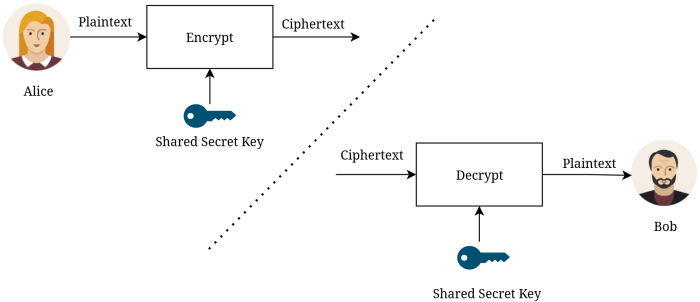
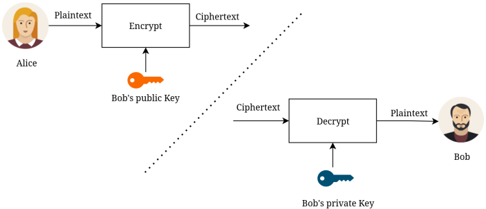

# Cifrado Simétrico y Asimétrico

## Criptografía simétrica (Clave Única)

La **criptografía simétrica** es un método donde se utiliza la misma clave tanto para cifrar como para descifrar la información. Es como una caja fuerte física: la misma llave que cierra la puerta es la que debe usar otra persona para abrirla.

### Conceptos Clave:

• **Plaintext (Texto plano)**: El mensaje original legible.

• **Ciphertext (Cifrado)**: El mensaje tras aplicar el algoritmo; ilegible sin la clave.

• **Key (Clave)**: El elemento secreto que determina la salida del algoritmo.



### Comparativa de Algoritmos

Algoritmo | Estado Actual | Notas |
| :--- | :--- | :--- |
| **DES** | ❌ Inseguro | Clave de 56 bits. Se rompió en 1998 en solo 56 horas. |
| **3DES** | ⚠️ Obsoleto | Deprecado en 2023. Basado en DES pero aplicado tres veces. |
| **AES** | ✅ Estándar | Seguro y actual. Usa bloques de 128 bits y claves de 128, 192 o 256 bits. |
| **Blowfish/Twofish** | ✅ Seguro | Diseñados por Bruce Schneier. |

### Tipos de Cifrado Simétrico

1. **Block Ciphers (Cifrado de Bloque)**: Divide el mensaje en trozos fijos (ej. 128 bits) y los cifra uno a uno (Ej: AES).

2. **Stream Ciphers (Cifrado de Flujo)**: Cifra el mensaje byte a byte o bit a bit de forma continua.

### Beneficios y Limitaciones

• **Beneficios**: Proporciona Confidencialidad (nadie más lo lee), Integridad (si se altera, no descifra bien) y Autenticidad (solo quien tiene la clave pudo enviarlo).

• **Limitación (Escalabilidad)**: Si tienes 100 usuarios, necesitas casi 5,000 claves únicas para que todos hablen entre sí de forma privada.


### Ejemplos Prácticos (Comandos)

#### 1. Usando GnuPG (GPG)

```bash
# Cifrar un archivo (te pedirá una contraseña que actuará como clave)
gpg --symmetric --cipher-algo AES256 --armor mensaje.txt

# Descifrar
gpg --output original.txt --decrypt mensaje.txt.asc
```
**Nota**: 

- `--armor` crea un archivo de texto legible (ASCII) en lugar de un binario.

-  `--output original.txt`: Aquí le indicas a GPG el nombre del nuevo archivo que quieres que cree con el mensaje ya descifrado.

- `--decrypt mensaje.txt.asc`: Aquí le dices cuál es el archivo que está bloqueado/cifrado y que quieres abrir.

#### 2. Usando OpenSSL

OpenSSL es un estándar en la industria y muy común en entornos Azure/Linux:

```bash
# Cifrar
openssl aes-256-cbc -e -in message.txt -out encrypted_message

# Descifrar
openssl aes-256-cbc -d -in encrypted_message -out original_message.txt
```

**Cifrar con AES-256 y endurecimiento contra fuerza bruta (-pbkdf2)**

```bash
#Cifrar
openssl aes-256-cbc -pbkdf2 -iter 10000 -e -in mensaje.txt -out mensaje.enc

# Descifrar
openssl aes-256-cbc -pbkdf2 -iter 10000 -d -in mensaje.enc -out mensaje_recuperado.txt
```

## Criptografía Asimétrica (Clave Pública)

A diferencia de la simétrica, aquí no necesitas un canal seguro para intercambiar claves, solo uno confiable (que asegure la integridad). Se basa en un **par de llaves** matemáticamente relacionadas:

-  **Public Key (Clave Pública)**: Se comparte con todo el mundo.

-  **Private Key (Clave Privada)**: Se guarda en secreto absoluto; nunca se comparte.



### ¿Cómo funciona el par?

1)  Si **cifras con la pública** de alguien, solo su **privada puede descifrarlo** (**Confidencialidad**).

2)  Si **cifras con tu privada**, cualquiera con tu **pública puede descifrarlo** (**Autenticidad/Firma**).


### Objetivos de Seguridad Logrados


 Objetivo | Método | Resultado |
| :--- | :--- | :--- |
| **Confidencialidad** | Cifrar con la pública del receptor. | Solo el destinatario puede leerlo. |
| **Integridad** | El descifrado exitoso con la pública. | El mensaje no fue alterado en el camino. |
| **Autenticidad** | Cifrar con la privada del emisor. | Prueba que el mensaje vino realmente de esa persona. |
| **No repudio** | Uso exclusivo de la clave privada. | El emisor no puede negar haber enviado el mensaje. |


### El Algoritmo RSA

Es el más famoso y se basa en la dificultad de factorizar números primos extremadamente grandes.

• **Seguridad**: Depende de que encontrar los factores primos de un número N muy grande es computacionalmente "imposible" en un tiempo razonable.

• **Variables**: Se generan p y q (primos), N (módulo), e (exponente público) y d (exponente privado).

### Comandos Prácticos (OpenSSL)

#### 1. Generar el par de llaves

```bash
# Crear la clave privada (2048 bits)
openssl genrsa -out private-key.pem 2048
```

```bash
# Extraer la clave pública de la privada
openssl rsa -in private-key.pem -pubout -out public-key.pem
```

```bash
# Extraer p, q, N y d  para ver los números primos (prime1 y prime2)
openssl rsa -in private-key.pem -text -noout
```

#### 2. Cifrar y Descifrar

```bash
# Cifrar un archivo con la clave PÚBLICA del receptor
openssl pkeyutl -encrypt -in mensaje.txt -out cifrado.bin -inkey public-key.pem -pubin

# Descifrar con tu clave PRIVADA
openssl pkeyutl -decrypt -in cifrado.bin -inkey private-key.pem -out mensaje_claro.txt
```