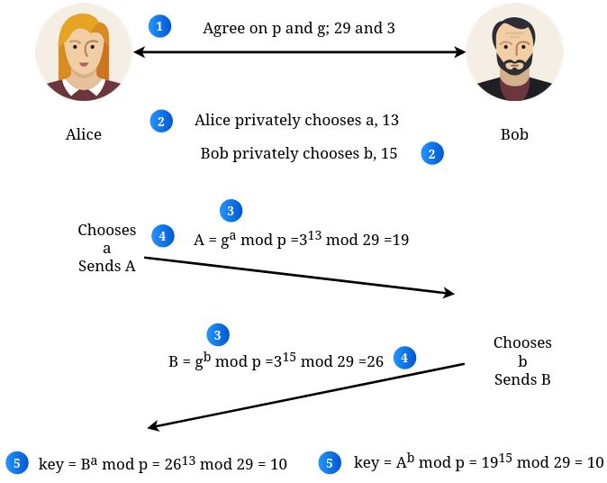

# Intercambio de Claves Diffie-Hellman

El **algoritmo Diffie-Hellman** es un método de **cifrado asimétrico** que permite que dos personas (como Alice y Bob) acuerden una **clave secreta compartida** a través de un canal público e inseguro. Es el cimiento de cómo se establecen conexiones seguras en Internet (como TLS/SSL) antes de pasar al cifrado simétrico.

---

### ¿Cómo funciona el proceso?

1. **Acuerdo Público:** Alice y Bob acuerdan las variables públicas: un número primo grande **$p$** y un generador **$g$**.
   * *Ejemplo:* **$p = 29$** y **$g = 3$**. Estos valores son conocidos por todos (públicos).

2. **Secretos Privados:** Cada parte elige un número entero privado (su clave privada) que **nunca se revela**.
   * *Ejemplo:* Alice elige **$a = 13$** y Bob elige **$b = 15$**.

3. **Cálculo de Claves Públicas:** Cada uno calcula su clave pública usando su secreto y los valores del paso 1.
   * **Alice** calcula: $A = g^a \mod p = 3^{13} \mod 29 = 19$
   * **Bob** calcula: $B = g^b \mod p = 3^{15} \mod 29 = 26$

4. **Intercambio de Claves:** Alice y Bob se envían las claves públicas a través del canal inseguro.
   * *Acción:* Alice envía su **19** a Bob; Bob envía su **26** a Alice.

5. **Cálculo del Secreto Compartido:** Finalmente, ambos calculan la clave secreta usando la pública que recibieron y su propia privada.
   * **Alice** calcula: $B^a \mod p = 26^{13} \mod 29 = 10$
   * **Bob** calcula: $A^b \mod p = 19^{15} \mod 29 = 10$

> **Resultado:** Ambos llegan al mismo número (**10**), que es la clave secreta compartida ($g^{ab} \mod p = 10$).



---

### Comandos Prácticos (OpenSSL)

#### 1. Generar e Inspeccionar Parámetros DH

```bash
# Crear un archivo de parámetros Diffie-Hellman (2048 bits). Este archivo contiene el número primo P y el generador G
openssl dhparam -out dhparams.pem 2048

# Análisis de parámetros (Extraer P y G en hexadecimal)
openssl dhparam -in dhparams.pem -text -noout
```

### El Talón de Aquiles: Ataque MitM

Aunque Diffie-Hellman es matemáticamente seguro, por sí solo es vulnerable a ataques de Man-in-the-Middle (MitM).

* **El Riesgo**: Un atacante podría interceptar los mensajes y hacerse pasar por Bob ante Alice, y por Alice ante Bob.

* **La Consecuencia**: El atacante acuerda llaves secretas distintas con cada uno, pudiendo descifrar, leer y volver a cifrar el tráfico sin que ellos lo noten.

* **La Solución**: Por eso en la vida real DH se usa junto con **Certificados Digitales (Firmas)** para autenticar quién es quién.