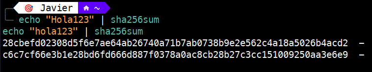

# Hashing

A diferencia del cifrado, el **hashing** no es para ocultar mensajes, sino para garantizar la **Integridad**. Una función hash toma datos de cualquier tamaño y devuelve una cadena de longitud fija llamada *message digest* o *checksum*.

---

### Características Clave

* **Tamaño Fijo:** No importa si el archivo pesa 1 KB o 10 TB, el hash (ej. SHA-256) siempre tendrá la misma longitud (256 bits / 64 caracteres hexadecimales).

* **Efecto Avalancha:** Cualquier cambio mínimo (incluso un solo bit) genera un hash completamente diferente.

* **Unidireccional (One-way):** Es una función de "solo ida". Puedes obtener el hash de una contraseña, pero no puedes "descifrar" el hash para obtener la contraseña original.

* **Resistencia a Colisiones:** Es matemáticamente improbable que dos archivos diferentes generen el mismo hash.

En la captura siguiente se observa cómo un cambio mínimo (H vs h) altera el hash por completo, como se mencionó en el segundo punto.



---

### Comandos Prácticos (Linux)

#### 1. Calcular Hash Estándar

Es la forma más común de verificar que un archivo descargado no ha sido modificado.
```bash
# Calcular el SHA-256 de un archivo
sha256sum archivo.txt

# Comparar dos archivos rápidamente
sha256sum archivo1.txt archivo2.txt
```

#### 2. HMAC (Hash-based Message Authentication Code)

El HMAC añade una clave secreta al hash. Esto garantiza **Integridad + Autenticidad**: asegura que el archivo no cambió Y que fue generado por alguien que conoce la clave.

```bash
# Ejemplo de generación de HMAC con OpenSSL
echo -n "mensaje" | openssl dgst -sha256 -hmac "mi_clave_secreta"
```
```bash
# Calcular HMAC usando una clave secreta (s!Kr37)
sha256hmac archivo.txt --key s!Kr37

# Alternativa común en sistemas Linux
hmac256 "mi_clave" archivo.txt
```

---

### Usos en Ciberseguridad

- **Almacenamiento de Contraseñas**: ¡Nunca se guardan en texto claro! Se guarda el hash.

- **Salting**: Para evitar ataques de "Tablas Rainbow", se añade un valor aleatorio (Salt) a la contraseña antes de aplicar el hash.

- **Firma Digital**: Se hashea el documento y luego se cifra ese hash con la clave privada del emisor.

---
  
### Algoritmos a Evitar (Legacy)

Algortimos no seguros para criptografía:

- **MD5**: Rápido, pero propenso a colisiones. Solo se usa para verificar errores de red no maliciosos.

- **SHA-1**: Obsoleto. Usa siempre la familia SHA-2 (SHA-256, SHA-512) o SHA-3.