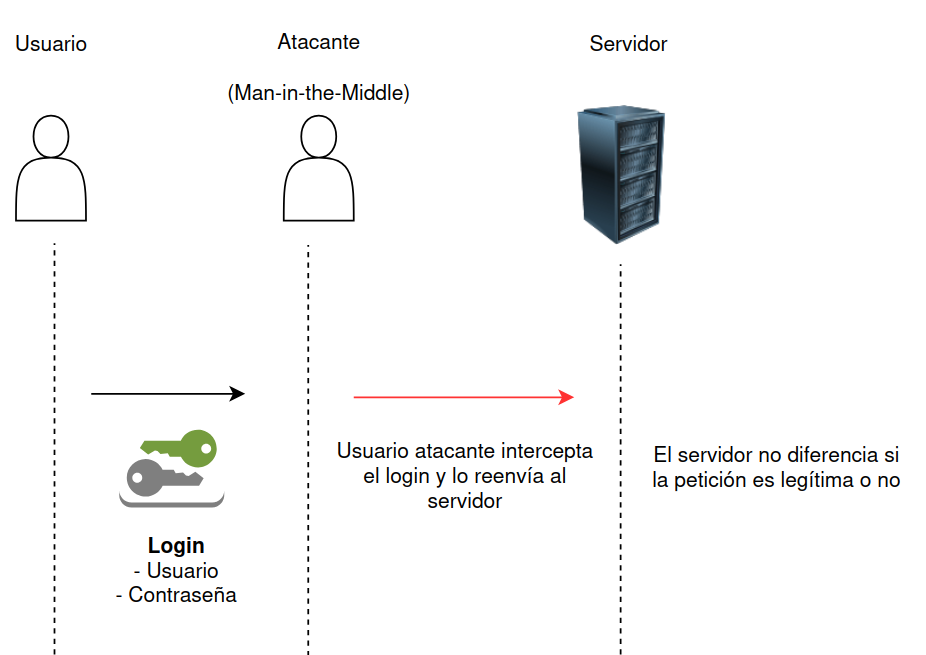

# Gestión y Ataques de Identidad

Este archivo cubre la administración del ciclo de vida de las identidades y la importancia de utilizar protocolos robustos para evitar ataques comunes.

## IdM vs IAM

Aunque a menudo se usan como sinónimos, existe una diferencia técnica de enfoque:

* **Identity Management (IdM)**: Se centra en la **gestión de los atributos**. Es la base de datos centralizada de identidades. Su foco es quién es el usuario, qué dispositivos tiene y qué permisos básicos posee.

* **Identity and Access Management (IAM)**: Es un concepto más **amplio y dinámico**. Incluye la gobernanza, el cumplimiento (GDPR, HIPAA) y la ejecución de políticas de acceso en tiempo real (MFA, SSO, RBAC).

### Ciclo de Vida: Aprovisionamiento

* **User Provisioning**: Proceso de creación y gestión de cuentas y privilegios.

* **Offboarding/Revocation**: Proceso crítico de eliminar accesos cuando un usuario deja la organización para evitar brechas de seguridad.

## Ataques contra la Autenticación

Los protocolos de autenticación "caseros" o simples son vulnerables incluso si usan contraseñas.

### 1. Eavesdropping (Escucha)

Si las credenciales se envían en texto claro (sin cifrar), un atacante que capture el tráfico de red puede leerlas directamente.

### 2. Replay Attack (Ataque de Reingreso)

Ocurre cuando un atacante captura un mensaje de autenticación válido (aunque esté cifrado) y lo **vuelve a enviar** al servidor para suplantar al usuario.

* **El problema**: El servidor acepta el código porque es "válido", aunque no sepa quién lo envió realmente.

* **La solución**: Usar mecanismos de **Challenge-Response únicos**, como añadir una marca de tiempo (timestamp) o un número aleatorio (nonce) para que cada inicio de sesión sea único y expire en milisegundos.

### Esquema: Flujo de un Replay Attack (Ataque de Reingreso)

