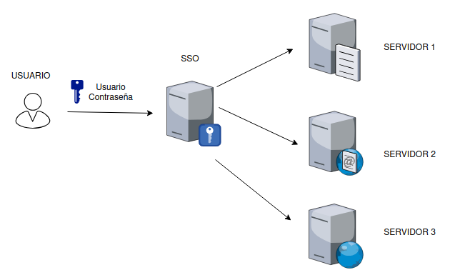

# Modelos de Control de Acceso y SSO

Este archivo detalla cómo los sistemas deciden quién accede a qué y cómo se simplifica la experiencia del usuario mediante el inicio de sesión único.

## Modelos de Control de Acceso

Un sistema controla el acceso basándose en diferentes modelos de seguridad predefinidos:

### 1. Discretionary Access Control (DAC)

* **Definición**: El dueño del recurso decide explícitamente quién tiene permisos sobre sus archivos o carpetas.

* **Uso**: Común en el día a día al compartir archivos en plataformas de almacenamiento online.

* **Limitación**: Es difícil de escalar cuando hay muchos usuarios o cuando los roles cambian con frecuencia.

### 2. Role-Based Access Control (RBAC)

* **Enfoque**: Los permisos se conceden en base a **roles** o posiciones funcionales, no a identidades individuales.

* **Gestión**: Los usuarios se asignan a grupos (ej. Contabilidad) y el acceso se otorga al grupo completo.

* **Ventaja**: Es mucho más manejable y eficiente; si un usuario cambia de rol, solo se mueve de grupo para actualizar sus permisos.

### 3. Mandatory Access Control (MAC)

* **Prioridad**: Se enfoca en la máxima seguridad y limita drásticamente las capacidades del usuario.

* **Restricción**: El usuario no puede realizar tareas más allá de lo estrictamente necesario, como cambiar permisos de archivos o instalar software.

* **Ejemplos técnicos**: 
    
    * **AppArmor**: Implementación de MAC en Debian/Ubuntu.
    
    * **SELinux**: Estándar en Red Hat y Fedora.

---

## Single Sign-On - SSO

El **SSO** soluciona el problema de tener que recordar múltiples nombres de usuario y contraseñas para diferentes servicios.

### ¿Cómo funciona?

En lugar de loguearse por separado en el email, la impresora y los archivos compartidos, el usuario se autentica una sola vez ante un sistema central que le otorga acceso a todos los demás servicios necesarios.

### Beneficios Principales:

* **Una sola contraseña fuerte**: Es más realista pedir al usuario que mantenga una única contraseña robusta que diez diferentes.

* **MFA simplificado**: El Segundo Factor de Autenticación se configura y activa una sola vez en el login inicial.

* **Soporte técnico eficiente**: Los problemas de restablecimiento de contraseña se reducen a una sola cuenta centralizada.

* **Productividad**: Evita que el usuario tenga que iniciar sesión cada vez que accede a una nueva herramienta de trabajo.

#### Esquema: Flujo de Single Sign-On (SSO)

