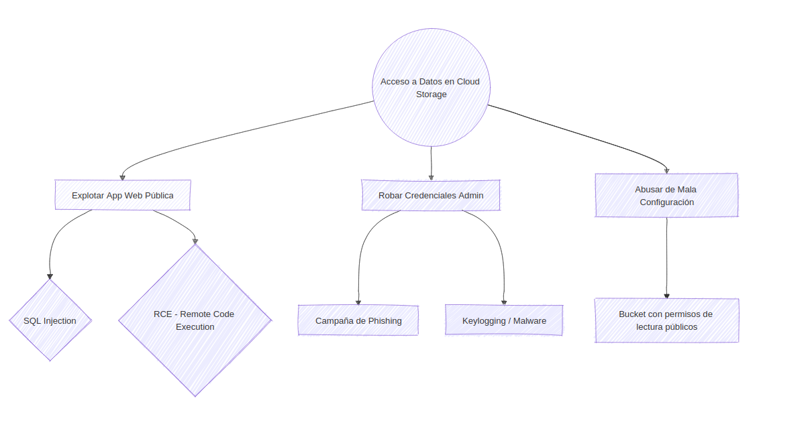

# Modelado de Amenazas (Threat Modelling)

El modelado de amenazas es un enfoque sistemático para identificar, priorizar y abordar posibles amenazas de seguridad en una organización. Al simular escenarios de ataque y evaluar vulnerabilidades, permite tomar decisiones informadas sobre la asignación de recursos y construir una estrategia de defensa robusta.

---

## 1. Conceptos Fundamentales

Para un modelado efectivo, es vital distinguir entre estos tres conceptos clave y cómo se relacionan entre sí:

| Término | Definición Técnica | Analogía (Una Casa) |
| :--- | :--- | :--- |
| **Amenaza (Threat)** | Cualquier evento o actor potencial que pueda explotar una vulnerabilidad para comprometer la tríada CIA (Confidencialidad, Integridad, Disponibilidad). | Alguien que intenta entrar a tu casa para robar tus pertenencias. |
| **Vulnerabilidad** | Una debilidad o fallo en un sistema, aplicación o proceso (bugs de software, malas configuraciones o fallos de diseño). | Una cerradura rota o una ventana que se quedó abierta. |
| **Riesgo (Risk)** | La posibilidad de ser comprometido cuando una amenaza aprovecha una vulnerabilidad. Evalúa qué tan probable es y cuánto daño causaría. | La probabilidad de robo por vivir en un barrio con alta criminalidad o no tener alarma. |

---

## 2. Proceso de Alto Nivel del Modelado de Amenazas

Antes de aplicar frameworks específicos, se sigue un proceso genérico estructurado en 6 pasos:

1.  **Definir el alcance (Scope):** Identificar específicamente qué sistemas, aplicaciones y redes formarán parte del ejercicio.

2.  **Identificación de Activos:** Desarrollar diagramas de la arquitectura y dependencias. Identificar la importancia de cada activo según los datos que maneja (datos de clientes, propiedad intelectual, etc.).

3.  **Identificar Amenazas:** Listar amenazas potenciales (ciberataques, ataques físicos, ingeniería social e insiders).

4.  **Analizar Vulnerabilidades y Priorizar Riesgos:** Evaluar las debilidades frente a los controles existentes. Los riesgos se priorizan en función de su probabilidad e impacto.

5.  **Implementar Contramedidas:** Diseñar y aplicar controles de seguridad (actualizaciones, controles de acceso, etc.) para mitigar los riesgos identificados.

6.  **Monitorear y Evaluar:** Probar continuamente la efectividad de las medidas y medir el éxito (ej. rastreando cuántos riesgos han sido eliminados).

---

## 3. Colaboración entre Equipos

El modelado de amenazas es un esfuerzo multidisciplinar donde cada equipo aporta una visión crítica:

* **Security Team:** Lidera el proceso y aporta la experiencia en amenazas y mitigación.

* **Development Team:** Asegura que la seguridad se incorpore en el ciclo de vida del desarrollo.

* **IT and Operations:** Aportan conocimiento sobre infraestructura, servidores y redes.

* **GRC Team:** Alinea el proceso con las regulaciones de la industria y las políticas internas.

* **Business Stakeholders:** Identifican los activos críticos y el nivel de tolerancia al riesgo del negocio.

* **End Users:** Aportan una perspectiva única sobre comportamientos y vulnerabilidades en la interacción real con el sistema.

---

## 4. Árboles de Ataque (Attack Trees)

Es una forma gráfica y jerárquica de analizar amenazas.

* **Estructura:** El **Nodo Raíz** representa el objetivo principal del atacante (ej. "Acceso no autorizado a datos bancarios"). Los nodos inferiores desglosan los pasos necesarios para lograrlo.

* **Attack Paths (Rutas de Ataque):** Son secuencias de vulnerabilidades interconectadas. Representan la ruta específica que sigue un atacante desde su punto de entrada hasta el objetivo final.

---

### Ejemplo Visual (Estructura de Árbol)

A continuación se muestra un ejemplo de cómo un atacante intentaría acceder a datos en la nube:

---

## 5. Modelado con MITRE ATT&CK

MITRE ATT&CK (Adversarial Tactics, Techniques, and Common Knowledge) es una base de conocimiento global de libre acceso que documenta comportamientos, tácticas y técnicas de adversarios reales basados en observaciones del mundo real.

### 5.1 Estructura de una Técnica en MITRE

Cada técnica (ej. *Exploit Public-Facing Application*) contiene secciones clave que enriquecen el modelo de amenazas:

* **Detalles Técnicos:** Nombre, explicación, tipos de datos/logs útiles para detección y plataformas afectadas (Windows, Linux, Cloud).

* **Procedure Examples:** Casos reales de cómo grupos APT han empleado la técnica.

* **Mitigations:** Medidas de seguridad y mejores prácticas recomendadas para protegerse.

* **Detections:** Estrategias e indicadores para identificar la técnica y los retos asociados.

* **References:** Fuentes externas y reportes para profundizar en el contexto.

### 5.2 Integración en el Proceso de Modelado

MITRE ATT&CK se integra después de la fase de "Identificar Amenazas":

1.  **Mapeo:** Se asocia cada amenaza identificada con las tácticas y técnicas correspondientes en el Framework.

2.  **Enriquecimiento:** Se utiliza la información de mitigación y detección de la página de la técnica para comprender mejor las debilidades del sistema.

### 5.3 Casos de Uso

* **Identificar rutas según infraestructura:** Mapear rutas de ataque específicas para entornos como **GCP**, **Azure**, **AWS** u **Office 365**.

* **Escenarios de emulación:** Evaluar la resiliencia de la organización basándose en grupos de amenazas conocidos que atacan el mismo sector industrial (ej. **APT28**, **Lazarus**).

* **Priorizar remediación:** Utilizar la información de impacto de las técnicas para identificar las vulnerabilidades más críticas que deben corregirse.

### 5.4 Enlaces de Interés

* **Web Oficial de MITRE ATT&CK:** [https://attack.mitre.org/](https://attack.mitre.org/)

* **Matriz Enterprise (Corporativa):** [https://attack.mitre.org/matrices/enterprise/](https://attack.mitre.org/matrices/enterprise/)

---

## 6. Mapeo con ATT&CK Navigator

El **ATT&CK Navigator** es una herramienta web diseñada para visualizar, filtrar y anotar la matriz de MITRE de forma dinámica. Es fundamental para el modelador de amenazas porque permite crear "vistas" personalizadas de la superficie de ataque.

### 6.1 Funcionalidades Clave

* **Capas (Layers):** Permite crear diferentes pestañas o visiones. Puedes tener una capa para **Windows**, otra para **Cloud** y otra para un grupo de APT específico.

* **Selección y Búsqueda:** Puedes seleccionar técnicas por:
    
    * **Amenaza:** Seleccionar todas las técnicas usadas por un software (ej. *Mimikatz*) o un grupo (ej. *APT41*).
    
    * **Plataforma:** Filtrar solo lo que afecta a entornos específicos como **Google Cloud Platform (GCP)**, **Azure**, **AWS** o **SaaS**.

* **Anotaciones y Scoring:** Permite asignar un valor numérico (0-100) y un color a cada celda. Esto se usa para:
    
    * Priorizar qué técnicas son más peligrosas para tu entorno.
    
    * Marcar qué técnicas ya tienes cubiertas con tus defensas actuales.

### 6.2 Uso Práctico en el Modelado

El Navigator se utiliza para responder preguntas críticas durante el proceso:

1.  **¿Cuál es mi superficie de ataque real?** Al filtrar por plataforma (ej. GCP), la matriz se reduce solo a lo que es técnicamente posible en tu entorno.

2.  **¿Quién nos ataca?** Si eres del sector financiero, puedes cargar las capas de grupos que suelen atacar bancos para ver qué técnicas usan con más frecuencia.

3.  **¿Dónde invertir?** Al cruzar las técnicas que "podrían ocurrir" con las que "ya detectamos", identificas brechas de seguridad claras.

### 6.3 Enlace a la Herramienta

* **ATT&CK Navigator (Web):** [https://mitre-attack.github.io/attack-navigator/](https://mitre-attack.github.io/attack-navigator/)

---

## 7. Análisis de Riesgos con Framework DREAD

Desarrollado originalmente por Microsoft, **DREAD** es un sistema de puntuación que ayuda a las organizaciones a evaluar y priorizar las amenazas. Cada categoría se puntúa habitualmente de 1 a 10.

### 7.1 Las 5 Categorías de DREAD

| Categoría | Descripción | Pregunta Clave |
| :--- | :--- | :--- |
| **D**amage | Evalúa el impacto total del ataque. | ¿Qué tan grave sería el daño si la amenaza ocurre? |
| **R**eproducibility | Evalúa qué tan fácil es para un atacante repetir el ataque. | ¿Se puede replicar el ataque fácilmente? |
| **E**xploitability | Mide el esfuerzo y conocimiento técnico necesario. | ¿Qué tan difícil es lanzar el ataque? |
| **A**ffected Users | Determina cuántos usuarios se verían impactados. | ¿A cuántos usuarios afectaría el ataque? |
| **D**iscoverability | Evalúa la facilidad para encontrar la vulnerabilidad. | ¿Qué tan fácil es encontrar esta debilidad? |

### 7.2 Cálculo del Riesgo

El valor final se obtiene calculando el promedio de las cinco categorías:

$$\text{Riesgo Final} = \frac{D + R + E + A + D}{5}$$

### 7.3 Interpretación de Resultados

* **Riesgo Alto (8-10):** Requiere mitigación inmediata.

* **Riesgo Medio (5-7):** Debe programarse su corrección a corto plazo.

* **Riesgo Bajo (1-4):** Puede monitorearse o aceptarse según la tolerancia al riesgo.

### 7.4 Ejemplos de Escenarios de Puntuación

| Escenario | D | R | E | A | D | Total | Prioridad |
| :--- | :--- | :--- | :--- | :--- | :--- | :--- | :--- |
| **RCE en servidor web principal** | 10 | 10 | 9 | 10 | 8 | **9.4** | **Crítica** |
| **IDOR en perfil de usuario** | 6 | 8 | 7 | 10 | 9 | **8.0** | **Alta** |
| **Reflected XSS en buscador** | 4 | 7 | 6 | 3 | 9 | **5.8** | **Media** |

---

## 8. Framework STRIDE

**STRIDE** es un modelo de clasificación de amenazas desarrollado por Microsoft para ayudar a los desarrolladores e ingenieros de seguridad a identificar vulnerabilidades en el diseño de software y sistemas.

### 8.1 Las 6 Categorías de STRIDE

A cada categoría le corresponde la violación de un principio fundamental de seguridad:

| Categoría | Propiedad Violada | Definición | Ejemplo Práctico |
| :--- | :--- | :--- | :--- |
| **S**poofing | **Autenticación** | Suplantar la identidad de una persona o dispositivo. | Usar credenciales robadas o falsificar una IP. |
| **T**ampering | **Integridad** | Modificación no autorizada de datos o procesos. | Cambiar el precio de un producto en la base de datos. |
| **R**epudiation | **No Repudio** | Capacidad de un usuario para negar haber realizado una acción. | Realizar una transferencia y decir "yo no fui" por falta de logs. |
| **I**nformation Disclosure | **Confidencialidad** | Exposición de información sensible a usuarios no autorizados. | Dejar un bucket de S3 o Azure Blob con acceso público. |
| **D**enial of Service | **Disponibilidad** | Interrumpir o degradar el servicio para los usuarios legítimos. | Un ataque DDoS que tumba la web. |
| **E**levation of Privilege | **Autorización** | Un usuario obtiene permisos que no debería tener. | Un usuario "Guest" accediendo al panel de "Admin". |

### 8.2 Aplicación de STRIDE

Se utiliza principalmente durante la fase de diseño para revisar los diagramas de flujo de datos (DFDs). Para cada elemento del sistema, se pregunta: **"¿Puede este componente ser sujeto de Spoofing? ¿Y de Tampering?"**, recorriendo todas las letras del acrónimo.

---

## 9. Framework PASTA

**PASTA** (Process for Attack Simulation and Threat Analysis) es un framework orientado al negocio y basado en el riesgo. Se diferencia de otros por integrar los objetivos comerciales y el cumplimiento normativo en el proceso de seguridad.

### 9.1 Las 7 Etapas de PASTA

1.  **Definir Objetivos (Define Objectives):** Identificar los objetivos comerciales, requisitos de cumplimiento y el impacto en el negocio.

2.  **Definir el Alcance Técnico (Define Technical Scope):** Identificar los activos técnicos que soportan los objetivos de negocio (servidores, redes, datos).

3.  **Descomposición de la Aplicación (App Decomposition):** Identificar flujos de datos, puntos de entrada y componentes de la aplicación.

4.  **Análisis de Amenazas (Threat Analysis):** Analizar escenarios de amenazas basados en inteligencia actual (inteligencia de amenazas).

5.  **Análisis de Vulnerabilidades (Vulnerability Analysis):** Identificar debilidades y vulnerabilidades existentes en los activos.

6.  **Modelado de Ataques (Attack Modeling):** Simular ataques para validar cómo se pueden explotar las vulnerabilidades identificadas.

7.  **Análisis de Riesgos e Impacto (Risk & Impact Analysis):** Calcular el impacto residual y proponer contramedidas finales alineadas con el presupuesto y el negocio.

### 9.2 Ventajas de PASTA

* **Alineación Estratégica:** No solo busca bugs, sino que protege lo que realmente genera dinero o valor a la empresa.

* **Enfoque en Simulación:** Valida las amenazas mediante simulaciones reales de ataque (paso 6).

* **Basado en Evidencia:** Utiliza datos reales de inteligencia de amenazas para el análisis.

---

## 10. Resumen Comparativo de Frameworks

Para elegir la metodología adecuada, debemos entender el enfoque de cada una. No son excluyentes; a menudo se combinan (por ejemplo, usar STRIDE para identificar y DREAD para puntuar).

| Framework | Objetivo Principal | ¿Para quién es? | Cuándo usarlo |
| :--- | :--- | :--- | :--- |
| **STRIDE** | **Clasificar** amenazas según el tipo de fallo de seguridad. | Desarrolladores / Arquitectos | Fase de diseño y diagramas de flujo. |
| **DREAD** | **Priorizar** riesgos mediante una puntuación numérica. | Gestores de Riesgo / Seguridad | Después de identificar amenazas para decidir qué arreglar. |
| **PASTA** | **Alinear** la seguridad con los objetivos de negocio. | CISO / Equipos de Seguridad Senior | Enfoque estratégico y simulaciones de ataque reales. |
| **MITRE ATT&CK** | **Mapear** comportamientos basados en ataques reales. | Analistas de SOC / Blue Team | Para conocer el "modus operandi" de atacantes específicos. |

### Conclusión Técnica

* Si quieres saber **"qué puede fallar"**: Usa **STRIDE**.

* Si quieres saber **"qué arreglar primero"**: Usa **DREAD**.

* Si quieres saber **"cómo nos atacaría un grupo real"**: Usa **MITRE**.

* Si quieres **"justificar la inversión en seguridad al jefe"**: Usa **PASTA**.
