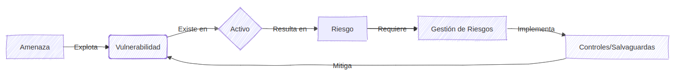

# Gestión de Riesgos (Risk Management)

La gestión de riesgos es el proceso de identificar, evaluar y responder a los riesgos asociados con una situación o actividad específica. En el ámbito de los sistemas de información, se encarga de las amenazas a los sistemas informáticos y sus recursos.

---

## 1. Introducción al Riesgo

Cualquier actividad conlleva un nivel de riesgo: la posibilidad de que ocurra algo no deseado o perjudicial. Ante un riesgo (ej. derramar café en el teclado), existen diferentes respuestas iniciales:

* **Evitación del riesgo:** No realizar la actividad que genera el riesgo (no acercar el café al escritorio).

* **Aceptación del riesgo:** Realizar la actividad siendo consciente del riesgo y sus consecuencias (beber café mientras trabajas sin protecciones).

* **Reducción/Mitigación del riesgo:** Implementar medidas para minimizar el impacto o la probabilidad (usar un teclado resistente a líquidos).

---

## 2. Terminología Básica

Para evitar ambigüedades, es esencial definir los pilares de la gestión de riesgos:

### 2.1 Amenaza (Threat)

Evento intencionado o accidental que puede comprometer la seguridad. Se clasifican en:

* **Humanas:** Causadas por personas (ciberataques, sabotaje, errores humanos, disturbios, incendios provocados).

* **Técnicas:** Fallos tecnológicos o de infraestructura (cortes de energía, fallos de hardware/software, vulnerabilidades de red).

* **Naturales:** Fenómenos de la naturaleza (terremotos, inundaciones). Su relevancia depende de la ubicación geográfica.

### 2.2 Vulnerabilidad

Debilidad en el software, hardware o red que puede ser explotada por una amenaza para obtener acceso no autorizado, causar daños o comprometer la tríada **CIA** (Confidencialidad, Integridad, Disponibilidad).

> Surgen de errores de programación (bugs), malas configuraciones o sistemas desactualizados.

### 2.3 Activo (Asset)

Cualquier recurso valioso para la organización necesario para alcanzar sus objetivos.

* **Tangibles:** Servidores, estaciones de trabajo, routers, firewalls.

* **Intangibles:** Datos organizacionales (registros de clientes, propiedad intelectual), software, documentación y políticas.

### 2.4 Riesgo (Risk)

Es la **probabilidad** de que una fuente de amenaza explote una vulnerabilidad existente en un activo, resultando en un efecto adverso para el negocio.

### 2.5 Gestión de Riesgos (Risk Management - RM)

Proceso sistemático de identificar, evaluar y mitigar los riesgos para mantenerlos en niveles aceptables. 

* **Política de Gestión de Riesgos:** Conjunto de procedimientos para minimizar eventos adversos y asegurar el cumplimiento legal.

* **Gestión de Riesgos de Sistemas de Información:** Prácticas específicas para proteger el sistema informático, evaluando la probabilidad de amenazas y asignando recursos para limitar daños.

### 2.6 Relación entre conceptos y Visualización

Para entender cómo interactúan estos términos, podemos visualizarlo como una cadena de eventos: Una **Amenaza** busca explotar una **Vulnerabilidad** que existe en un **Activo**, lo que genera un **Riesgo** que debe ser gestionado mediante **Controles**.

#### Diagrama de Relación de Riesgo

#### Matriz de Evaluación de Riesgos (Heat Map)

Una herramienta visual clave es la **Matriz de Probabilidad e Impacto**, que permite categorizar los riesgos de un vistazo según su severidad:

* **Eje X (Impacto):** Mide la gravedad del daño si el riesgo ocurre (Cualitativo: Insignificante a Catastrófico).

* **Eje Y (Probabilidad):** Mide qué tan probable es que ocurra (Cualitativo: Raro a Casi seguro).

* **Zonas de Color:**

    * **Verde (Bajo):** Riesgos aceptables que solo requieren monitoreo.

    * **Amarillo (Medio):** Riesgos que deben ser gestionados o mitigados a corto/medio plazo.

    * **Rojo (Alto/Crítico):** Riesgos que requieren acción inmediata y contramedidas urgentes.

#### Ejemplo Práctico de Matriz de Riesgos (5x5)

A continuación, se muestra cómo se verían diferentes incidentes reales mapeados en una matriz de evaluación según su severidad:

| Probabilidad / Impacto | Insignificante (1) | Menor (2) | Moderado (3) | Mayor (4) | Catastrófico (5) |
| :--- | :---: | :---: | :---: | :---: | :---: |
| **Casi Seguro (5)** | 🟢 Spam menor | 🟡 | 🟠 | 🔴 **DDoS masivo** | 🔴 |
| **Probable (4)** | 🟢 | 🟡 Cambio pass | 🟠 **Phishing** | 🔴 | 🔴 |
| **Posible (3)** | 🟢 | 🟡 | 🟡 | 🟠 **Fuga datos** | 🔴 |
| **Improbable (2)** | 🟢 | 🟢 | 🟡 | 🟡 | 🟠 **Fallo Región** |
| **Raro (1)** | 🟢 | 🟢 | 🟢 | 🟡 | 🟡 Meteorito |

**Leyenda de Prioridad:**

* 🔴 **Crítico (Rojo):** DDoS masivo o Fuga de datos de clientes. Requieren planes de respuesta inmediata 
y presupuesto prioritario.

* 🟠 **Alto (Naranja):** Phishing dirigido. Requiere controles técnicos y formación activa.

* 🟡 **Medio (Amarillo):** Cambios de contraseña sospechosos. Requiere monitoreo y auditorías periódicas.

* 🟢 **Bajo (Verde):** Spam recibido. Se acepta el riesgo y se delega en filtros automáticos.

---

## 3. Metodologías de Evaluación de Riesgos

Existen diversos marcos de trabajo (frameworks) para abordar la evaluación de riesgos. Cada uno tiene un enfoque distinto según el sector o el objetivo de la organización:

### 3.1 Frameworks Principales

* **NIST SP 800-30:** Desarrollado por el Instituto Nacional de Estándares y Tecnología (EE.UU.). Se centra en identificar, evaluar y determinar la probabilidad e impacto para desarrollar un plan de respuesta. Es un estándar muy robusto en ciberseguridad.

* **FRAP (Facilitated Risk Analysis Process):** Un enfoque colaborativo donde las partes interesadas (stakeholders) trabajan juntas. Está diseñado para ser inclusivo y facilitar el análisis mediante el consenso.

* **OCTAVE (Operationally Critical Threat, Asset, and Vulnerability Evaluation):** Pone el foco en los **activos críticos** para la misión de la organización. Identifica qué es vital y qué amenazas o vulnerabilidades podrían afectarlo.

* **FMEA (Failure Modes and Effect Analysis):** Originario de la ingeniería y fabricación. Analiza los "modos de fallo" de un sistema y las consecuencias de dichos fallos.

---

### 3.2 El Proceso según NIST SP 800-30

El NIST establece que la gestión es un ciclo de cuatro pasos que se alimentan entre sí:

1.  **Frame Risk (Enmarcar):** Establecer el contexto y el entorno del riesgo.

2.  **Assess Risk (Evaluar):** Identificar amenazas y analizar impacto/probabilidad.

3.  **Respond to Risk (Responder):** Aplicar medidas de mitigación o respuesta.

4.  **Monitor Risk (Monitorear):** Seguimiento continuo de la eficacia de las medidas.

---

## 4. Enmarcar el Riesgo (Frame Risk)

El proceso comienza estableciendo el **contexto del riesgo**. El propósito es desarrollar una estrategia de gestión que sirva de base y ponga límites a las decisiones futuras.

Para crear un marco de riesgo sólido, las organizaciones deben identificar cuatro pilares:

### 4.1 Pilares del Marco de Riesgo

* **Suposiciones de Riesgo (Risk Assumptions):** ¿Qué asumimos sobre las amenazas y vulnerabilidades? ¿Cuál es su probabilidad e impacto estimado?

* **Limitaciones (Risk Constraints):** ¿Qué restricciones tenemos para evaluar o responder? (Ej: presupuesto limitado, falta de personal, leyes locales).

* **Tolerancia al Riesgo (Risk Tolerance):** ¿Qué nivel de riesgo es aceptable para la empresa? ¿Cuánta incertidumbre estamos dispuestos a asumir?

* **Prioridades y Compensaciones (Trade-offs):** ¿Qué funciones del negocio son críticas? ¿Qué estamos dispuestos a sacrificar para proteger lo más importante?

---

### 4.2 Ejemplo Práctico: Empresa de Contabilidad

Aplicando el marco de riesgo al escenario de **Robo de Datos**:

| Elemento | Análisis del Escenario |
| :--- | :--- |
| **Suposiciones** | Al manejar datos financieros de clientes, el impacto de un robo sería desastroso para la reputación. La probabilidad de ser objetivo de ataques es alta. |
| **Limitaciones** | El presupuesto para mejorar la seguridad física y contratar personal experto es limitado. |
| **Tolerancia** | **Cero.** Una empresa de contabilidad no puede permitirse un robo de datos sin quebrar por pérdida de confianza. |
| **Prioridades** | Mantener la imagen de confianza, garantizando la **Confidencialidad** y la **Integridad**. |

---

## 5. Evaluar el Riesgo (Assess Risk)

La evaluación de riesgos es el núcleo técnico de la gestión. Su objetivo es identificar y analizar los riesgos dentro del marco establecido en el paso anterior.

Para una evaluación completa, debemos determinar cuatro factores:

1. **Amenazas:** ¿Qué eventos externos o internos nos preocupan?

2. **Vulnerabilidades:** ¿Qué debilidades tenemos ante esas amenazas?

3. **Impacto:** ¿Cuál sería el daño real si la vulnerabilidad es explotada?

4. **Probabilidad (Likelihood):** ¿Qué tan posible es que ocurra?

---

### 5.1 Ejemplos de Evaluación de Escenarios

Para entender cómo se evalúa, analizamos dos casos con perfiles de riesgo opuestos:

#### Escenario A: Desastre Natural (Tsunami)

* **Contexto:** Oficina a pie de playa.

* **Amenaza:** Tsunami.

* **Vulnerabilidad:** Ubicación geográfica (cercanía al mar y nivel del suelo).

* **Impacto:** **Catastrófico** (destrucción total de equipos y documentos).

* **Probabilidad:** **Insignificante/Nula** (basado en registros históricos y datos geológicos).

* **Conclusión:** Aunque el impacto es enorme, la probabilidad es tan baja que el riesgo suele ser aceptable o simplemente se monitoriza.

#### Escenario B: Ciberataque (Ransomware en Universidad)

* **Contexto:** Universidad prestigiosa con datos de investigación y alumnos.

* **Amenaza:** Grupos de Ransomware.

* **Vulnerabilidad:** Los datos están centralizados en sistemas informáticos accesibles.

* **Impacto:** **Alto** (paralización de la actividad docente y administrativa hasta restaurar backups).

* **Probabilidad:** **Alta** (las instituciones educativas son objetivos frecuentes de ataques automatizados y dirigidos).

* **Conclusión:** El riesgo es crítico. Aquí la probabilidad compensa el hecho de que los datos no tengan un "valor comercial" directo para el atacante.

---

## 6. Análisis de Riesgos (Risk Analysis)

Una vez identificados los riesgos, debemos analizarlos para priorizarlos. Existen dos enfoques principales:

### 6.1 Análisis Cualitativo

Se basa en juicios subjetivos y adjetivos. Es rápido y útil para comunicar riesgos de forma sencilla.

* **Calificaciones:** Se usan términos como **Alto, Medio, Bajo** o colores (**Rojo, Amarillo, Verde**).

* **Uso:** Se asignan recursos según la combinación de Probabilidad e Impacto.

| Nivel de Riesgo | Prioridad de Recursos | Acción Sugerida |
| :--- | :--- | :--- |
| 🔴 **ALTO** | **Máxima** | Mitigación inmediata; requiere atención de la directiva. |
| 🟡 **MEDIO** | **Moderada** | Implementar controles a corto plazo y monitorear. |
| 🟢 **BAJO** | **Mínima** | Aceptar el riesgo y realizar revisiones periódicas. |

#### Matriz de Decisión Rápida

> [!IMPORTANT]
> **Riesgo Probable + Impacto Significativo** = 🔴 **Prioridad Crítica** (Inversión urgente).  
> **Riesgo Improbable + Impacto Trivial** = 🟢 **Prioridad Baja** (Gasto mínimo).

---

### 6.2 Análisis Cuantitativo

Asigna valores monetarios y porcentajes numéricos. Es el método más preciso para justificar inversiones en seguridad.

#### A. Single Loss Expectancy (SLE)

Es la pérdida económica cada vez que ocurre un incidente.
$$SLE = \text{Asset Value} \times EF$$

* **Asset Value (Valor del Activo):** Precio total del recurso (hardware + datos).

* **Exposure Factor (EF):** Porcentaje de pérdida que el ataque causaría al activo.

> **Ejemplo:** Laptop ($1.000) con datos ($9.000). Total = $10.000.
> Si un Ransomware cifra todo ($EF = 90\%$), el **$SLE$ es $9.000$**.

#### B. Annualized Loss Expectancy (ALE)

Es el coste esperado del riesgo **por año**. Esta cifra es la que se usa para decidir si un control es rentable.

$$ALE = SLE \times ARO$$

* **Annualized Rate of Occurrence (ARO):** Cuántas veces al año se espera que ocurra la amenaza.

> [!TIP]
> Si un incidente ocurre una vez cada 2 años, el **$ARO$ es $0.5$**. Si ocurre 4 veces al año, el **$ARO$ es $4$**.

> **Ejemplo:** Si el Ransomware infecta una laptop cada 2 años ($ARO = 0.5$).
> El **$ALE$ es $9.000 \times 0.5 = 4.500$**.
> **Conclusión:** La empresa pierde, de media, **$4.500 al año** por este riesgo.

---

### Resumen de Fórmulas Cuantitativas

| Sigla | Nombre | Fórmula | Concepto Clave |
| :--- | :--- | :--- | :--- |
| **SLE** | Single Loss Expectancy | $AV \times EF$ | ¿Cuánto pierdo por **un** golpe? |
| **ALE** | Annualized Loss Expectancy | $SLE \times ARO$ | ¿Cuánto pierdo **al año**? |

---

## 7. Responder al Riesgo (Respond to Risk)

Esta fase determina qué hacer basándonos en la gravedad, probabilidad y el coste de las contramedidas.

### 7.1 Las 4 Respuestas Posibles

1.  **Evitar (Avoid):** Eliminar la actividad que genera el riesgo. 
    * *Ejemplo:* Prohibir el acceso a Internet en ordenadores con datos bancarios críticos.

2.  **Transferir (Transfer):** Compartir el riesgo con un tercero.
    * *Ejemplo:* Comprar un ciberseguro contra incendios o brechas de datos.

3.  **Mitigar (Mitigate):** Invertir en defensas para reducir el riesgo a un nivel aceptable.
    * *Ejemplo:* Instalar un Antivirus en lugar de prohibir el uso de USBs.

4.  **Aceptar (Accept):** Analizar el riesgo y decidir no cambiar nada porque el control es demasiado caro o altera demasiado el negocio.

> [!WARNING]
> **"Ignorar el riesgo" NO es una opción válida.** Aceptar un riesgo implica haberlo analizado y documentado. Ignorarlo es negligencia.

---

### 7.2 El Valor de la Salvaguarda (Cálculo de Rentabilidad)

¿Cómo sabemos si un antivirus de \$120 es una buena inversión? Usamos esta fórmula:

$$\text{Valor de Salvaguarda} = (ALE_{\text{antes}}) - (ALE_{\text{después}}) - (\text{Coste Anual del Control})$$

#### Ejemplo Práctico (Antivirus para Laptop):

* **ALE antes del control:** \$4.500 (lo que calculamos en el punto 6).

* **Coste del Antivirus:** \$120 al año.

* **ALE después del control:** El antivirus reduce la probabilidad ($ARO$) de 0.5 a 0.02.
  * $ALE_{\text{después}} = \$9.000 \times 0.02 = \$180$.

**Cálculo final:**
$$\text{Valor} = \$4.500 - \$180 - \$120 = \mathbf{\$4.200}$$

> [!IMPORTANT]
> Como el valor es **positivo (\$4.200)**, la inversión está totalmente justificada. Si el resultado fuera negativo, la empresa debería buscar otra estrategia (como Aceptar o Transferir).

---

## 8. Monitorear el Riesgo (Monitor Risk)

La gestión de riesgos no termina con la respuesta; es un ciclo continuo. El monitoreo es vital para identificar nuevos riesgos, eliminar los que ya no existen y verificar si nuestras defensas siguen funcionando.

El monitoreo se centra en tres áreas críticas:

### 8.1 Efectividad (Effectiveness)

Un control que funciona hoy puede ser inútil mañana. Debemos verificar si la solución sigue mitigando el riesgo correctamente.

> [!WARNING]
> **Ejemplo de las notas adhesivas:** Si obligas a usar contraseñas complejas (Mitigación) pero los empleados las anotan en un *Post-it* pegado al monitor por ser difíciles de recordar, el control ha dejado de ser efectivo.

### 8.2 Cambio (Change)

Los riesgos cambian debido a:

* **Cambios en el negocio:** Apertura de sedes, nuevas contrataciones o adquisiciones.

* **Cambios en los sistemas:** Migración a la nube (Azure/AWS), añadir nuevo hardware o actualizar software. 

Cualquier cambio técnico puede introducir vulnerabilidades que antes no existían.

### 8.3 Cumplimiento (Compliance)

Debemos vigilar que la organización siga cumpliendo con:

* **Nuevas leyes y regulaciones:** (Ej: actualizaciones de RGPD o leyes locales).

* **Políticas internas:** Asegurar que se respetan las normas de la empresa.

* **Auditorías:** El seguimiento de los hallazgos de una auditoría es obligatorio para evitar multas o acciones legales.

---
## 9. Riesgos en la Cadena de Suministro (Supply Chain Risk)

Una cadena de suministro es la secuencia de proveedores que permiten la entrega de un producto o servicio. En IT, el riesgo no solo está en nuestra infraestructura, sino en el **hardware, software o servicios** que compramos a otros.

### 9.1 Tipos de Riesgos según el Suministro

* **Riesgo en Hardware:** Un atacante puede insertar un "Troyano de Hardware" en un dispositivo electrónico para obtener acceso no autorizado o funciones ocultas.

* **Riesgo en Software:** Inserción de código malicioso en el código fuente de una aplicación antes de que llegue al cliente. Es el peor escenario posible (Ej: Caso SolarWinds).

* **Riesgo en Servicios:** Dependencia de terceros para la disponibilidad (uptime) o la protección de datos. Si el proveedor de servicios es hackeado, tus datos también están en riesgo.

---

### 9.2 Ejemplo Práctico: Firma de Contabilidad

Analizando a los proveedores de la firma:

| Proveedor | Tipo | Riesgo Potencial |
| :--- | :--- | :--- |
| **Tienda Local de PC** | Hardware | Mantenimiento malintencionado o componentes con troyanos. |
| **Software Contable** | Software | Código malicioso inyectado en una actualización del programa. |
| **Proveedor de Email** | Servicio | Brecha en los servidores del proveedor que expone correos confidenciales. |

> [!CAUTION]
> El riesgo puede "colarse" a través de un proveedor aunque nuestra propia seguridad sea perfecta. La seguridad de una empresa es tan fuerte como el eslabón más débil de su cadena de suministro.
