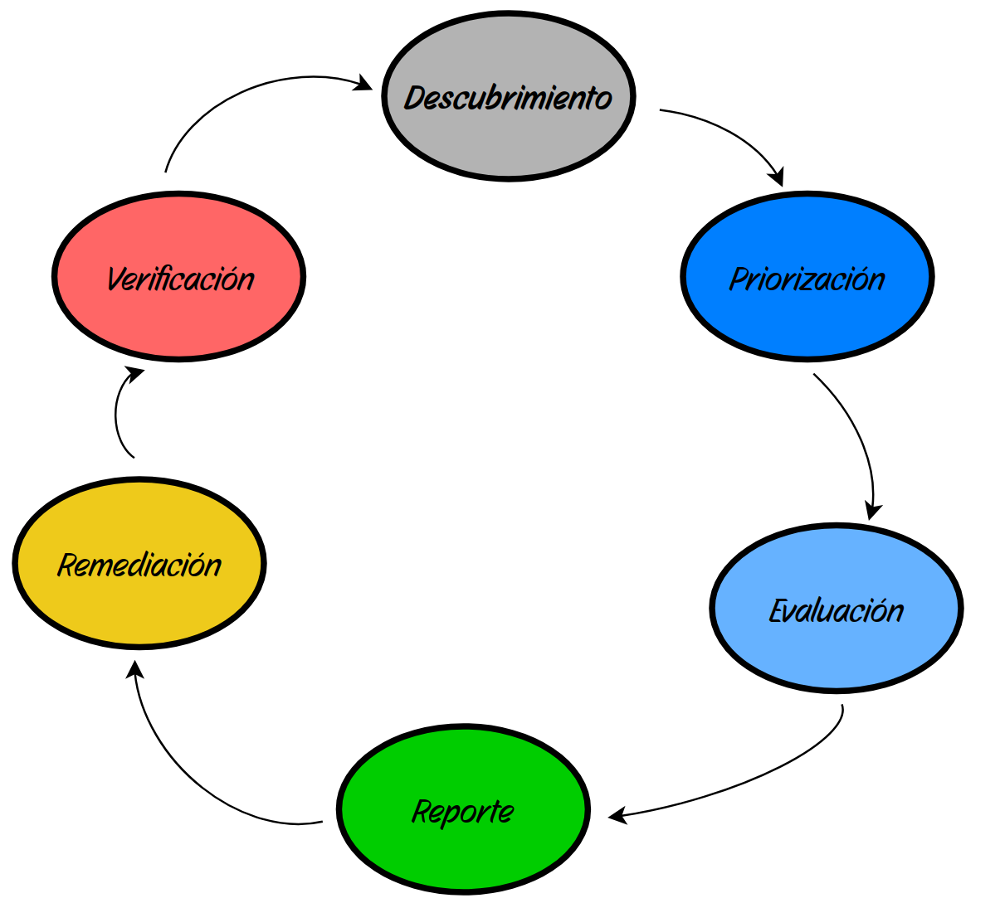

# Gestión de Vulnerabilidades (Vulnerability Management)

Según el **NIST**, una vulnerabilidad es una debilidad en un sistema, procedimientos de seguridad o controles internos que podría ser explotada por una fuente de amenazas.

## 1.Escaneo vs. Gestión

* **Vulnerability Scanning (Escaneo):** El uso de software para encontrar fallos. Es una acción técnica puntual. Algunas herramientas populares de infraestructura (como Nessus o Nexpose) y de aplicaciones web (como Acunetix o OWASP ZAP). Por otro lado, contamos con soluciones robustas de código abierto como Greenbone.

* **Vulnerability Management (Gestión):** El proceso completo y continuo que rodea al escaneo. Incluye la priorización, remediación y seguimiento del riesgo de forma proactiva.

## 2. El Estándar SCAP (Security Content Automation Protocol)

Protocolos estándar para la automatización y unificación de datos de seguridad:

* **CVE (Common Vulnerabilities and Exposures):** Diccionario de identificadores únicos para vulnerabilidades públicas, mantenido por MITRE. [CVE Details](https://www.cvedetails.com/) es un sitio web de renombre para la búsqueda de CVE y su impacto.

* **CPE (Common Platform Enumeration):** Método estándar para identificar y clasificar sistemas operativos y aplicaciones.

* **CVSS (Common Vulnerability Scoring System):** Sistema de puntuación (0-10) para medir la severidad de una vulnerabilidad.

> [!TIP]
> **CVSS (0-10):**
> * **0.0 - 3.9:** Bajo (Low)
> * **4.0 - 6.9:** Medio (Medium)
> * **7.0 - 8.9:** Alto (High)
> * **9.0 - 10.0:** Crítico (Critical) -> **¡Prioridad de remediación inmediata!**

## 3. Ciclo de Vida de la Gestión de Vulnerabilidades (NIST)

El proceso se divide en 6 fases críticas que se pueden mapear desde el [Marco de ciberseguridad del NIST](https://www.nist.gov/cyberframework):

1. **Descubrimiento (Discover):** Inventario de todos los activos y servicios en el entorno.

2. **Priorización (Prioritize):** Clasificación de activos según su criticidad para el negocio.

3. **Evaluación (Assess):** Análisis técnico de vulnerabilidades y establecimiento de la línea base.

4. **Reporte (Reporting):** Documentación de hallazgos y eliminación de **Falsos Positivos**.

5. **Remediación (Remediation):** Aplicación de parches, medidas de mitigación o aceptación del riesgo.

6. **Verificación (Verification):** Re-escaneo para confirmar la resolución de la vulnerabilidad.

  

## 4. Operativa: El Flujo de Remediación (Ticketing)

Para que el ciclo de vida sea efectivo, la fase de **Remediación** se suele operativizar mediante un sistema de tickets:

1. **Apertura:** Tras el *Reporte*, se genera un ticket (ej. Jira/ServiceNow) detallando la vulnerabilidad y el activo afectado.

2. **Asignación:** Se deriva al equipo técnico responsable (Sistemas, DBAs, Desarrolladores).

3. **Acción:** El equipo aplica la solución (Parche, Cambio de configuración o Mitigación).

4. **Validación y Cierre:** Seguridad verifica el parche y cierra el ticket.

## 5. Marco de Trabajo NIST Cybersecurity Framework (CSF)

Funciones aplicadas a la gestión de vulnerabilidades:

* **Identificar:** Visibilidad de activos y procesos.

* **Proteger:** Implementación de salvaguardas y gestión de parches.

* **Detectar:** Monitorización continua para identificar eventos de seguridad.

* **Responder:** Procedimientos para mitigar el impacto de vulnerabilidades descubiertas.

* **Recuperar:** Mejora de la resiliencia y registro de lecciones aprendidas.