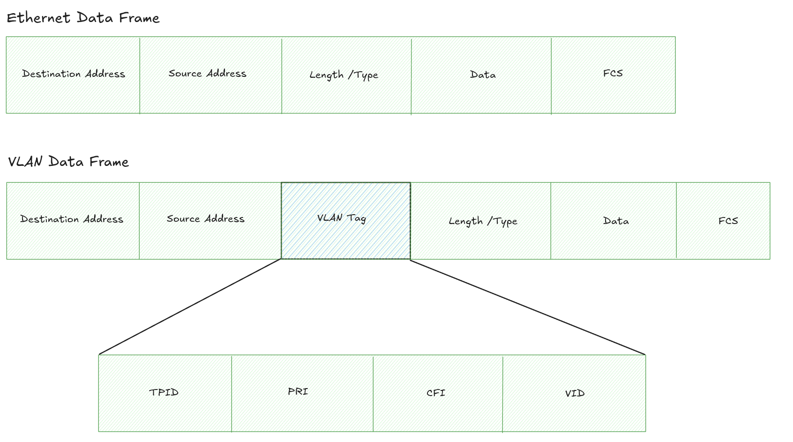
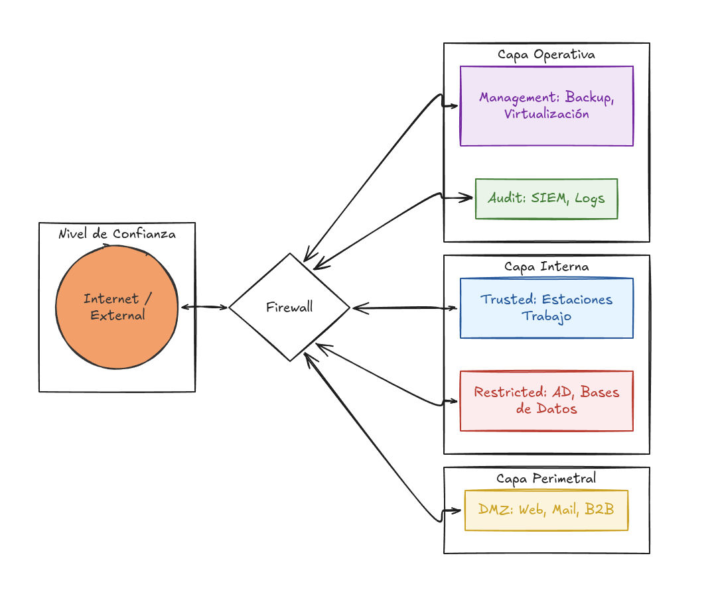
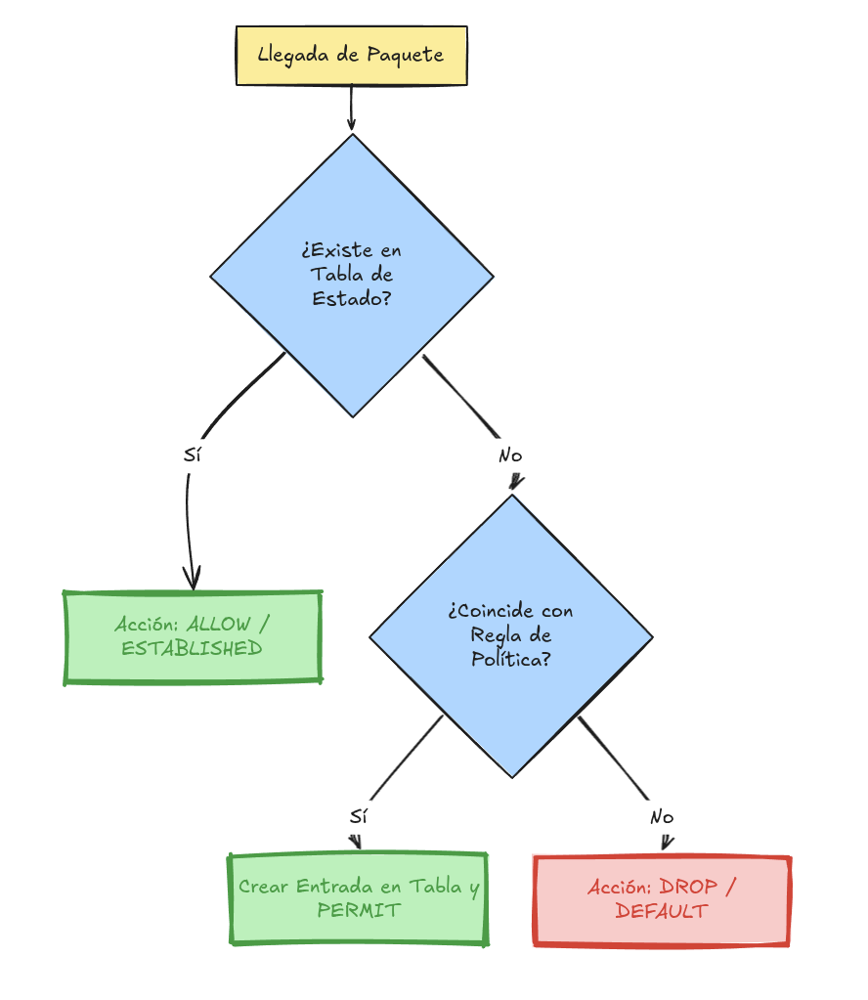
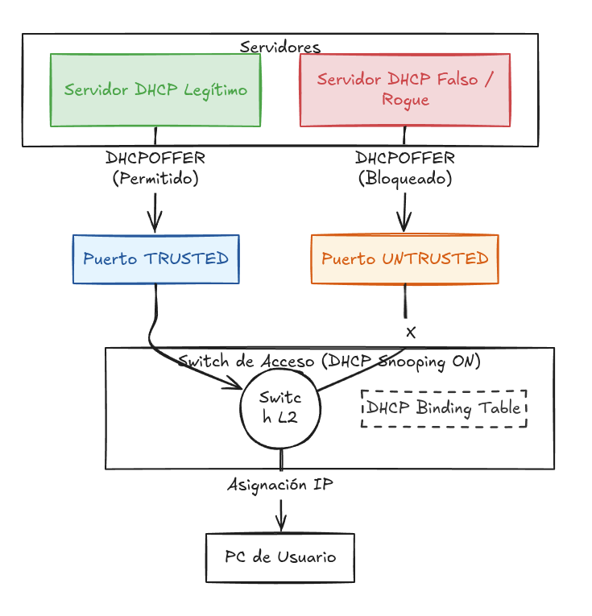

# Arquitectura de Red Segura

Una red corporativa bien diseñada no solo permite la comunicación, sino que garantiza la **redundancia**, la **optimización** y la **seguridad**. El objetivo primordial es que, si un componente falla o es comprometido, el resto del entorno permanezca operativo y protegido.

---

## 1. Introducción y Objetivos de Diseño

La seguridad de red busca evitar que un atacante que comprometa un activo (como un servidor web expuesto) pueda realizar un **movimiento lateral** hacia datos sensibles.

* **Resiliencia:** Capacidad de la red para redistribuir paquetes mediante rutas alternativas si un nodo falla.

* **Aislamiento:** Garantizar que dispositivos de terceros o desconocidos (**BYOD**) no tengan visibilidad sobre los sistemas críticos.

* **Segmentación Efectiva:** Diferenciar el tráfico de gestión, el de usuarios y el de servidores.

---

## 2. Segmentación de Red (Network Segmentation)

La segmentación divide una red en zonas más pequeñas para reducir la superficie de ataque.

### El problema del Subnetting básico

El subnetting (Capa 3) organiza la red por rangos de IP, pero no restringe la comunicación por sí solo. Sin reglas de filtrado, un dispositivo infectado puede saltar entre subredes si el router tiene las rutas activas.

### La solución: VLANs (Virtual LAN)

Las VLANs segmentan la red en la **Capa 2 (Enlace de datos)**. Permiten agrupar dispositivos de forma lógica, independientemente de su conexión física.

* **Etiquetado (Tagging) 802.1q:** Estándar de la industria (dot1q) que añade una etiqueta a la trama para identificar su VLAN.

* **Native VLAN:** Gestiona el tráfico sin etiqueta. Se recomienda cambiar la VLAN 1 por defecto para evitar ataques de *VLAN Hopping*.

<div align="left">
  
</div>

#### Análisis de los campos del VLAN Tag (dot1.q)

* **TPID (Tag Protocol Identifier)**: Son 16 bits que siempre están configurados como 0x8100. Es la señal para el switch de: "Atención, lo que viene ahora es una etiqueta VLAN, no datos normales".

* **PRI (Priority)**: 3 bits que definen la prioridad del tráfico (CoS - Class of Service). Esto permite que, por ejemplo, el tráfico de Voz sobre IP (VoIP) pase antes que una descarga de archivos si el enlace está saturado.

* **CFI (Canonical Format Indicator)**: 1 bit que asegura la compatibilidad entre redes Ethernet y Token Ring (hoy en día casi siempre es 0).

* **VID (VLAN ID)**: El campo más importante (12 bits). Aquí es donde se guarda el "número" de la VLAN (del 1 al 4094). Es lo que permite que tu tráfico de la VLAN 10 esté separado del de la VLAN 20 en el mismo cable.

---

### Configuración Estándar (Ejemplos de Industria)

#### A. Cisco (Cisco IOS)
```bash
# Puerto de acceso (PC final)
interface GigabitEthernet0/1
 switchport mode access
 switchport access vlan 10

# Puerto Troncal (Trunk)
interface GigabitEthernet0/2
 switchport trunk encapsulation dot1q
 switchport mode trunk
```
Referencia oficial: [Cisco Catalyst 9000 VLAN Configuration Guide](https://www.cisco.com/c/en/us/td/docs/switches/lan/catalyst9300/software/release/16-5/configuration_guide/vlan/b_165_vlan_9300_cg/b_165_vlan_9300_cg_chapter_01.html)

#### B. Juniper (Junos OS)
```bash
# Configuración de puerto y VLAN
set interfaces ge-0/0/1 unit 0 family ethernet-switching interface-mode access vlan members vlan-10
set vlans vlan-10 vlan-id 10
```
Referencia oficial: [Juniper Guía del usuario de conmutación Ethernet](https://www.juniper.net/documentation/mx/es/software/junos/multicast-l2/topics/topic-map/private-vlans.html)

---

## 3. Comunicación Inter-VLAN: Router on a Stick (ROAS)

Diseño que utiliza un único enlace físico (**Trunk**) entre el switch y el router para comunicar múltiples VLANs mediante **sub-interfaces virtuales** (ej. eth0.10).

> [!WARNING]
> **Punto Crítico de Seguridad:** Si el router comunica las VLANs pero no aplica políticas de filtrado (ACLs o Firewalls), la segmentación es organizativa pero **no ofrece seguridad real** frente a movimientos laterales.

---

## 4. Zonas de Seguridad (Security Zones)

Las zonas de seguridad definen **qué** o **quién** reside en una VLAN y establecen las reglas de comunicación. La zonificación permite aplicar el **principio de mínimo privilegio** a nivel de red: en lugar de que toda la red interna sea "confiable", se separan los entornos para que un compromiso en una estación de trabajo (Zona Confiable) no afecte automáticamente a la base de datos de clientes (Zona Restringida).

### Estándares Comunes de Zonificación

| Zona | Explicación | Ejemplos |
| :--- | :--- | :--- |
| **Externa (External)** | Dispositivos y entidades fuera de nuestro control. | Internet, usuarios externos. |
| **DMZ** | Separa redes no confiables de los recursos internos. | Servidores públicos (Web, Mail), BYOD, invitados. |
| **Confiable (Trusted)** | Redes internas estándar sin información crítica. | Estaciones de trabajo de empleados, B2B. |
| **Restringida (Restricted)** | Servidores de alto riesgo o bases de datos sensibles. | Controladores de Dominio (AD), datos de clientes. |
| **Gestión (Management)** | Dispositivos dedicados a la administración de red. | Servidores de backup, consolas de virtualización. |
| **Auditoría (Audit)** | Dedicada a la seguridad y monitorización. | SIEM, telemetría, colectores de logs. |

<div align="left">
  
</div>

---

## 5. Control de Acceso y Flujo de Tráfico

El diseño de una arquitectura segura no solo depende de dónde ubicamos los activos, sino de cómo permitimos que interactúen:

1.  **Tránsito Externo:** La mayoría del tráfico externo (HTTP/S, SMTP) debe morir en la **DMZ**.

2.  **Acceso Remoto:** Si un usuario remoto necesita acceder a un recurso interno, se deben crear reglas basadas en identidades, IPs o direcciones MAC.

3.  **Gobierno de Tráfico:** Las reglas técnicas (quién accede a qué) deben estar alineadas con las políticas de seguridad y cumplimiento de la empresa.

> [!IMPORTANT]
> **Defensa en Capas:** Las zonas de seguridad y los controles de acceso dirigen físicamente el tráfico, pero son las políticas de seguridad las que determinan los permisos finales.

---

## 6. Políticas y Controles de Seguridad de Red

Una vez definida la arquitectura y las zonas, el siguiente paso es la **aplicación de políticas** (enforcement). Si existen rutas entre VLANs, debemos restringir el acceso para que solo el tráfico legítimo sea permitido.

### Filtrado de Tráfico: ACL y ACE

El método más común para filtrar tráfico en dispositivos de red es mediante el uso de Listas de Control de Acceso (ACL).

* **ACL (Access Control List):** Es el conjunto de reglas o directrices que determinan si un paquete debe ser permitido o denegado.

* **ACE (Access Control Entry):** Es cada una de las líneas o reglas individuales dentro de una ACL. Una ACE define criterios específicos como:

    * Dirección IP de origen y destino.

    * Protocolo (TCP, UDP, ICMP).

    * Puertos de origen y destino (ej. puerto 80 para HTTP, 22 para SSH).

### Funcionamiento del Filtrado

Cuando un paquete llega a un router o firewall con una ACL aplicada:

1. El dispositivo inspecciona la cabecera del paquete (IPs y puertos).

2. Compara el paquete con cada **ACE** de la lista en orden secuencial (de arriba hacia 
abajo).

3. En cuanto encuentra una coincidencia, aplica la acción (**Permit** o **Deny**) y deja de buscar.

4. **Deny Any Any (Implícito):** Por estándar de seguridad, si un paquete no coincide con ninguna regla de la lista, es descartado automáticamente.

### Ejemplo Práctico de ACL (Cisco IOS)

Para ilustrar cómo se aplican estos conceptos en la industria, supongamos que queremos permitir tráfico SSH (puerto 22) solo desde una IP específica hacia un servidor en la Zona Restringida:

```bash
# Crear la ACL extendida
access-list 101 permit tcp host 10.10.212.209 host 10.10.212.50 eq 22
access-list 101 deny ip any any

# Aplicar la ACL a la interfaz correspondiente
interface GigabitEthernet0/0
 ip access-group 101 in
```

Referencia oficial: [Cisco Catalyst 9300 ACLs](https://www.cisco.com/c/en/us/td/docs/switches/lan/catalyst9300/software/release/17-14/configuration_guide/sec/b_1714_sec_9300_cg/configuring_ipv4_acls.html)

---

## 7. Limitaciones del Filtrado en Routers

Aunque las ACLs en routers son eficaces para el control de tráfico básico (**Capa 3 y 4**), presentan limitaciones importantes para una arquitectura de seguridad moderna:

* **Falta de Estado (Stateless)**: Muchos routers procesan cada paquete de forma aislada, sin entender el contexto de la conexión completa.

* **Visibilidad Limitada**: No pueden inspeccionar el contenido del paquete (**Capa 7**), por lo que no detectan ataques ocultos en tráfico aparentemente legítimo (ej. una inyección SQL sobre el puerto 80).

* **Escalabilidad**: Gestionar cientos de ACLs en múltiples routers se vuelve inmanejable y propenso a errores humanos.

>[!TIP]
>Evolución: Para solucionar estas limitaciones, las arquitecturas seguras evolucionan del simple filtrado en routers hacia el uso de Firewalls de Próxima Generación (NGFW) y políticas basadas en zonas, que veremos en la siguiente sección.

---

## 8. Firewalls y Políticas de Pares de Zonas (Zone-Pairs)

Para implementar una seguridad robusta, debemos pasar del simple filtrado de paquetes a la **correlación de tráfico**. Esto implica que el dispositivo de seguridad entienda el "estado" de una conexión (protocolo, proceso, dirección y dirección del flujo).

### Firewalls: Stateless vs. Stateful

* **Stateless (Sin estado):** Como las ACL tradicionales. Tratan cada paquete de forma aislada. No saben si un paquete entrante es una respuesta legítima a una petición interna o un intento de conexión no solicitado.

* **Stateful (Con estado):** Estos firewalls rastrean la conversación completa. Mantienen una **Tabla de Estado** que les permite saber si un paquete es parte de una sesión ya establecida, permitiendo el tráfico de retorno automáticamente sin necesidad de reglas manuales complejas.

<div align="left">
  
</div>

>[!NOTE]
>Como se observa en el diagrama, el firewall solo consulta las reglas de política (ACLs) cuando llega un paquete nuevo. Si el paquete ya pertenece a una conexión establecida, se permite el paso directamente consultando la memoria (Tabla de Estado), lo que mejora drásticamente el rendimiento y la seguridad.

### Lógica de Zone-Pairs (ZPF)

Un **Zone-Pair** es una política basada en la dirección que aplica reglas de tráfico entre dos zonas de seguridad (ej. DMZ → LAN). 

* **Configuración Unidireccional:** Se debe definir una política diferente para cada combinación de origen y destino. Si no se define un par para una dirección específica, el tráfico se descarta por defecto.
* **Acción por Defecto (Default Action):** Siguiendo el principio de seguridad, la acción predeterminada para cualquier zona debe ser `drop` (descartar). 

---

### Implementación en la Industria (Conceptos Clave)

Independientemente del fabricante, la lógica de un Firewall de Zonas se basa en tres estados críticos para la regla de "Inspección":

1. **Established (Establecida):** Paquetes que forman parte de una sesión ya permitida y abierta en la tabla de estados.

2. **Related (Relacionada):** Paquetes que inician una nueva conexión pero que están asociados lógicamente a una ya existente (muy común en protocolos como FTP o SIP).

3. **Invalid (Inválida):** Paquetes que no coinciden con ninguna sesión activa y no siguen la secuencia lógica del protocolo (deben ser descartados).

#### Ejemplo de Configuración Agnostica/Cisco (ZPF)

En dispositivos de nivel empresarial, la lógica sigue este orden:

1. Se crean las **Zonas**.

2. Se definen las **Clases de Tráfico** (qué protocolos inspeccionar).

3. Se crea un **Mapa de Políticas** (qué hacer con ese tráfico: *Inspect, Pass o Drop*).

4. Se aplica el **Zone-Pair** vinculando origen, destino y política.

```bash
# Ejemplo conceptual de lógica Zone-Pair
zone security TRUSTED
zone security EXTERNAL

# Crear el par y aplicar la política de inspección de estado
zone-pair security TRUST-TO-EXT source TRUSTED destination EXTERNAL
 service-policy type inspect HTTP_INSPECTION_POLICY
 ```
 ### Tabla de Comportamiento (Diseño Seguro)

| Origen | Destino | Protocolo | Acción | Acción por Defecto |
| :--- | :--- | :--- | :--- | :--- |
| **DMZ** | **LAN** | HTTPS | Inspect/Accept | Drop |
| **LAN** | **DMZ** | ICMP | Inspect/Accept | Drop |
| **WAN** | **DMZ** | HTTP | Inspect/Accept | Drop |

> [!WARNING]
> Es crítico recordar que las políticas deben configurarse tanto para IPv4 como para IPv6, ya que un atacante podría intentar evadir los controles de la zona a través de tráfico IPv6 si este no está monitorizado.

---

## 9. Inspección SSL/TLS y UTM

Incluso con una zonificación perfecta, un atacante puede ocultar tráfico malicioso (como un implante de phishing) dentro de conexiones cifradas (HTTPS). Para el firewall y los analistas, este tráfico parecerá legítimo a menos que se inspeccione su contenido.

### Inspección SSL/TLS

La inspección SSL/TLS utiliza un **Proxy SSL** para interceptar protocolos cifrados (HTTP, POP3, SMTP). El proceso funciona de la siguiente manera:

1. El proxy intercepta el tráfico cifrado.

2. Des cifra el contenido para hacerlo legible.

3. Envía el tráfico a una plataforma **UTM (Unified Threat Management)**.

### UTM (Unified Threat Management)

Una solución UTM agrupa múltiples servicios de seguridad en un solo flujo de trabajo. Una vez que el proxy des cifra el tráfico, el UTM lo procesa a través de:

* **IPS (Intrusion Prevention System):** Para detectar patrones de ataques conocidos o exploits.

* **Filtrado Web:** Para bloquear el acceso a dominios maliciosos o de C2 (Command & Control).

* **Antivirus de Red:** Para escanear archivos en tránsito.

### Consideraciones de Riesgo: El dilema del MitM

Implementar inspección SSL convierte técnicamente al firewall en un **MitM (Man-in-the-Middle)**. Esto conlleva desafíos importantes que una organización debe evaluar:

* **Privacidad y Seguridad:** El proxy podría interceptar contraseñas en texto plano o datos bancarios sensibles de los empleados.

* **Riesgo de Confianza:** Un atacante avanzado podría enrutar su tráfico a través de dominios de confianza o proveedores de nube legítimos para evadir la detección.

* **Rendimiento:** La des-encriptación y re-encriptación de todo el tráfico de la red requiere una alta capacidad de procesamiento.

> [!TIP]
> **Estrategia Híbrida:** Muchas corporaciones optan por "listas blancas" (bypass), permitiendo que aplicaciones conocidas y seguras no sean inspeccionadas, centrando los recursos en el tráfico desconocido o de mayor riesgo.

---

## 10. Seguridad en Capa 2: DHCP Snooping y DAI

Para asegurar la red de forma integral, no basta con filtrar el tráfico en el router; debemos proteger los protocolos de infraestructura en los switches (Capa 2) para evitar ataques de intermediario (MitM).

### DHCP Snooping

Es una característica de seguridad que actúa como un firewall entre hosts no confiables y servidores DHCP confiables. Su objetivo principal es combatir la presencia de **servidores DHCP falsos (Rogue DHCP)**.

* **Funcionamiento:** El switch clasifica las interfaces en "confiables" (donde está el servidor DHCP legal) y "no confiables" (puertos de usuarios).

<div align="left">
  
</div>

* **DHCP Binding Database:** El switch crea una base de datos vinculando la dirección MAC del host, la dirección IP asignada, el tiempo de concesión y la interfaz física.

* **Condiciones de Descarte:** Se bloquean paquetes DHCP si:
    
    1.  Un paquete de respuesta (DHCPOFFER/ACK) llega por una interfaz no confiable.
    
    2.  La dirección MAC de origen no coincide con la dirección de hardware del cliente DHCP.
    
    3.  Llega un paquete con una dirección de agente de retransmisión (*relay agent*) que no es 0.0.0.0.

### Dynamic ARP Inspection (DAI)

DAI es una función de seguridad que valida los paquetes ARP en la red para prevenir el **ARP Spoofing** o envenenamiento de caché.

* **Lógica de Validación:** DAI utiliza la base de datos creada por el DHCP Snooping. Cuando un host envía un paquete ARP, el switch intercepta el paquete y compara la pareja MAC/IP con la base de datos de vinculación.

* **Acción:** Si la dirección MAC y la IP no coinciden con el registro legítimo, el switch descarta el paquete y registra el intento de ataque.

> [!IMPORTANT]
> **Dependencia Técnica:** Para que DAI funcione correctamente, es requisito indispensable tener activado **DHCP Snooping**, ya que es su fuente de verdad para validar las identidades de los hosts.

---

## 11. Conclusión del Diseño de Red Segura

Una arquitectura de red moderna y segura requiere una estrategia de defensa en profundidad que abarque desde la segmentación física hasta la inspección de aplicaciones:

1.  **Segmentación (VLANs):** Aislar dispositivos lógicamente.

2.  **Zonificación:** Aplicar el principio de mínimo privilegio (DMZ, Restricted, Trusted).

3.  **Filtrado (ACLs/Zone-Pairs):** Controlar el flujo de tráfico mediante inspección de estado (Stateful).

4.  **Inspección Profunda (UTM/SSL):** Visibilidad sobre amenazas ocultas en tráfico cifrado.

5.  **Protección de Infraestructura (Snooping/DAI):** Asegurar la integridad de la Capa 2.

El diseño de red no es estático; debe adaptarse continuamente según los requisitos de cada entorno y la evolución de las amenazas.
