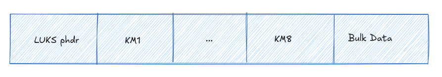

# Bastionado de Sistemas Linux (Hardening)

El **bastionado** o **hardening** es el proceso de asegurar un sistema mediante la reducción de su superficie de ataque. En Linux, esto implica proteger desde el acceso físico hasta los servicios de red y el cifrado de datos.

---

## 1. Seguridad Física: La Primera Capa de Defensa

La seguridad física es el cimiento de cualquier estrategia de protección. Si un adversario tiene acceso físico al hardware, puede extraer discos duros o manipular el proceso de arranque, invalidando las protecciones lógicas del sistema operativo.

### 1.1 El concepto "Boot Access = Root Access"

Este adagio de la seguridad subraya que si un atacante puede manipular el cargador de arranque (bootloader), tiene el control total sobre el sistema. Sin protección, es trivial editar las líneas de comando de **GRUB** para iniciar el sistema con una shell de superusuario (`/bin/bash`) o resetear la contraseña de `root`.

**Medidas de Mitigación:**

* **Contraseña de BIOS/UEFI:** Evita que el sistema arranque desde medios externos no autorizados (USB/CD) y protege la configuración del hardware. Es ideal para estaciones de trabajo, aunque menos práctico en servidores que requieren reinicios automáticos.

* **Contraseña de GRUB:** Bloquea el acceso a las configuraciones avanzadas de arranque y a la edición de parámetros del kernel.

### 1.2 Implementación de Contraseña en GRUB

Para evitar que un intruso con acceso físico al teclado comprometa la cuenta de superusuario, se debe generar un hash y añadirlo a la configuración del sistema.

* **Herramienta:** `grub2-mkpasswd-pbkdf2`

* **Funcionamiento:** Esta herramienta genera un hash utilizando **PBKDF2** (Password-Based Key Derivation Function 2) con SHA512 e iteraciones, lo que hace que el hash sea resistente a ataques de fuerza bruta.

```bash
# Ejemplo de generación de hash en la terminal
root@AttackBox# grub2-mkpasswd-pbkdf2
Enter password: 
Reenter password: 
PBKDF2 hash of your password is grub.pbkdf2.sha512.10000.534B77859C13DCF0...
```
---

## 2. Cifrado de Disco: LUKS (Linux Unified Key Setup)

El cifrado hace que los datos sean ilegibles sin la clave de descifrado. En escenarios de robo de hardware, un disco cifrado protege la confidencialidad de la información, convirtiendo los datos en ruido digital para el atacante.

<div align="left">
  
</div>

### 2.1 Arquitectura de LUKS

LUKS es el estándar por defecto en Linux para el cifrado de bloques. Su estructura se divide en tres partes fundamentales:

* **LUKS phdr (Partition Header):** Almacena metadatos críticos como el UUID, el cifrado utilizado (ej. AES), el modo de cifrado, la longitud de la clave y el checksum de la clave maestra.

* **KM (Key Material):** Contiene 8 ranuras de llaves (**Key Slots**). Cada ranura activa guarda una copia de la **clave maestra** cifrada con la contraseña de un usuario diferente. Esto permite que hasta 8 contraseñas distintas puedan desbloquear el mismo disco.

* **Bulk Data:** El área que contiene los datos reales del usuario, protegidos mediante la clave maestra.

### 2.2 Proceso de Cifrado y Derivación de Claves

LUKS utiliza la función **PBKDF2** (o Argon2 en versiones modernas) para derivar la clave de cifrado a partir de la contraseña del usuario. El uso de un **salt** (sal) y un alto número de **iteraciones** garantiza que la clave generada sea resistente a ataques de diccionario y computacionalmente costosa de crackear.

### 2.3 Guía de Implementación (Línea de Comandos)

Para configurar una unidad cifrada desde cero, se siguen estos pasos técnicos:

1.  **Identificar el dispositivo:** `lsblk` o `fdisk -l`.

2.  **Formatear la partición con LUKS:**
    ```bash
    # Este paso destruye los datos existentes en la partición
    sudo cryptsetup -y -v luksFormat /dev/sdb1
    ```
3.  **Abrir el contenedor cifrado:** Crea un mapeo lógico en `/dev/mapper/`.
    ```bash
    sudo cryptsetup luksOpen /dev/sdb1 unidad_segura
    ```
4.  **Formatear y Montar:**
    ```bash
    # Crear sistema de archivos ext4
    sudo mkfs.ext4 /dev/mapper/unidad_segura -L "MiDiscoCifrado"
    # Montar para uso normal
    sudo mount /dev/mapper/unidad_segura /mnt
    ```
5.  **Auditoría de la cabecera:** Para verificar el estado y los algoritmos utilizados.
    ```bash
    sudo cryptsetup luksDump /dev/sdb1
    ```

>[!TIP]
>**Higiene de Datos:** Antes de formatear una unidad para uso seguro, es recomendable sobrescribir los datos viejos con ceros o datos aleatorios mediante `dd` para evitar la recuperación forense de fragmentos de datos no cifrados previos.

---

## 3. Firewall del Sistema (Host-based Firewall)

Un firewall de host protege una única máquina controlando el tráfico que entra y sale de ella. Su función principal es mitigar riesgos: aunque un atacante logre explotar una vulnerabilidad, el firewall puede evitar que abra puertos de escucha (*bind shells*) o que el sistema se comunique con el exterior sin autorización.

### 3.1 Fundamentos y Capas en Linux

* **Stateful (Con estado):** A diferencia de los firewalls antiguos (*stateless*), los actuales rastrean las conexiones. Saben si un paquete es parte de una conversación ya establecida, impidiendo ataques que manipulan flags TCP.

* **Filtrado por Puerto:** Linux filtra por IP y Puerto (TCP/UDP). Para restringir aplicaciones específicas por binario, se requieren herramientas adicionales como **SELinux** o **AppArmor**.

* **Netfilter:** Es el framework del kernel que ejecuta el filtrado. Las herramientas siguientes son interfaces para gestionarlo.

### 3.2 Implementación Técnica (Ejemplo: Permitir SSH)

Para habilitar SSH (puerto 22) de forma segura, debemos configurar reglas de entrada y salida.

#### A. iptables (Legacy)

Funciona mediante cadenas predefinidas. El orden es crítico: se procesan de arriba a abajo.

```bash
# 1. Limpiar reglas previas
iptables -F
# 2. Permitir entrada y salida para el puerto 22
iptables -A INPUT -p tcp --dport 22 -j ACCEPT
iptables -A OUTPUT -p tcp --sport 22 -j ACCEPT
# 3. Política por defecto: Denegar todo lo demás
iptables -P INPUT DROP
iptables -P OUTPUT DROP
```

#### B. nftables (Moderno)

Más escalable y modular. No tiene cadenas por defecto; hay que definirlas.

```bash
# 1. Crear tabla y cadenas asociadas a hooks del kernel
nft add table ip fwfilter
nft add chain ip fwfilter fwinput { type filter hook input priority 0 \; }
nft add chain ip fwfilter fwoutput { type filter hook output priority 0 \; }

# 2. Añadir reglas específicas
nft add rule ip fwfilter fwinput tcp dport 22 accept
nft add rule ip fwfilter fwoutput tcp sport 22 accept
```

#### C. UFW (Uncomplicated Firewall)

Interfaz simplificada diseñada para facilitar la gestión sin errores.

```bash
# Permitir tráfico y verificar
sudo ufw allow 22/tcp
sudo ufw status
```
### 3.3 Estrategias de Política

La seguridad de un sistema depende de su política base (el comportamiento cuando ninguna regla coincide).

| Política | Acción por Defecto | Concepto | Nivel de Seguridad |
| :--- | :--- | :--- | :--- |
| **Whitelist** | **Denegar Todo** (Drop/Reject) | Solo permites lo que conoces. | **Alto (Recomendado)** |
| **Blacklist** | **Permitir Todo** (Accept) | Solo bloqueas lo que sabes que es malo. | **Bajo / Inseguro** |

#### Análisis de Riesgos

* **Whitelist (Default Deny):** Es la mejor práctica de bastionado. Si un atacante instala un servicio malicioso en un puerto aleatorio, el firewall lo bloqueará automáticamente porque no está en la "lista blanca".

* **Blacklist (Default Allow):** Es extremadamente arriesgada. Se basa en que tú sepas de antemano qué direcciones IP o puertos son peligrosos. Si aparece una amenaza nueva (Zero-day), tu firewall no hará nada para detenerla.

> [!WARNING]
> En administración de sistemas Linux, la **Whitelist** es el estándar de oro. Siempre se configura el firewall para descartar todo (`DROP`) y luego se abren "agujeros" específicos para SSH, HTTP o bases de datos.

---

## 4. Acceso Remoto Seguro (SSH Hardening)

El acceso remoto facilita la administración, pero expone el sistema a ataques de interceptación (*sniffing*), fuerza bruta y explotación de servicios.

### 4.1 Protección contra Interceptación (Sniffing)

Es vital utilizar protocolos que cifren el tráfico.

* **Protocolos inseguros:** Telnet envía credenciales en texto plano, permitiendo que cualquier herramienta de captura de paquetes las lea.

* **Solución:** Usar **SSH** (Secure Shell). Cifra toda la comunicación, garantizando que contraseñas y datos viajen protegidos.

### 4.2 Protección contra Fuerza Bruta

Los atacantes automatizan ataques para adivinar contraseñas, apuntando principalmente al usuario `root`. Para mitigar esto se aplican dos directrices:

1.  **Deshabilitar login de root:** Impide ataques directos al superusuario.

2.  **Usar Autenticación por Llave Pública:** Elimina la dependencia de contraseñas memorizables y vulnerables.

### 4.3 Configuración del Servidor (sshd_config)

El endurecimiento se realiza editando el archivo `/etc/ssh/sshd_config`:

```bash
# Impedir el acceso directo como root
PermitRootLogin no

# Habilitar autenticación por llaves
PubkeyAuthentication yes

# Deshabilitar contraseñas (Hacerlo solo tras verificar acceso por llave)
PasswordAuthentication no
```
>[!IMPORTANT]
> En sistemas modernos (Ubuntu 22.04+): Para asegurar que el acceso por contraseña esté totalmente cerrado, se recomienda añadir también la directiva `KbdInteractiveAuthentication no`. Esto evita que el servidor solicite la contraseña mediante el método de "autenticación interactiva por teclado", que a veces puede saltarse la restricción de PasswordAuthentication.

### 4.4 Gestión de Llaves SSH

La autenticación basada en llaves es más robusta y cómoda. El proceso estándar es:

* **Generar par de llaves**: `ssh-keygen -t rsa` (Genera id_rsa privada y id_rsa.pub pública).

* **Copiar llave pública al servidor**: `ssh-copy-id usuario@servidor`

* **Verificación**: Confirmar el acceso antes de deshabilitar las contraseñas para evitar el bloqueo del sistema (lockout).

>[!CAUTION]
>**Riesgo de Bloqueo**: Nunca deshabilites `PasswordAuthentication` sin haber comprobado antes que tu llave SSH funciona correctamente o sin tener acceso físico al terminal.

---

## 5. Seguridad de Cuentas de Usuario

El bastionado de cuentas se basa en el principio de menor privilegio: reducir el uso de la cuenta `root` para minimizar el riesgo de errores fatales o sabotajes accidentales.

### 5.1 Uso de sudo (Super User Do)

En lugar de operar como `root`, se deben usar cuentas de usuario estándar dentro del grupo de administradores. Esto permite ejecutar comandos privilegiados de forma controlada y auditable.

* **Sistemas Debian/Ubuntu:** El grupo se denomina `sudo`.
    ```bash
    usermod -aG sudo <username>
    ```
* **Sistemas RedHat/Fedora:** El grupo se denomina `wheel`.
    ```bash
    usermod -aG wheel <username>
    ```

### 5.2 Deshabilitar la cuenta root

Una vez configurado un usuario con privilegios de `sudo`, es una buena práctica deshabilitar el acceso interactivo al usuario `root` para evitar que sea el objetivo principal de ataques de fuerza bruta.

* **Método:** Cambiar la shell de root en `/etc/passwd`.

* **Resultado:** `root:x:0:0:root:/root:/sbin/nologin`

### 5.3 Política de Contraseñas (libpwquality)

Para forzar el uso de credenciales robustas, se utiliza la librería `libpwquality`, que permite establecer restricciones técnicas durante el cambio de contraseña.

* **Configuración:** `/etc/security/pwquality.conf` (RedHat) o `/etc/pam.d/common-password` (Debian).

* **Parámetros clave:**

    * `minlen=12`: Establece la longitud mínima.

    * `minclass=3`: Exige al menos 3 clases de caracteres (mayúsculas, minúsculas, dígitos, etc.).

    * `difok=5`: Obliga a que la nueva contraseña tenga 5 caracteres distintos a la anterior.

    * `badwords`: Define una lista negra de palabras prohibidas.

### 5.4 Gestión de Cuentas Inactivas y de Servicio

Es crítico auditar el sistema y cerrar cuentas que no requieren acceso humano.

1.  **Usuarios inactivos:** Si un usuario deja la organización, su shell debe cambiarse a `/sbin/nologin`.

2.  **Cuentas de servicio:** Usuarios como `www-data`, `nginx` o `mongo` deben tener su shell configurada como `/sbin/nologin`. Esto mitiga el impacto de una vulnerabilidad RCE al impedir que el atacante obtenga una shell interactiva.

### 5.5 Control de Binarios con SUID/SGID

El bit **SUID** permite que un programa se ejecute con los privilegios del propietario (frecuentemente `root`). Si un binario con vulnerabilidades o capacidad de ejecutar comandos tiene este bit activo, un atacante puede usarlo para escalar privilegios.

* **Riesgo:** Binarios como `find`, `vim` o `bash` nunca deberían tener el bit SUID activo en un entorno bastionado.

* **Auditoría:** Es vital buscar periódicamente binarios con permisos SUID:

    ```bash
    # Buscar archivos con el bit SUID activo
    find / -perm -4000 -type f 2>/dev/null
    ```
* **Mitigación:** Eliminar el bit SUID de archivos innecesarios:

    ```bash
    sudo chmod u-s /ruta/al/binario
    ```
---

## 6. Gestión de Software y Servicios

Cada paquete instalado aumenta la superficie de ataque. La seguridad del sistema mejora drásticamente al minimizar el software activo y la información que este revela al exterior.

### 6.1 Reducción de la Superficie de Ataque

* **Eliminar Servicios Innecesarios:** La mejor política es no instalar lo que no se necesita. Si un servicio (ej. un servidor web Apache) ya no es requerido, debe ser desinstalado o, al menos, deshabilitado.

* **Bloqueo de Puertos:** Tras limpiar el software, el firewall debe reflejar estos cambios. Si no hay un servidor web, los puertos 80 y 443 deben estar cerrados. Esto actúa como defensa en profundidad: si un atacante logra iniciar un servicio oculto, el firewall bloqueará su comunicación.

### 6.2 Sustitución de Protocolos Legacy

Es imperativo reemplazar protocolos antiguos que carecen de cifrado por sus alternativas 
modernas y seguras:

* **Acceso Remoto:** Sustituir **Telnet** por **SSH**.

* **Transferencia de Archivos:** Sustituir **TFTP** o **FTP** por **SFTP** (Secure File Transfer Protocol).

### 6.3 Eliminación de Banners e Identificación

Por defecto, muchos servicios responden con "strings" de identificación que revelan el nombre del programa, su versión y el sistema operativo. 

* **Riesgo:** Esta información permite a un atacante buscar vulnerabilidades específicas (CVE) para esa versión exacta.

* **Acción:** Se deben configurar los servicios (como SSH o servidores web) para ocultar o falsear sus versiones, dificultando la fase de reconocimiento del atacante.

> [!TIP]
> **Principio de Minimalismo:** Un sistema bastionado solo debe ejecutar los procesos estrictamente necesarios para su función. Menos software implica menos parches de seguridad que gestionar y menos exploits potenciales.

---

## 7. Políticas de Actualización y Ciclo de Vida

Mantener el sistema y el kernel actualizados es la medida de bastionado más crítica para corregir vulnerabilidades conocidas (CVE) y errores de estabilidad.

### 7.1 Gestión de Actualizaciones por Distribución

Cada familia de Linux utiliza herramientas específicas para gestionar sus repositorios y paquetes:

| Familia | Comando de Actualización | Herramienta |
| :--- | :--- | :--- |
| **Debian / Ubuntu** | `sudo apt update && sudo apt upgrade` | APT |
| **RHEL / Fedora (Actual)** | `sudo dnf update` | DNF |
| **RHEL (Legacy/RHEL 7)** | `sudo yum update` | YUM |

### 7.2 Ciclo de Vida del Software (LTS y Enterprise)

Para sistemas en producción, es vital elegir versiones con soporte a largo plazo para garantizar parches de seguridad durante años.

* **Ubuntu LTS (Long Term Support):** Lanzadas cada 2 años (años pares, ej. 22.04). Ofrecen **5 años** de actualizaciones gratuitas y hasta 10 años con suscripción *Ubuntu Pro (ESM)*.

* **Red Hat Enterprise Linux (RHEL):** Las versiones 8 y 9 ofrecen hasta **12 años** de soporte total (5 años de soporte completo + 5 de mantenimiento + 2 de vida extendida).

### 7.3 Actualización del Kernel (Caso "Dirty COW")

Las actualizaciones no deben limitarse a las aplicaciones; el núcleo (kernel) es prioritario.

* **Riesgo:** Vulnerabilidades como **Dirty COW** (explotación de una condición de carrera en el mecanismo *copy-on-write*) permiten a un usuario local obtener privilegios de `root` en versiones de kernel desde la 2.6.22 en adelante.

* **Solución:** Monitorizar las noticias de seguridad y aplicar parches de kernel de forma regular.

### 7.4 Automatización de Parches

En distribuciones enfocadas a la estabilidad, se recomienda configurar **actualizaciones automáticas** para reducir la ventana de exposición ante nuevas amenazas.

> [!IMPORTANT]
> Ejecutar un sistema operativo que ha alcanzado su fin de vida (como Ubuntu 14.04 sin ESM) expone a toda la red a riesgos graves, ya que no recibirá parches contra nuevos exploits.

---

## 8. Auditoría y Gestión de Logs

El análisis de registros (logs) es fundamental para detectar intrusiones y diagnosticar fallos. En Linux, la mayoría de estos archivos se centralizan en el directorio `/var/log`.

### 8.1 Archivos de Log Críticos
Para la seguridad y el bastionado, los archivos más relevantes son:

| Archivo | Distribución | Descripción |
| :--- | :--- | :--- |
| `/var/log/auth.log` | Debian/Ubuntu | Intentos de autenticación (éxitos y fallos). |
| `/var/log/secure` | RHEL/Fedora | Equivalente a auth.log en sistemas Red Hat. |
| `/var/log/messages` | General | Mensajes generales del sistema y servicios. |
| `/var/log/kern.log` | General | Registros directos del kernel de Linux. |
| `/var/log/wtmp` | General | Historial completo de inicios y cierres de sesión. |
| `/var/log/utmp` | General | Usuarios conectados actualmente al sistema. |

### 8.2 Herramientas de Análisis Rápido
Dado que los archivos de log crecen constantemente y requieren privilegios de `sudo` para su lectura, se utilizan comandos específicos para filtrar información:

* **Monitoreo en tiempo real (`tail`):** Permite ver las líneas más recientes de un archivo.
    
    ```bash
    # Ver las últimas 12 líneas de un log
    sudo tail -n 12 /var/log/auth.log
    ```
* **Búsqueda de patrones (`grep`):** Ideal para identificar eventos específicos como errores o ataques de fuerza bruta.
    
    ```bash
    # Buscar intentos fallidos de inicio de sesión
    sudo grep "FAILED" /var/log/auth.log
    ```

> [!TIP]
> **Defensa Preventiva:** Un administrador debe monitorizar regularmente estos logs o utilizar herramientas de centralización (como SIEM o Syslog remoto) para evitar que un atacante borre sus huellas locales tras comprometer el sistema.

---

## 9. Capas Avanzadas de Bastionado

Para entornos críticos, se deben implementar protecciones que actúen cuando el resto de defensas fallan.

### 9.1 Control de Acceso Obligatorio (MAC)

Sistemas como **AppArmor** (Ubuntu) o **SELinux** (RHEL) aplican políticas que limitan las acciones de los procesos, incluso si estos se ejecutan con privilegios de root.

### 9.2 Prevención de Intrusiones (Fail2Ban)

Automatiza el bloqueo de IPs mediante el análisis de logs. Si una IP genera múltiples fallos de autenticación en `/var/log/auth.log`, el firewall la bloquea dinámicamente.

### 9.3 Endurecimiento del Kernel (sysctl)

Ajustes en `/etc/sysctl.conf` para mitigar ataques de red:

* `net.ipv4.conf.all.accept_redirects = 0`: Evita el redireccionamiento de rutas maliciosas.

* `net.ipv4.tcp_syncookies = 1`: Protege contra ataques de denegación de servicio (SYN Flood).
