# 03-Bastionado-de-Sistemas-Windows (Hardening)

El bastionado de Windows es el proceso de asegurar una estación de trabajo mediante la reducción de su superficie de ataque, configurando de forma restrictiva identidades, redes, aplicaciones y almacenamiento. El endurecimiento del sistema se basa en la gestión crítica de sus componentes principales para evitar brechas de datos o ejecuciones maliciosas.

## 1. Conceptos Generales del Sistema

### Servicios de Windows (`services.msc`)

Los servicios gestionan funciones críticas en segundo plano (red, almacenamiento, credenciales) y son administrados por el **Service Control Manager**. Se ejecutan bajo tres categorías principales: **LocalSystem** (máximos privilegios), **NetworkService** (privilegios mínimos con identidad de red) y **LocalService** (privilegios mínimos locales). El bastionado implica auditar servicios de terceros y asegurar que solo los procesos esenciales estén activos.

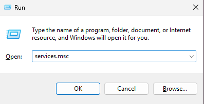

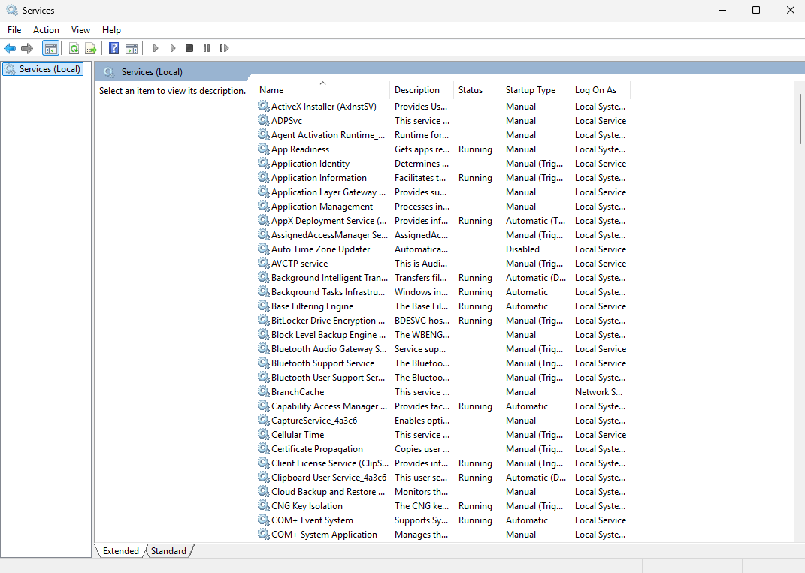

### Registro de Windows (`regedit`)

Base de datos jerárquica que almacena toda la configuración del sistema y aplicaciones. Es un vector crítico para la **persistencia** del malware, que suele abusar de las llaves `Run` y `Run Once` para ejecutarse en cada inicio. Es imperativo restringir el acceso al editor de registro para evitar alteraciones no autorizadas en la seguridad del sistema.

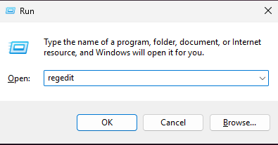

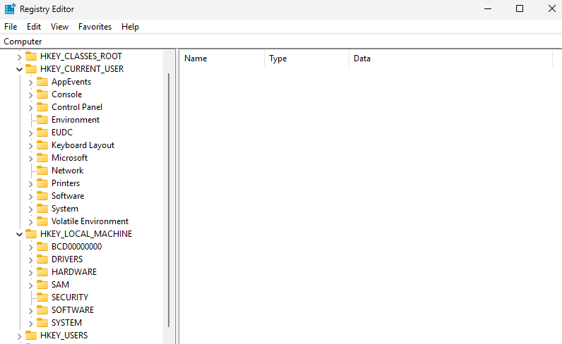

### Visor de Eventos (`eventvwr`)

Repositorio centralizado de logs que registra todo lo que ocurre en el equipo. Los atacantes lo analizan para perfilar el sistema, mientras que los defensores lo usan para detectar anomalías.

* **Aplicación:** Eventos de software instalado.

* **Sistema:** Logs de componentes del SO y hardware.

* **Seguridad:** Registro de autenticaciones y uso de privilegios.

* **Ubicación técnica:** Los logs se almacenan por defecto en `C:\WINDOWS\system32\config\`.

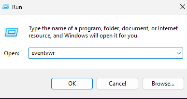

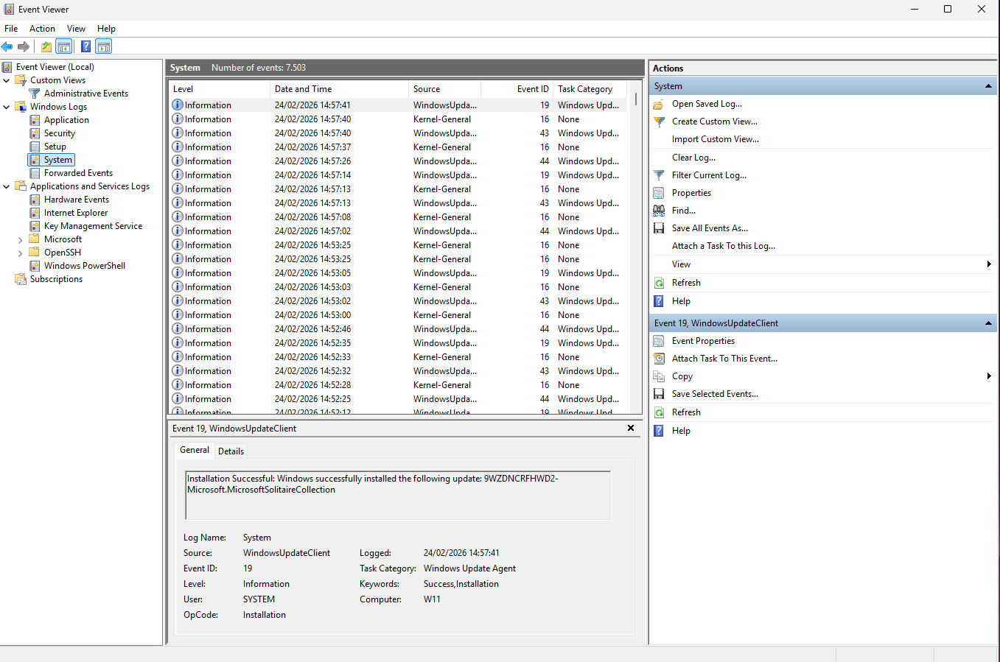

### Telemetría

Sistema de recolección de datos de Microsoft operado por el servicio **Connected User Experiences and Telemetry** (técnicamente `DiagTrack` vía `diagtrack.dll`). Los datos se cifran en `%ProgramData%\Microsoft\Diagnosis` antes de enviarse. En sistemas bastionados, este servicio se limita o desactiva para prevenir la exposición de metadatos operativos.

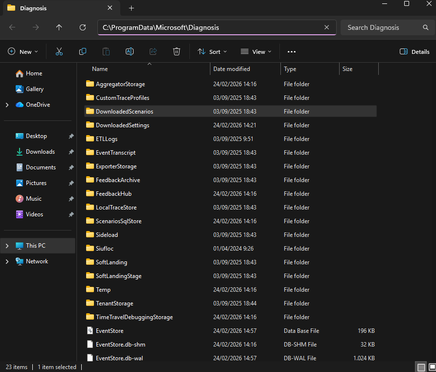
---

## 2. Identity & Access Management (IAM)

La gestión de identidades y accesos asegura que solo los usuarios autenticados e íntegros interactúen con el sistema. En Windows, esto se basa en la separación de funciones y el control estricto de privilegios.

### 2.1 Cuentas Estándar vs. Administrador

El bastionado exige la distinción clara entre tipos de cuenta para reducir el radio de exposición:

* **Cuenta de Administrador:** Reservada exclusivamente para tareas de gestión (instalación de software, edición del registro, gestión de servicios).

* **Cuenta Estándar:** Destinada a tareas rutinarias (navegación, ofimática). 

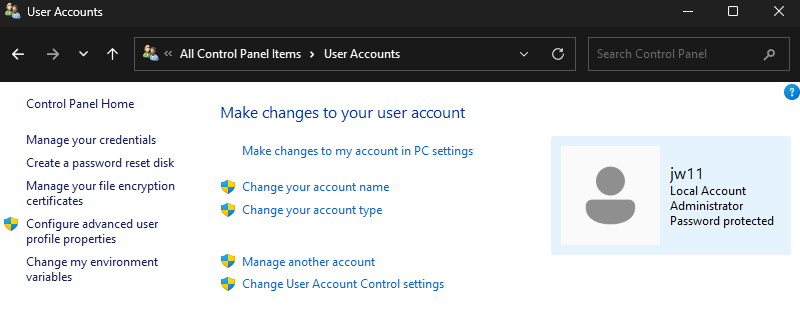

* **Windows Hello:** Implementa autenticación multifactor (MFA) mediante biometría o dispositivos físicos, superando la debilidad de las contraseñas tradicionales.

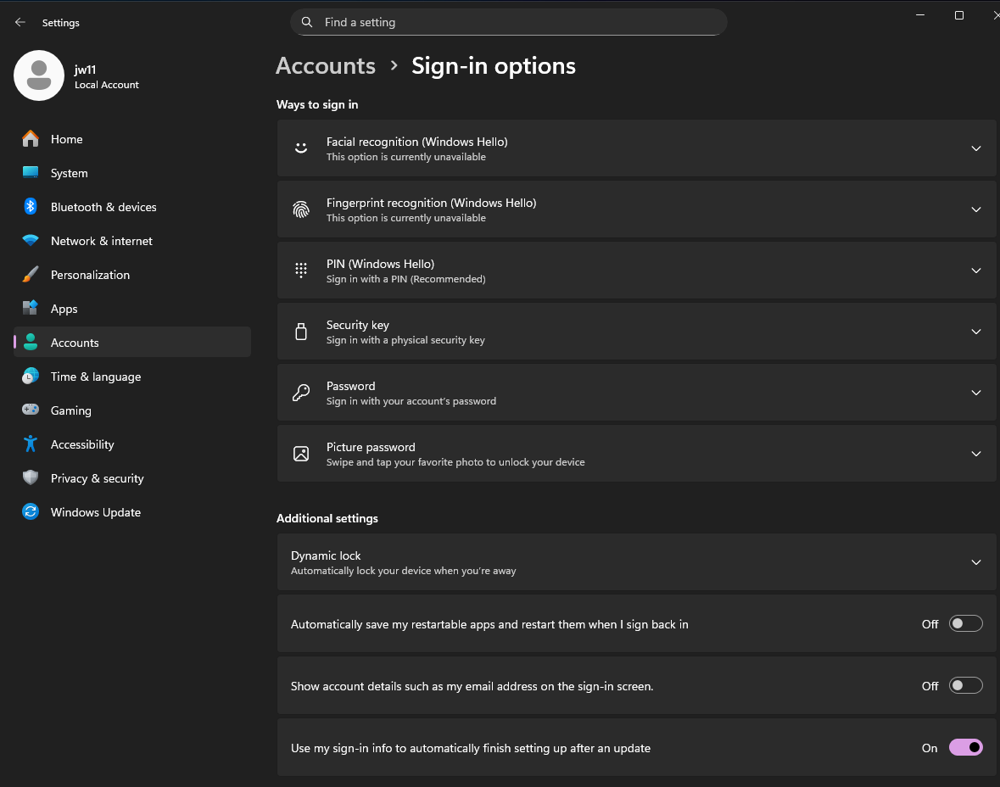

### 2.2 User Account Control (UAC)

UAC es una característica de seguridad que obliga a que todas las aplicaciones se ejecuten en un contexto de no-administrador por defecto.

* **Funcionamiento:** Si una acción requiere privilegios elevados (modificar el firewall, instalar drivers), el sistema solicita confirmación o credenciales.

* **Principio de Menor Privilegio:** Un sujeto debe poseer solo los permisos mínimos necesarios para realizar su función.

* **Configuración Recomendada:** El nivel de notificación debe ser siempre **"Always Notify"** (Notificar siempre).

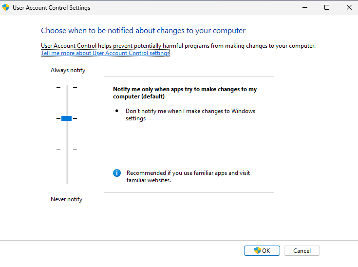

### 2.3 Directivas de Grupo y Políticas de Contraseñas

El **Group Policy Editor** (`gpedit.msc`) es la herramienta central para el bastionado en versiones Pro y Enterprise. 

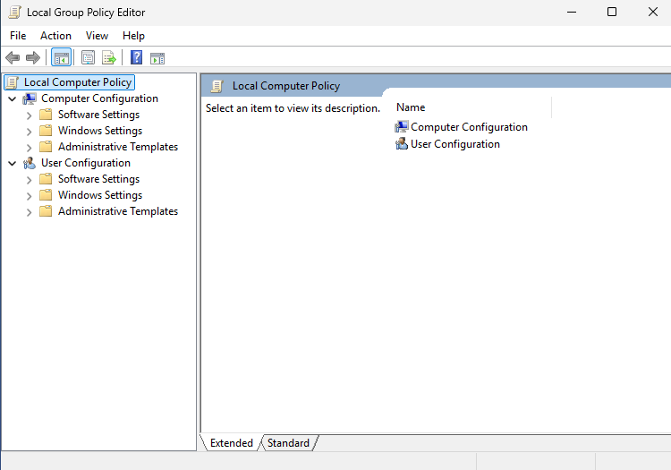

Es vital configurar políticas robustas en `Security settings > Account Policies > Password policy`:

* **Complejidad:** Exigir mayúsculas, minúsculas, números y símbolos.

* **Diccionarios:** Validar contraseñas contra bases de datos de claves filtradas.

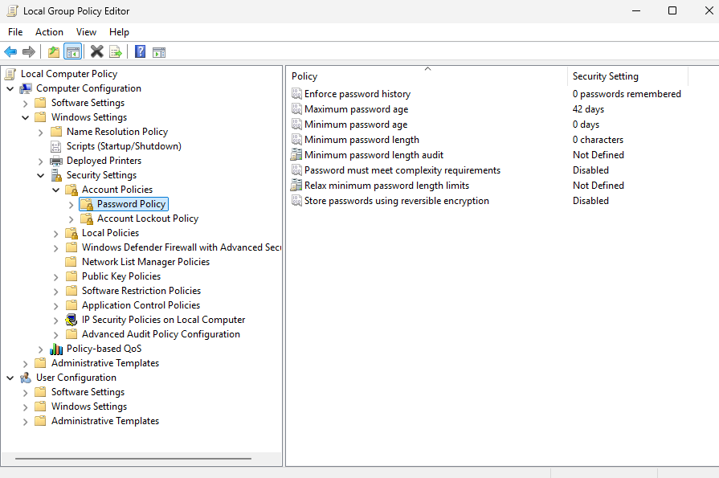

### 2.4 Política de Bloqueo de Cuenta (Lockout Policy)

Para mitigar ataques de fuerza bruta (adivinación de contraseñas), se configura el bloqueo automático en `Security settings > Account Policies > Account Lockout Policy`:

* **Umbral de bloqueo:** Se recomienda un máximo de **3 intentos fallidos**.

* **Duración:** Establecer un tiempo de bloqueo (ej. 1 hora) para neutralizar herramientas de cracking automatizado.

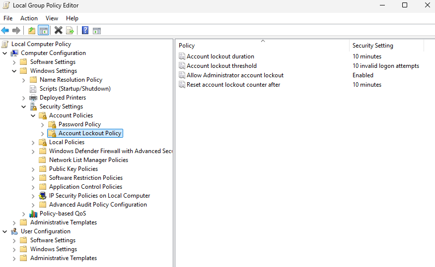

---

## 3. Network Management

La seguridad de red en el host busca minimizar la exposición de la máquina a ataques externos mediante el control del tráfico, la desactivación de protocolos obsoletos y la protección de los mecanismos de resolución de nombres.

### 3.1 Windows Defender Firewall (`WF.msc`)

El firewall de Windows actúa como la primera línea de defensa filtrando el tráfico entrante y saliente. 

* **Perfiles de Red:** Windows utiliza tres perfiles (Dominio, Privado y Público). En redes domésticas o de confianza, el perfil Privado debe estar activo con la opción "Bloquear conexiones entrantes".

* **Política de Denegación por Defecto (Default Deny):** Se debe configurar el firewall para bloquear todo el tráfico entrante y solo permitir excepciones específicas (Whitelist).

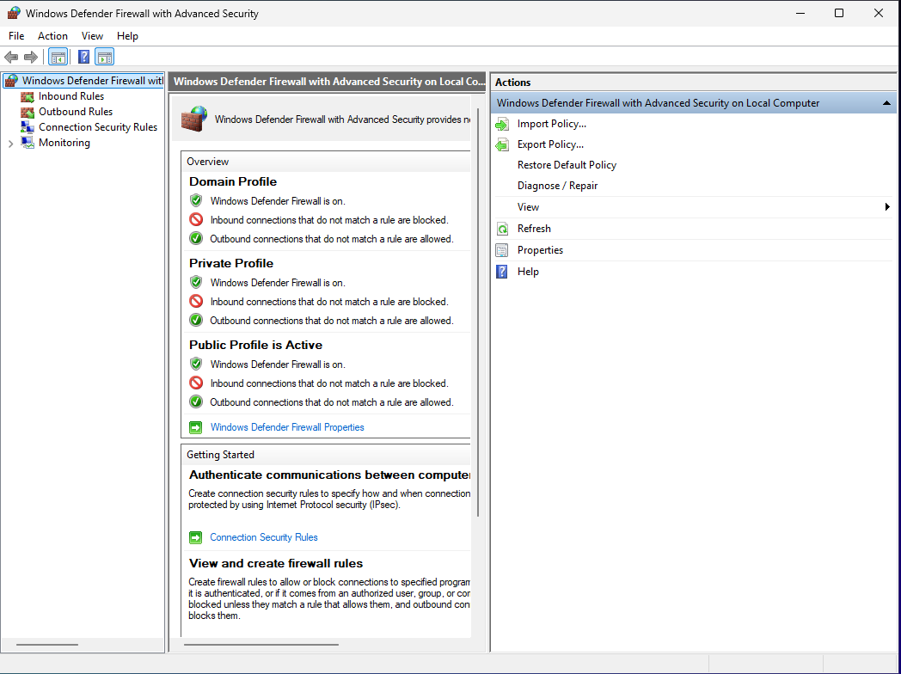

### 3.2 Deshabilitar Dispositivos y Protocolos Innecesarios

Reducir la superficie de ataque implica eliminar puntos de entrada que no se utilicen:

* **Interfaces de Red:** Deshabilitar adaptadores WiFi o Ethernet no utilizados en el Administrador de Dispositivos (`devmgmt.msc`).

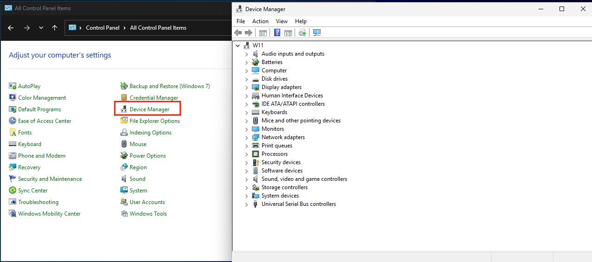

* **Protocolo SMBv1:** Este protocolo de intercambio de archivos es altamente vulnerable (explotado en ataques como WannaCry). Si el equipo no requiere compartir archivos en red, se debe deshabilitar mediante PowerShell:
  `Disable-WindowsOptionalFeature -Online -FeatureName SMB1Protocol`

### 3.3 Protección de DNS y ARP

Los atacantes pueden manipular la resolución de nombres y direcciones para realizar ataques de Man-in-the-Middle (MitM).

* **Archivo `hosts`:** Ubicado en `C:\Windows\System32\Drivers\etc\hosts`, actúa como un DNS local. Debe supervisarse para evitar que el malware redirija tráfico legítimo a servidores de Mando y Control (C2).

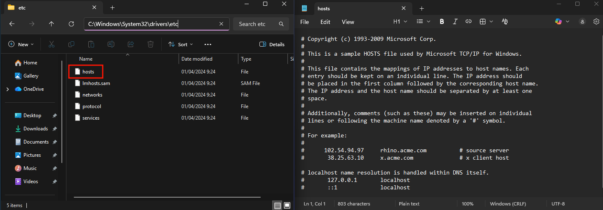

* **Protección ARP:** El protocolo ARP carece de autenticación. Se puede verificar la caché ARP con el comando `arp -a`. Si una dirección MAC aparece duplicada para diferentes IPs, el sistema podría estar bajo un ataque de **ARP Poisoning**. Para mitigar riesgos inmediatos, se puede limpiar la caché con `arp -d`.

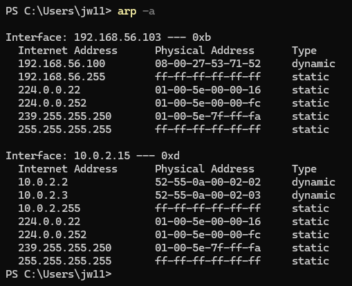

### 3.4 Control de Acceso Remoto (RDP)

El protocolo de escritorio remoto (RDP) es un vector crítico de ataque (ej. vulnerabilidad BlueKeep). 

* **Acción:** Si no es estrictamente necesario para la administración, debe deshabilitarse en `Settings > Remote Desktop`.

* **Hardening:** En caso de requerirse, debe limitarse a usuarios específicos y utilizar Network Level Authentication (NLA).

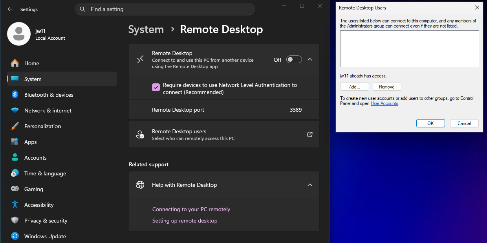

---

## 4. Application Management

La gestión de aplicaciones se centra en controlar qué software puede ejecutarse en el sistema y asegurar que las herramientas de uso diario (navegadores y suites ofimáticas) no se conviertan en vectores de compromiso.

### 4.1 Instalación de Software Seguro

Para mitigar la ejecución de troyanos ocultos en instaladores de terceros, se debe restringir el origen de las aplicaciones.
* **Configuración:** En `Settings > Apps > Advanced app settings`, seleccionar **"The Microsoft Store only"**. Esto garantiza que el software ha sido validado por Microsoft antes de su distribución.

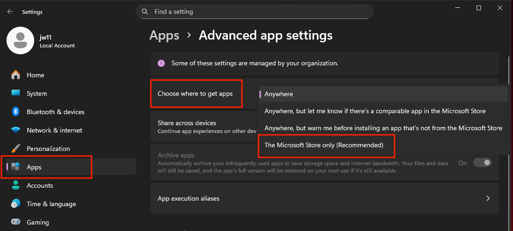

### 4.2 Windows Defender Antivirus

Integrado en el Centro de Seguridad de Windows, ofrece cuatro capas de protección fundamentales:

* **Real-time protection:** Escaneo continuo del sistema y procesos activos.

* **Browser integration:** Análisis de archivos descargados en tiempo real.

* **Application Guard:** Ejecución de sesiones de navegación en un espacio aislado (sandbox) para evitar cambios no autorizados en el SO.

* **Controlled Folder Access:** Protege áreas críticas de la memoria y carpetas específicas contra el acceso de aplicaciones no autorizadas (vital contra el Ransomware).

### 4.3 Hardening de Microsoft Office

La suite de Office es frecuentemente explotada mediante macros, applets de Flash y vinculación de objetos (OLE) para lograr la Ejecución Remota de Código (RCE).

* **Medida de Bastionado:** Deshabilitar macros por defecto o aplicar reglas de **Attack Surface Reduction (ASR)** de Microsoft. En entornos donde las macros son necesarias (ej. banca), se deben permitir solo aquellas firmadas digitalmente por editores de confianza.

### 4.4 AppLocker

Es una característica avanzada que permite definir reglas para permitir o bloquear la ejecución de ejecutables (`.exe`), scripts (`.ps1`, `.vbs`) e instaladores (`.msi`).

* **Reglas de Publicador:** Permite bloquear o permitir aplicaciones basándose en la firma digital del desarrollador, lo que impide la ejecución de software no firmado o alterado.

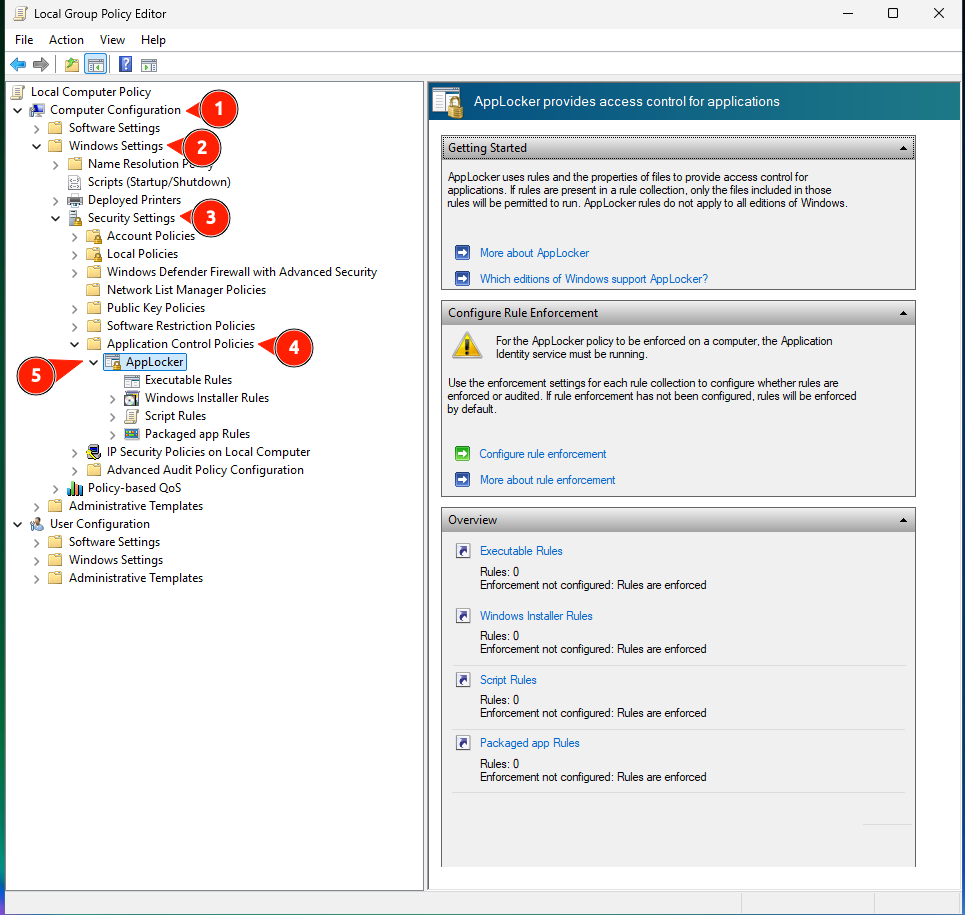

### 4.5 Seguridad en el Navegador (Microsoft Edge)

El navegador es a menudo el punto de entrada para el movimiento lateral y el malware.

* **Microsoft SmartScreen:** Servicio de reputación que verifica sitios web y descargas contra una base de datos de amenazas conocida en `Windows Security > App & Browser Control`.

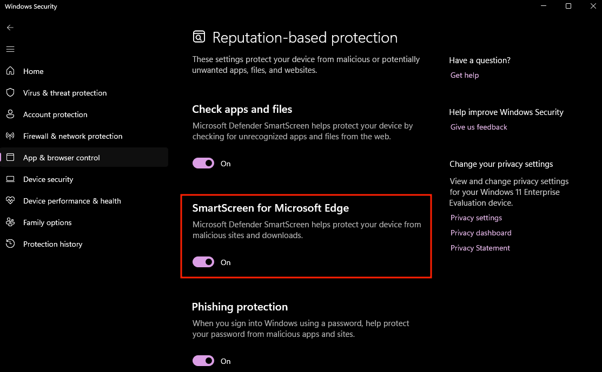

* **Prevención de Seguimiento:** En la configuración de Edge, establecer la **"Tracking prevention"** en el nivel **Strict** para bloquear rastreadores, anuncios maliciosos y cookies de terceros.

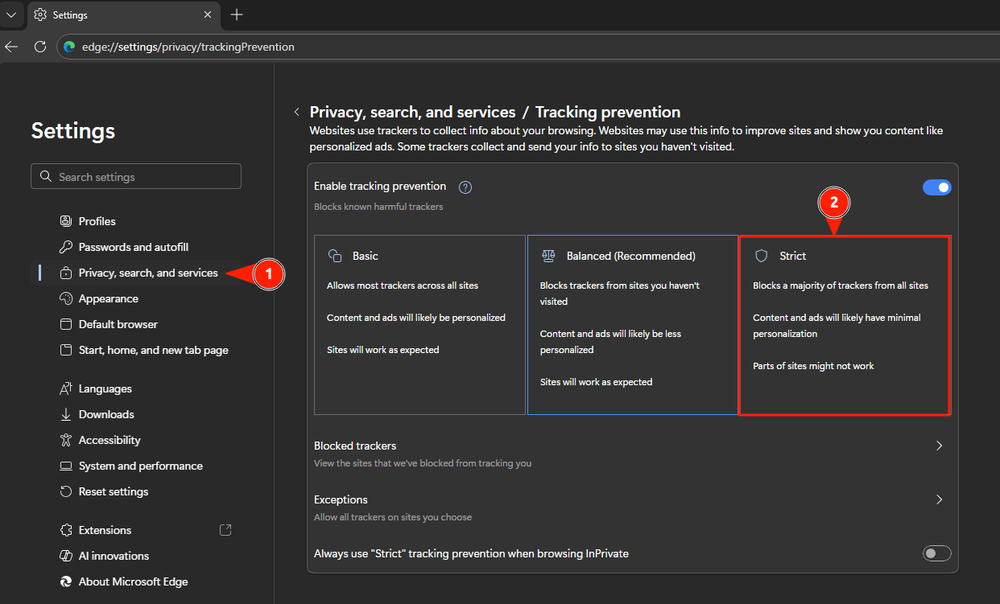

## 5. Storage & Compute

La seguridad del almacenamiento y del proceso de arranque garantiza la integridad de los datos en reposo y la confianza en el software que se ejecuta desde el encendido del equipo.

### 5.1 Cifrado de Datos con BitLocker

BitLocker es la herramienta nativa de Windows para el cifrado de disco completo, protegiendo los datos contra accesos físicos no autorizados.

* **Requisitos:** Requiere un chip **TPM (Trusted Platform Module)** para almacenar las claves de cifrado de forma segura en el hardware.

* **Gestión de Claves:** Es imperativo almacenar la clave de recuperación en un lugar seguro y externo al equipo cifrado.

* **Configuración:** Se gestiona desde `Control Panel > System and Security > BitLocker Drive Encryption`.

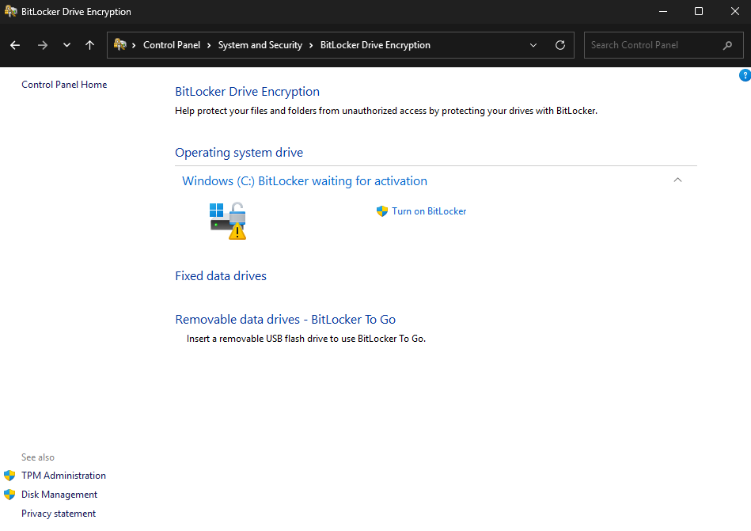

### 5.2 Windows Sandbox

Proporciona un entorno de escritorio ligero y aislado para ejecutar aplicaciones de forma segura sin afectar al sistema anfitrión.

* **Funcionamiento:** Es un entorno volátil; al cerrar el Sandbox, todos los archivos, software y estados se eliminan permanentemente.

* **Uso en Bastionado:** Se recomienda para analizar archivos sospechosos o probar software antes de su instalación definitiva en el SO base.

* **Habilitación:** Requiere virtualización activa en la BIOS/UEFI y se activa en `Turn Windows features on or off > Windows Sandbox`.

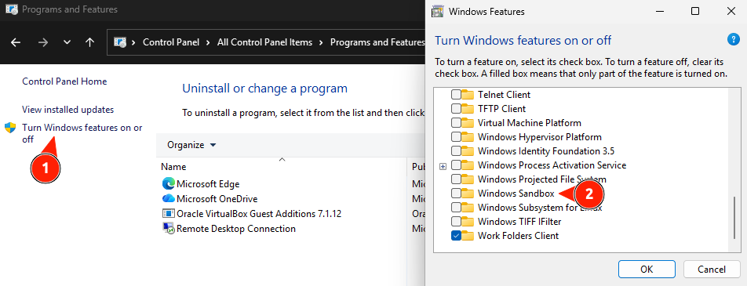

### 5.3 Windows Secure Boot

Secure Boot es un estándar de seguridad que asegura que el sistema se inicie utilizando únicamente software (firmware, cargadores de arranque y drivers) en el que el fabricante confía.

* **Protección:** Evita que rootkits o malware de bajo nivel tomen el control del PC antes de que el sistema operativo cargue sus propias defensas.

* **Verificación:** Se puede comprobar su estado ejecutando `msinfo32` y buscando la entrada "Secure Boot State".

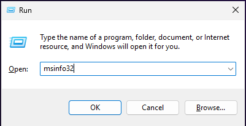

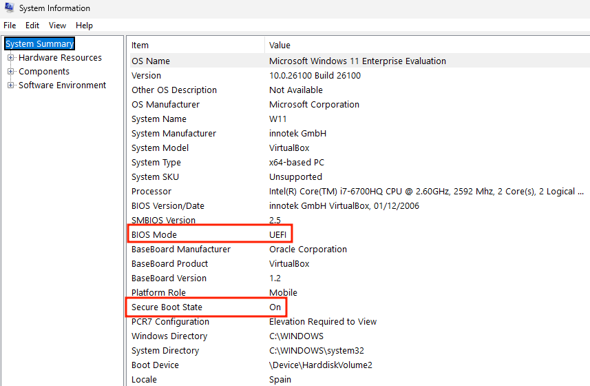

### 5.4 Copias de Seguridad (File History)

La última línea de defensa ante desastres (fallos de hardware o ataques de ransomware) es una política de backups robusta. En Windows 11, esta función se mantiene como una herramienta heredada.

* **File History:** Realiza copias de seguridad automáticas de los archivos de tus bibliotecas (Documentos, Imágenes, Escritorio, etc.) en una unidad externa o ubicación de red.

* **Configuración en Windows 11:** 

1. Abre el **Panel de Control**.
2. Ve a **Sistema y seguridad**.
3. Haz clic en **Historial de archivos**.
4. Conecta una unidad externa y haz clic en **Activar**.

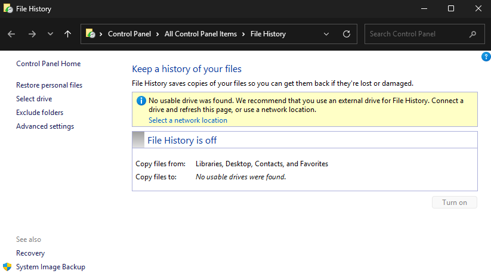

* **Nota de Bastionado:** A diferencia de Windows 10, Windows 11 no permite añadir carpetas personalizadas fácilmente desde "Configuración". Se recomienda usar el Panel de Control para gestionar las exclusiones y la frecuencia de las copias en "Configuración avanzada".

---

## 6. Mantenimiento y Actualizaciones

Un sistema bastioneado requiere una vigilancia constante frente a nuevas vulnerabilidades (CVE) que los atacantes descubren y explotan continuamente. El parcheo de seguridad es la contramedida más crítica en este ciclo de vida.

### 6.1 Windows Update

La instalación inmediata de parches de seguridad es vital para cerrar brechas antes de que sean explotadas masivamente.

* **Automatización:** Se debe configurar el sistema para que descargue e instale automáticamente las actualizaciones en `Settings > Update & Security > Windows Update`.

* **Reducción de Riesgos:** Los usuarios que ejecutan versiones obsoletas de Windows están expuestos a amenazas conocidas para las cuales ya existe una solución, pero que no ha sido aplicada por falta de mantenimiento.

* **Prioridad:** Los parches calificados como "Críticos" o de "Seguridad" deben tener prioridad absoluta sobre las actualizaciones de características o mejoras estéticas.

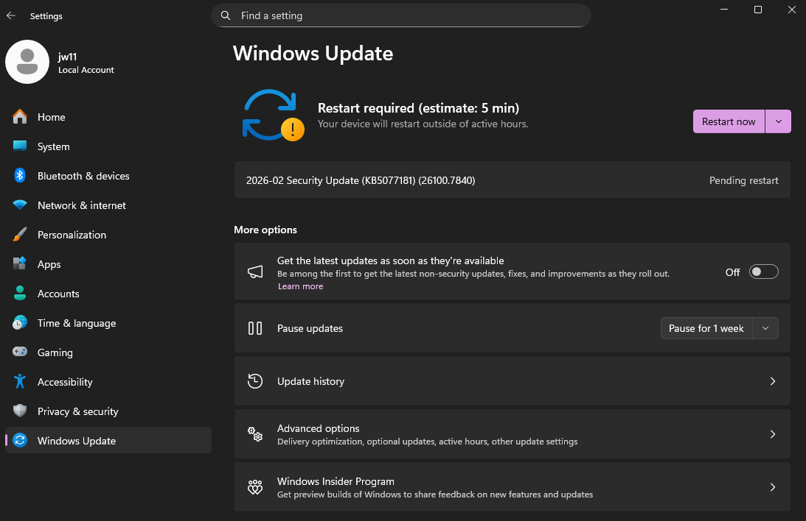

## 7. Resumen de Herramientas para el Bastionado

| Herramienta | Comando / Ruta | Función Principal |
| :--- | :--- | :--- |
| **Editor de Registro** | `regedit` | Configuración avanzada del sistema. |
| **Servicios** | `services.msc` | Gestión de procesos en segundo plano. |
| **Visor de Eventos** | `eventvwr` | Auditoría y análisis de logs de seguridad. |
| **Firewall Avanzado** | `WF.msc` | Control detallado de tráfico de red. |
| **Directiva de Grupo** | `gpedit.msc` | Aplicación de políticas de seguridad (Pro/Ent). |
| **Información Sistema** | `msinfo32` | Verificación del estado de Secure Boot. |
| **PowerShell (Admin)** | `Disable-WindowsOptionalFeature` | Desactivación de protocolos como SMBv1. |

## 8. Resumen Visual de Bastionado (Cheat Sheet)

El siguiente esquema resume las acciones críticas realizadas para el endurecimiento del sistema Windows 11, categorizadas por capas de defensa:

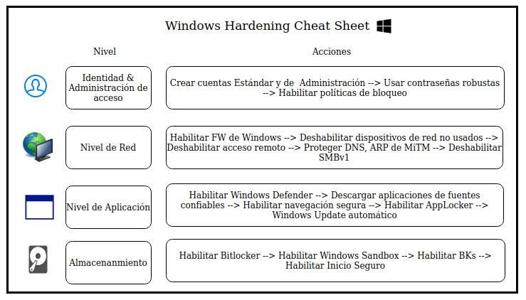