# Principios de Bastionado en Active Directory

Active Directory (AD) es el núcleo de gestión y gobernanza para identidades y dispositivos en infraestructuras corporativas. El bastionado (hardening) en entornos Windows Server 2019 o posterior es una disciplina crítica para reducir la superficie de ataque y garantizar la resiliencia del dominio ante compromisos avanzados. Este proceso se fundamenta en la implementación de métodos de autenticación robustos, la gestión centralizada de seguridad mediante GPOs y la adopción estricta del modelo de privilegio mínimo para mitigar movimientos laterales.

---

# 1. Conceptos Estructurales y Relaciones de Confianza en AD

Active Directory se organiza mediante una jerarquía lógica compuesta por dominios, árboles y bosques, donde el **Dominio** es la unidad central que almacena la información crítica de sus objetos. El **Controlador de Dominio (DC)** actúa como el núcleo de inteligencia, gestionando la autenticación de usuarios y la autorización de recursos en toda la red.

La interconexión de estos elementos se define mediante:


* **Trees (Árboles):** Conjuntos de dominios que comparten un espacio de nombres contiguo y recursos. La comunicación se establece mediante relaciones de confianza entre dominios "padre" e "hijo".

* **Forests (Bosques):** El contenedor de mayor nivel que agrupa múltiples árboles. Comparten un catálogo global, esquema de directorio y configuración común. La comunicación entre distintos bosques requiere una confianza a nivel de bosque.

* **Trusts (Confianzas):** Puentes de comunicación que gobiernan el intercambio de recursos. Se clasifican según:

    * **Características:** *Transitivas* (si A confía en B y B en C, A confía en C) o *No transitivas*.

    * **Dirección:** *Unidireccionales* (One-way) o *Bidireccionales* (Two-way).

* **Objetos (Containers y Leaves):** En AD, todo es un objeto. Un objeto que contiene a otros (como una OU) es un **Container**, mientras que un objeto final que no contiene otros (como un usuario o impresora) se denomina **Leaf**.

Para gestionar estas relaciones, se accede a través de: **Server Manager** > **Tools** > **Active Directory Domains and Trusts**.

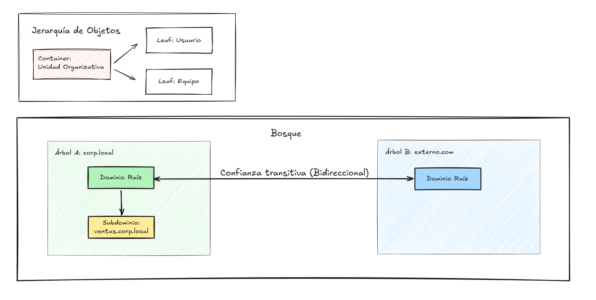

---

# 2. Métodos de Autenticación

Este bloque detalla el refuerzo de la seguridad en la comunicación y la integridad de datos mediante el **Group Policy Management Editor (GPMC)**, centrándose en deshabilitar protocolos legados y robustecer la validación de identidades.

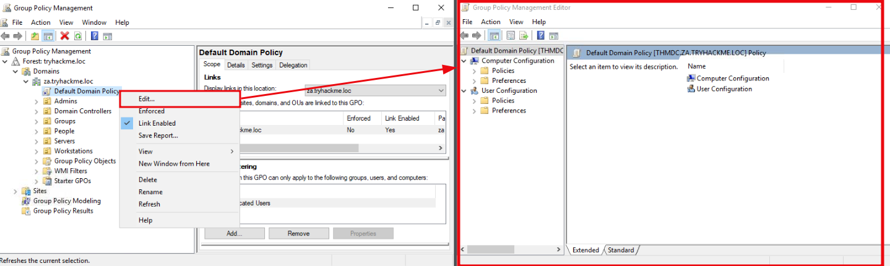

### 2.1 Gestión de Hashes de Contraseña (LM Hash)

Windows genera dos tipos de hashes para contraseñas de menos de 15 caracteres: **LM** (extremadamente débil) y **NT**.

* **Acción:** Impedir que Windows almacene el hash LM.

    * **Ruta GPO:** `Computer Configuration > Policies > Windows Settings > Security Settings > Local Policies > Security Options`

    * **Directiva:** `Network security: Do not store LAN Manager hash value on next password change` -> **Enabled**.

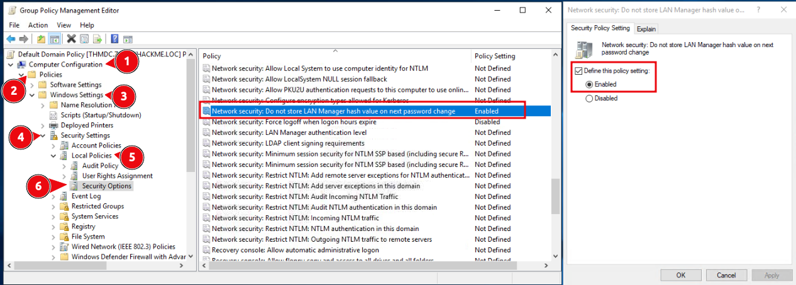

### 2.2 Integridad de Protocolos (SMB y LDAP Signing)

Para mitigar ataques de **Man-in-the-Middle (MiTM)** y de retransmisión, es vital obligar a la firma digital del tráfico:

* **SMB Signing:** Asegura la integridad del tráfico de archivos e impresión.
    
    * **Ruta:** `Computer Configuration > Policies > Windows Settings > Security Settings > Local Policies > Security Options`
    
    * **Directiva:** `Microsoft network server: Digitally sign communications (always)` -> **Enabled**.

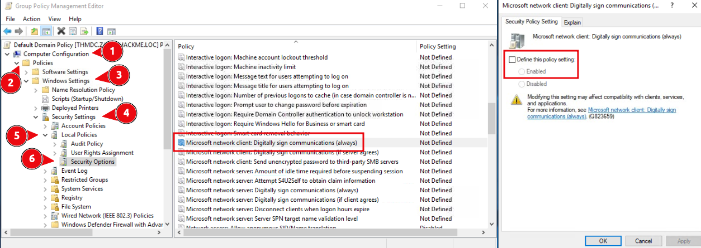

* **LDAP Signing:** Utiliza SASL para rechazar solicitudes LDAP que no estén firmadas o cifradas.
    
    * **Ruta:** `Computer Configuration > Policies > Windows Settings > Security Settings > Local Policies > Security Options`
    
    * **Directiva:** `Domain controller: LDAP server signing requirements` -> **Require signing**.

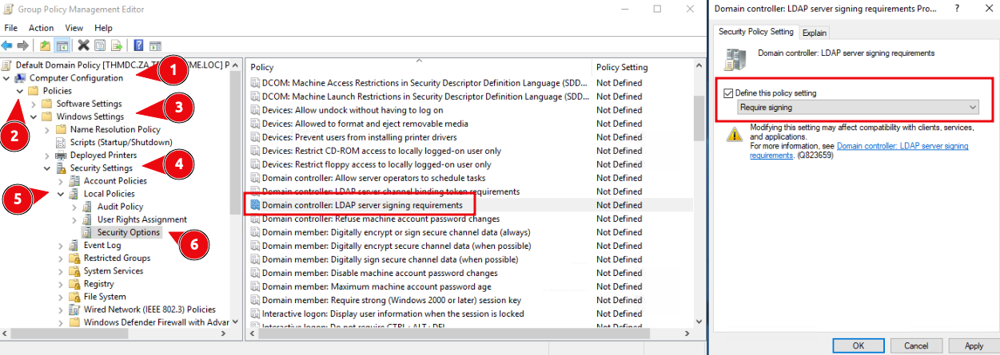

### 2.3 Estrategias de Rotación de Contraseñas

Para gestionar cuentas de servicio y evitar vulnerabilidades por contraseñas estáticas se proponen tres técnicas:

1.  **Scripts de PowerShell:** Automatización mediante tareas programadas (conlleva mayor carga de mantenimiento).

2.  **MFA (Multi-Factor Authentication):** Añade una capa de seguridad extra que permite flexibilizar la frecuencia de cambio.

3.  **gMSAs (Group Managed Service Accounts):** Solución nativa recomendada que gestiona y rota contraseñas automáticamente cada 30 días.

### 2.4 Directivas de Contraseñas (Password Policies)

Configuración de reglas de complejidad y vigencia en:

`Computer Configuration > Policies > Windows Settings > Security Settings > Account Policies > Password Policy`.

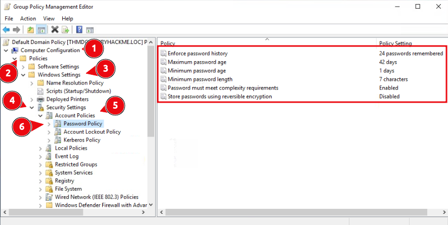

| Configuración | Recomendación de Bastionado |
| :--- | :--- |
| **Enforce password history** | Prevenir el uso de las últimas **10 a 15** contraseñas. |
| **Minimum password length** | Configurar una longitud de entre **10 y 14** caracteres. |
| **Password complexity** | **Enabled** (Debe incluir mayúsculas, minúsculas, números y símbolos; prohibido usar el nombre de cuenta). |

---

# 3. Implementación del Modelo de Privilegio Mínimo

La implementación del modelo de privilegio mínimo (Least Privilege) es fundamental para reducir la superficie de ataque, limitando el acceso de usuarios y aplicaciones únicamente a lo estrictamente necesario para su función.

### 3.1 Tipos de Cuentas en AD

Para un bastionado efectivo, es necesario clasificar y separar las identidades según su propósito:

* **User accounts (Cuentas de usuario):** Cuentas estándar para tareas cotidianas. Deben ser la norma para la mayoría de la red.

* **Privilege accounts (Cuentas privilegiadas):** Cuentas con derechos elevados. Se subdividen en primer y segundo nivel de privilegios.

* **Shared accounts (Cuentas compartidas):** Uso limitado (ej. visitantes). **No recomendadas**; deben usarse bajo supervisión y por tiempo limitado.

### 3.2 Control de Acceso Basado en Roles (RBAC)

El RBAC permite indicar privilegios de acceso a niveles granulares (zonas DNS, servidores o registros). Determina quién tiene control sobre la creación, edición y eliminación de recursos en Active Directory, asegurando que cada módulo o proceso acceda solo a su información legítima.

### 3.3 Modelo de Acceso por Niveles (Tiered Access Model)

El Tiered Model separa los activos de AD en capas lógicas para prevenir la escalada de privilegios y proteger las identidades de mayor valor.


* **Tier 0:** Nivel máximo. Incluye Controladores de Dominio, cuentas de Administrador de Dominio y grupos de alta jerarquía.

* **Tier 1:** Servidores y aplicaciones miembros del dominio (ej. servidores de archivos, bases de datos).

* **Tier 2:** Dispositivos de usuario final (ej. estaciones de trabajo de RRHH, ventas y personal no IT).

> **Regla de Oro:** Se deben usar GPOs para evitar que las credenciales privilegiadas (Tier 0) crucen fronteras hacia niveles inferiores (Tier 1 o 2), ya sea de forma accidental o intencionada.


### 3.4 Auditoría de Cuentas

Es vital realizar auditorías periódicas para mantener la integridad del modelo de privilegios:

1.  **Usage Audit (Uso):** Monitorea las tareas específicas de cada cuenta y valida sus derechos de acceso.

2.  **Privilege Audit (Privilegios):** Verifica que cada cuenta mantenga solo el privilegio mínimo necesario.

3.  **Change Audit (Cambios):** Busca modificaciones no autorizadas en permisos, contraseñas o configuraciones que puedan derivar en brechas de datos.

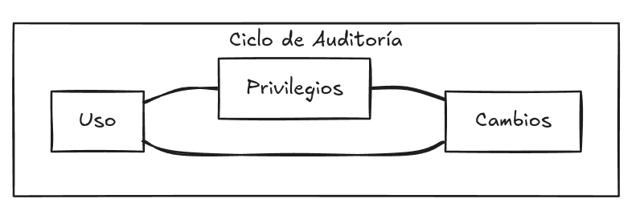

---

# 4. Microsoft Security Compliance Toolkit (MSCT)

El **Microsoft Security Compliance Toolkit (MSCT)** es un conjunto de herramientas oficiales diseñadas para implementar, gestionar y validar líneas base (baselines) de seguridad a nivel local y de dominio, eliminando la necesidad de scripts complejos.

### 4.1 Instalación de Security Baselines

Microsoft proporciona configuraciones de seguridad predefinidas en formatos consumibles como copias de seguridad de objetos de política de grupo (GPO Backups).

* **Proceso de obtención:** Se descargan desde el sitio oficial de Microsoft como archivos `.zip`.

* **Implementación:**

    1.  Extraer el contenido del archivo zip.

    2.  Navegar a la carpeta `Scripts`.

    3.  Seleccionar el baseline deseado y ejecutarlo mediante **PowerShell**.

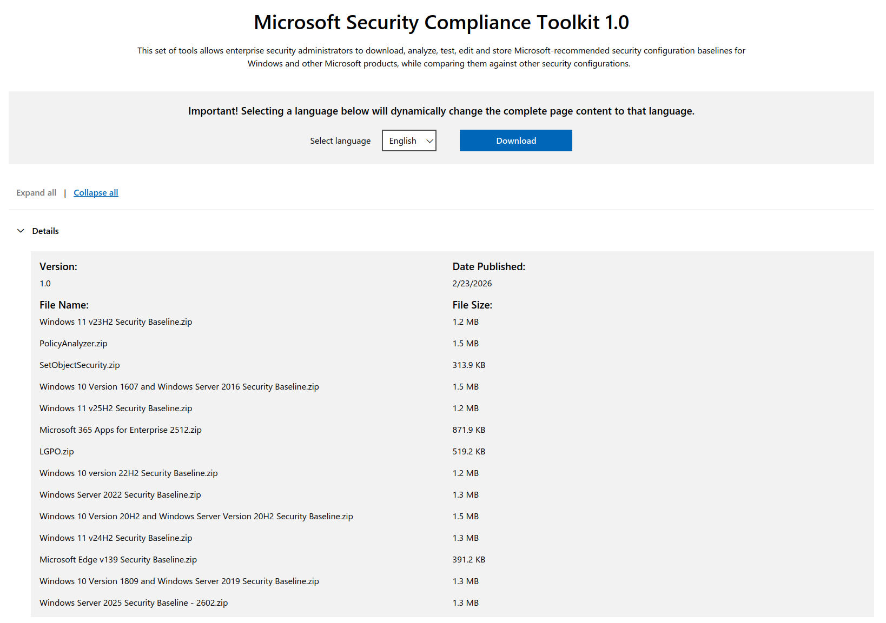

### 4.2 Policy Analyzer

Es una utilidad dentro del MSCT que permite comparar conjuntos de GPOs para identificar:

* **Inconsistencias:** Configuraciones contradictorias entre diferentes políticas.

* **Redundancias:** Ajustes repetidos que no aportan valor.

* **Alteraciones:** Cambios necesarios entre versiones de políticas.

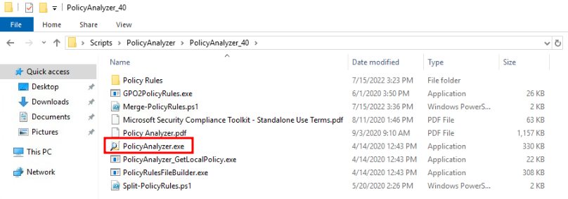

**Uso práctico:**

1.  Ejecutar el archivo `PolicyAnalyzer.exe`.

2.  Añadir las políticas locales o de dominio para realizar la comparativa visual.

3.  Resolver conflictos antes de que las directivas se apliquen en producción.

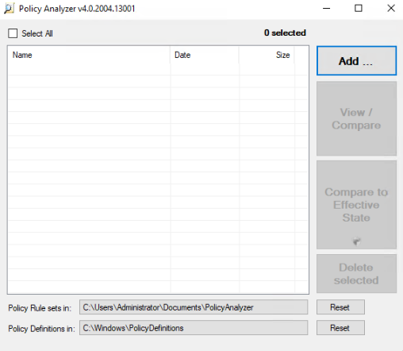

### 4.3 Recomendaciones de Seguridad

> **Nota crítica:** Por motivos de integridad y para evitar ataques de cadena de suministro, las baselines de seguridad **solo deben descargarse desde el sitio web oficial de Microsoft**.

---

# 5. Protección contra Ataques Conocidos en Active Directory

El compromiso de una cuenta de Administrador de Dominio representa un riesgo crítico de seguridad. Para defender la infraestructura, es esencial adoptar una mentalidad ofensiva y entender las técnicas de explotación más comunes para aplicar medidas preventivas efectivas.

### 5.1 Técnicas de Explotación de Kerberos

* **Kerberoasting:** Un atacante solicita un ticket de servicio (TGS) de Kerberos para cuentas de servicio, con el fin de extraer el hash de la contraseña y crackearlo offline.

    * **Detección:** Difícil, ya que utiliza tráfico legítimo.

    * **Mitigación:** Implementar **MFA** y forzar **rotaciones frecuentes** de las contraseñas de las cuentas de servicio del KDC.

* **AS-REP Roasting:** Enfocado en cuentas de usuario que no requieren preautenticación Kerberos. El atacante solicita el hash y lo crackea offline.

    * **Mitigación:** Deshabilitar la opción *"Do not require Kerberos preauthentication"* en las cuentas de usuario y asegurar contraseñas fuertes.

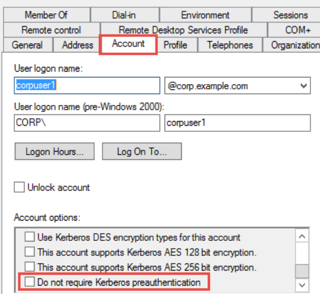

### 5.2 Pass-the-Hash (PtH)

Técnica donde el atacante utiliza un hash de contraseña NTLM robado para autenticarse en otros sistemas sin necesidad de crackear la contraseña en texto plano.

* **Mitigación:**

    * **Restricted Admin Mode para RDP:** Evita el almacenamiento de credenciales en la memoria RAM del equipo destino durante una sesión RDP.
        
        * **Activación (GPO):** `Computer Configuration > Administrative Templates > System > Credentials Delegation` > *Restrict delegation of credentials to remote servers* -> **Enabled** (Require Restricted Admin).

    * **LAPS (Local Administrator Password Solution):** Gestiona y rota automáticamente la contraseña del administrador local de cada equipo, almacenándola de forma segura en AD.
        
        * **Activación:** Instalar el MSI de LAPS en los equipos cliente y configurar vía GPO: `Computer Configuration > Policies > Administrative Templates > LAPS` > *Enable local admin password management* -> **Enabled**.

### 5.3 Contraseñas Débiles y Fuerza Bruta

Las contraseñas sencillas son el objetivo principal para obtener un acceso inicial.

* **Recomendación:** Implementar políticas de contraseñas fuertes y realizar auditorías periódicas.

* **Protección RDP:** Nunca exponer RDP directamente a Internet. Utilizar VPNs o RD Gateway.

### 5.4 Recursos Compartidos Públicos

Carpetas compartidas sin autenticación permiten movimientos laterales a los atacantes.

* **Acción:** Auditar los recursos compartidos existentes utilizando PowerShell:

    ```powershell
    Get-SmbShare
    # Para verificar qué archivos están abiertos y quién los tiene:
    Get-SmbOpenFile
    ```
* **Mitigación:** Configurar permisos **NTFS** y **Share** estrictos basados en el principio de menor privilegio.

### 5.5 Otros Vectores de Ataque

Es crucial entender que Kerberoasting, AS-REP Roasting y PtH no son los únicos métodos. Los atacantes también utilizan técnicas como **Pass-the-Ticket (PtT)**, **DCSync**, **BloodHound** para mapear rutas de ataque complejas, y ataques basados en **GPO** para persistencia.

---

# 6. Windows Active Directory Hardening Cheat Sheet

El bastionado de Active Directory es un proceso continuo que requiere esfuerzos colectivos y validación constante. Esta guía rápida resume las técnicas clave discutidas para asegurar el entorno.

### Resumen de Técnicas de Bastionado (Cheatsheet)

| Área | Acción de Bastionado | Herramienta |
| :--- | :--- | :--- |
| **Hashes** | Deshabilitar el almacenamiento de LM Hash. | GPO |
| **Protocolos** | Habilitar **SMB Signing** y **LDAP Signing**. | GPO |
| **Contraseñas** | Configurar complejidad (10-14 chars), historial y rotación de cuentas de servicio (gMSA). | GPO |
| **Administración**| Implementar **LAPS** (Local Admin Password Solution) para equipos miembro. | LAPS / GPO |
| **Red** | Deshabilitar **LLMNR** y **NetBIOS** para prevenir Poisoning. | GPO |
| **Privilegios** | Implementar modelo de **Tiered Access** (Separación Tier 0, 1, 2). | GPO / RBAC |
| **Protección** | Implementar **MFA** para accesos críticos y administrativos. | MFA / PIM |
| **Auditoría** | Centralizar logs (**Event ID 4624** - inicio de sesión, **Event ID 4720** - creación de usuario, **Event ID 4672** - asignación de privilegios especiales) y configurar alertas de comportamiento anómalo. | SIEM / Event Log |

> **Nota:** La seguridad de AD no es estática. Se deben revisar periódicamente las directivas utilizando herramientas como el **Microsoft Security Compliance Toolkit (MSCT)** para identificar desviaciones.

---