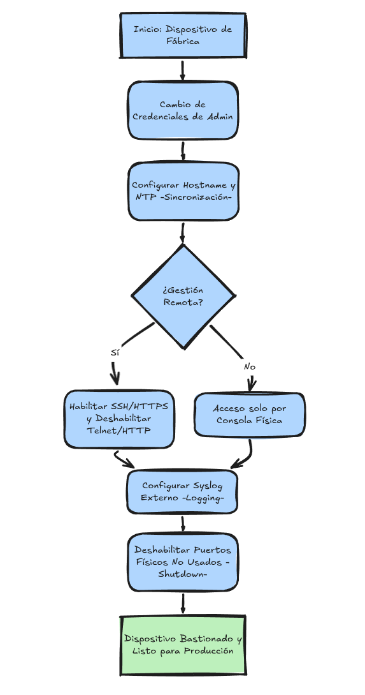

# Bastionado de Dispositivos de Red (Network Device Hardening)

Este módulo se centra en fortalecer la infraestructura que constituye la columna vertebral de cualquier red (switches, routers, firewalls, etc.) para garantizar la tríada **CIA** (Confidencialidad, Integridad y Disponibilidad).

---

## 1. Dispositivos de Red vs. Endpoints

Es fundamental distinguir entre ambos para aplicar las políticas de seguridad correctas:

* **Endpoints (Dispositivos finales):** Generan o consumen datos (Laptops, Smartphones, Servidores, IoT). Se ubican en el borde de la red e interactúan directamente con el usuario.

* **Dispositivos de Red:** Gestionan, filtran y transportan los datos (Switches L2, Routers L3, Load Balancers, VPNs, IPS). Son el "backbone" del sistema.

---

## 2. Amenazas Comunes y Vectores de Ataque

El objetivo del hardening es prevenir accesos no autorizados, aplicar políticas de acceso, evitar el robo de datos y asegurar la disponibilidad continua.

### Tabla de Amenazas y Vectores

| Amenaza | Descripción | Vectores de Ataque |
| :--- | :--- | :--- |
| **Acceso no autorizado** | Control total del dispositivo y, por ende, de la red. | Brute force, explotación de vulnerabilidades (RCE), Phishing/Ingeniería Social. |
| **Denegación de Servicio (DoS)** | Interrupción de dispositivos críticos para dejarlos inoperativos. | Inundación de peticiones (Flooding), manipulación de paquetes, explotación de recursos lógicos. |
| **Man-in-the-Middle (MitM)** | Intercepción de tráfico entre dos partes suplantando identidades. | **ARP Spoofing**, **DNS Spoofing**, Rogue Access Points. |
| **Escalada de Privilegios** | Obtención de derechos de administrador desde una cuenta básica. | Contraseñas débiles (o iguales para user/admin), vulnerabilidades, **errores de configuración**. |
| **Robo de ancho de banda** | Uso no autorizado de recursos (hotlinking) desde sitios externos. | Scraping masivo de datos, ataques de Malware. |

---

## 3. Objetivos del Hardening en Redes

Para mitigar los vectores anteriores, el proceso de bastionado debe centrarse en:

1. **Identificación:** Localizar vulnerabilidades en las configuraciones actuales.

2. **Mitigación:** Aplicar parches y cerrar puertos/servicios innecesarios.

3. **Resiliencia:** Configurar los dispositivos para que puedan resistir ataques activos sin caerse.

---

## 4. Técnicas Generales de Bastionado

Para reducir la **superficie de ataque**, aplicamos controles que limitan los puntos de entrada y fortalecen la identidad.

* **Actualización y Parcheado:** Mantener el firmware/OS y aplicaciones al día para cerrar vulnerabilidades conocidas.

* **Cierre de Servicios e Interfaces:** Deshabilitar cualquier servicio (ej. servicios de descubrimiento como CDP/LLDP si no son necesarios) y puertos físicos que no se utilicen.

* **Mínimo Privilegio (PoLP):** Los usuarios y procesos solo deben tener los permisos estrictamente necesarios.

* **Gestión de Credenciales:** * Cambiar contraseñas por defecto inmediatamente.
    
    * Uso de contraseñas complejas (+10 caracteres).
    
    * Implementar **MFA** (Autenticación Multi-Factor).

* **Backups de Configuración:** Realizar copias de seguridad periódicas para restaurar el servicio rápidamente tras un fallo o ataque.

---

## 5. Gestión de Protocolos y Monitorización

El uso de protocolos seguros garantiza que la administración del dispositivo y el tráfico de datos no puedan ser interceptados.

### 5.1 Protocolos de Comunicación Segura

Es obligatorio sustituir protocolos de texto plano por alternativas con cifrado:

| Protocolo Inseguro (Bloquear) | Alternativa Segura (Usar) | Propósito |
| :--- | :--- | :--- |
| **Telnet** | **SSH** | Consola remota |
| **HTTP** | **HTTPS** | Gestión vía web |
| **FTP** | **SFTP / SCP** | Transferencia de archivos |
| **SNMP v1/v2** | **SNMP v3** | Gestión y alertas |

### 5.2 Controles de Logging y Visibilidad

El registro de eventos es la base para la detección y respuesta ante incidentes.

* **Syslog:** Envío centralizado de registros a un servidor externo (SIEM/Log server).

* **SNMP Traps:** Notificaciones automáticas ante eventos específicos (ej. caída de una interfaz).

* **NetFlow:** Análisis de los flujos de tráfico para detectar comportamientos anómalos.

* **Captura de Paquetes (PCAP):** Análisis forense detallado mediante herramientas como Wireshark.

---
            
## 6. Bastionado de VPN (Caso práctico: OpenVPN)

En entornos de trabajo remoto, la VPN es un punto crítico de entrada. Su bastionado se centra en cifrado fuerte, autenticación segura y la implementación de secreto perfecto hacia adelante (PFS).

### 6.1 Configuración de OpenVPN en Linux

El archivo principal de configuración en Ubuntu se encuentra en `/etc/openvpn/server/server.conf`. Tras cualquier cambio, es necesario reiniciar el servicio:
`sudo systemctl restart openvpn-server@server.service`

### 6.2 Prácticas de Hardening en el Servidor

Para maximizar la seguridad, se deben modificar los siguientes parámetros en el archivo `.conf`:

* **Cifrado de datos (Cipher):** Evitar algoritmos obsoletos (como Blowfish). Se recomienda **AES-256-CBC** o superior para proteger los datos en tránsito.

    * *Config:* `cipher AES-256-CBC`

* **Autenticación de Paquetes (Auth):** Utilizar algoritmos de hash seguros para verificar la integridad de los paquetes. Evitar MD5 o SHA1.

    * *Config:* `auth SHA256`

* **Versión de TLS:** Forzar el uso de versiones modernas de TLS para evitar ataques de degradación (downgrade).

    * *Config:* `tls-version-min 1.2`

* **Usuarios Dedicados:** No ejecutar el servicio como root. Se deben crear usuarios y grupos específicos con permisos limitados.

### 6.3 Perfect Forward Secrecy (PFS)

El **PFS** garantiza que, si una clave de sesión se ve comprometida en el futuro, las sesiones pasadas sigan siendo seguras ya que cada una utiliza una clave única. 

* En OpenVPN se implementa con la directiva `tls-crypt`.

* **Generación de clave:** `sudo openvpn --genkey --secret ta.key`

### 6.4 Resumen de Comandos Útiles

| Acción | Comando |
| :--- | :--- |
| **Editar Configuración** | `sudo nano /etc/openvpn/server/server.conf` |
| **Actualizar Servicio** | `sudo apt upgrade openvpn` |
| **Reiniciar VPN** | `sudo systemctl restart openvpn-server@server.service` |
| **Generar clave PFS** | `openvpn --genkey --secret [nombre_clave].key` |

---
## 7. Bastionado de Routers, Switches y Firewalls

El bastionado de dispositivos de red no es una lista de tareas aisladas, sino un proceso secuencial. El siguiente diagrama de flujo resume la metodología estándar para asegurar un equipo desde su estado de fábrica:

### 7.1 Configuración Base y Auditoría

Al inicializar cualquier dispositivo de red, es crítico configurar los parámetros que permitirán una respuesta ante incidentes efectiva:

* **Sincronización de Tiempo (NTP):** Configurar servidores de hora precisos. Sin una estampa de tiempo coherente, los logs son inútiles para el análisis forense.

* **Identificación (Hostname):** Asignar nombres únicos que sigan una convención de nomenclatura corporativa para evitar confusiones en el monitoreo.

* **Niveles de Logueo:** Activar el registro de eventos con un nivel de severidad adecuado (mínimo *Informational* o *Debug* durante auditorías) y redirigirlos a un servidor Syslog externo.

### 7.2 Hardening de la Interfaz de Gestión

El acceso administrativo es el objetivo principal de un atacante para comprometer toda la red.

* **Cambio de Credenciales por Defecto:** Regla número uno. Las bases de datos de contraseñas de fábrica son públicas; el uso de credenciales por defecto equivale a dejar la puerta abierta.

* **Protocolos de Gestión Seguros:** 

    * **Deshabilitar HTTP/Telnet:** Forzar el uso de **HTTPS** y **SSH**.

    * **Acceso por Llave Pública (SSH Keys):** Siempre que el dispositivo lo permita, priorizar el login mediante llaves SSH en lugar de solo contraseñas.

    * **Restricción de Interfaces:** Limitar el acceso a la gestión solo desde interfaces específicas o VLANs de administración, bloqueando el acceso desde redes de usuarios o Internet.

### 7.3 Control de Servicios y Persistencia

Los atacantes buscan mantener el acceso instalando scripts o binarios maliciosos.

* **Scripts de Inicio (Startup Scripts):** Auditar y deshabilitar cualquier script o servicio automático innecesario (como crontabs o servicios de descubrimiento no utilizados). Esto reduce la superficie de ataque y previene métodos de persistencia.

* **Desactivación de Puertos Físicos:** Apagar administrativamente (`shutdown`) todos los puertos que no estén en uso para evitar intrusiones físicas directas.

### 7.4 Seguridad en Redes Inalámbricas (Wi-Fi)

Si el dispositivo gestiona redes inalámbricas, se deben aplicar controles estrictos:

* **Cifrado Fuerte:** Utilizar **WPA3** (o WPA2-Enterprise si hay servidor RADIUS).

* **Ocultación de SSID:** (Opcional) Deshabilitar el broadcast del SSID para reducir la visibilidad ante escaneos casuales.

* **Segmentación:** Mantener el tráfico Wi-Fi en una VLAN aislada del resto de la infraestructura crítica.

---

## 8. Técnicas Avanzadas y Seguridad Empresarial

En entornos corporativos, la superficie de ataque aumenta debido a la diversidad de equipos. El bastionado debe evolucionar desde la configuración básica hacia el control dinámico del tráfico y la protección de protocolos de Capa 2.

### 8.1 Gestión de Tráfico y Reglas de Firewall

El control del flujo de datos es vital para detener la exfiltración de información hacia servidores de Comando y Control (C2).

* **Reglas de Tráfico (ACLs):** Implementar reglas de "Denegar por defecto". Solo permitir el tráfico hacia IPs y puertos conocidos.

* **Port Forwarding (Reenvío de Puertos):** Debe usarse con extrema precaución. Solo abrir puertos estrictamente necesarios y monitorear qué servicios internos se exponen. Un atacante con acceso al router intentará crear reglas de port forwarding para facilitar su persistencia.

* **Egress Filtering (Filtrado de Salida):** No solo restringir qué entra, sino controlar qué sale de la red para evitar que hosts comprometidos se comuniquen con el exterior.

### 8.2 Monitoreo y Mantenimiento Continuo

* **Análisis de Tráfico en Tiempo Real:** El uso de gráficas y estadísticas de ancho de banda permite detectar picos inusuales de subida (posible exfiltración) o bajada (posible descarga de malware).

* **Tareas Programadas (Cron Jobs):** Auditar periódicamente los archivos de tareas programadas del sistema. Los atacantes suelen insertar scripts aquí para asegurar que su acceso se mantenga tras un reinicio.

* **Actualización de Firmware:** Mantener el firmware y los paquetes de software actualizados para mitigar vulnerabilidades *Zero-Day* o *Known-Exploits*.

---

### 8.3 Mitigación de Ataques de Capa 2 e Infraestructura

Estas técnicas son fundamentales en switches empresariales para evitar ataques de red interna:

| Técnica | Descripción | Amenaza Mitigada |
| :--- | :--- | :--- |
| **Port Security** | Limita el número de direcciones MAC permitidas en un puerto físico del switch. | Acceso físico no autorizado y desbordamiento de tablas CAM (Content Addressable Memory). |
| **Prevención de ARP Spoofing** | Uso de tablas ARP estáticas o inspección dinámica (DAI). | Ataques Man-in-the-Middle (MitM). |
| **DHCP Snooping** | Bloquea servidores DHCP no autorizados (Rogue DHCP) definiendo puertos "confiables". | Suplantación de identidad de red y redirección de tráfico. |
| **Adopción de IPv6** | Aprovecha el soporte nativo de **IPsec** para garantizar confidencialidad y autenticidad. | Intercepción de paquetes y manipulación en tránsito. |
---

## 9. Herramientas de Monitoreo de Red

El bastionado no es un proceso de "configurar y olvidar". Es necesario el monitoreo continuo para detectar cuellos de botella, caídas de servicio o amenazas de seguridad en tiempo real.

### Herramientas Estándar de la Industria

| Herramienta | Tipo | Uso Principal |
| :--- | :--- | :--- |
| **Nagios** | Open Source | Monitoreo de infraestructura, redes y sistemas con alertas en tiempo real. |
| **Zabbix** | Open Source | Potente herramienta de monitoreo de rendimiento con dashboards personalizados y mapas de red. |
| **SolarWinds NPM** | Comercial | Visibilidad completa del rendimiento, descubrimiento automático de red y mapeo dinámico. |
| **PRTG** | Comercial | Solución "todo en uno" para análisis de tráfico, disponibilidad y alertas personalizadas. |

---

## 10. Conclusión y Resumen de Hardening

El bastionado de dispositivos de red es un pilar fundamental de la estrategia de ciberseguridad. Al tratar los dispositivos de red como activos críticos (y no solo como "cajas de paso"), reducimos drásticamente el riesgo de brechas de datos y tiempos de inactividad.

### Puntos Clave (Takeaways):

1.  **Higiene Básica:** Actualizaciones constantes de firmware y cambio inmediato de credenciales por defecto.

2.  **Cifrado:** Eliminar protocolos de texto plano (Telnet/HTTP) y sustituirlos por versiones seguras (SSH/HTTPS/SNMPv3).

3.  **Defensa en Profundidad:** Aplicar seguridad en Capa 2 (Port Security, DHCP Snooping) y Capa 3 (ACLs de entrada y salida).

4.  **Visibilidad:** Sin logs centralizados y sincronización horaria (NTP), es imposible realizar un análisis forense tras un incidente.

5.  **Identidad:** Implementar MFA y el principio de menor privilegio (PoLP) para cualquier acceso administrativo.
