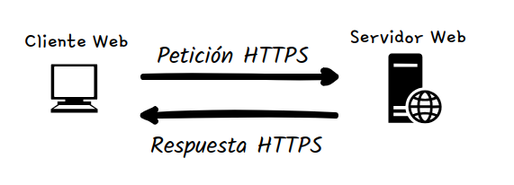
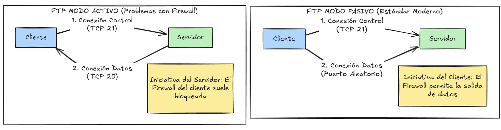
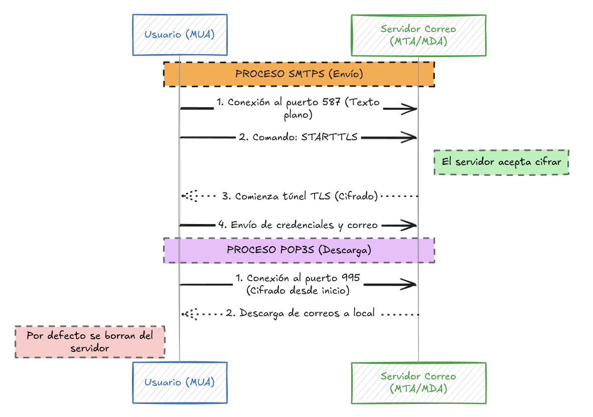
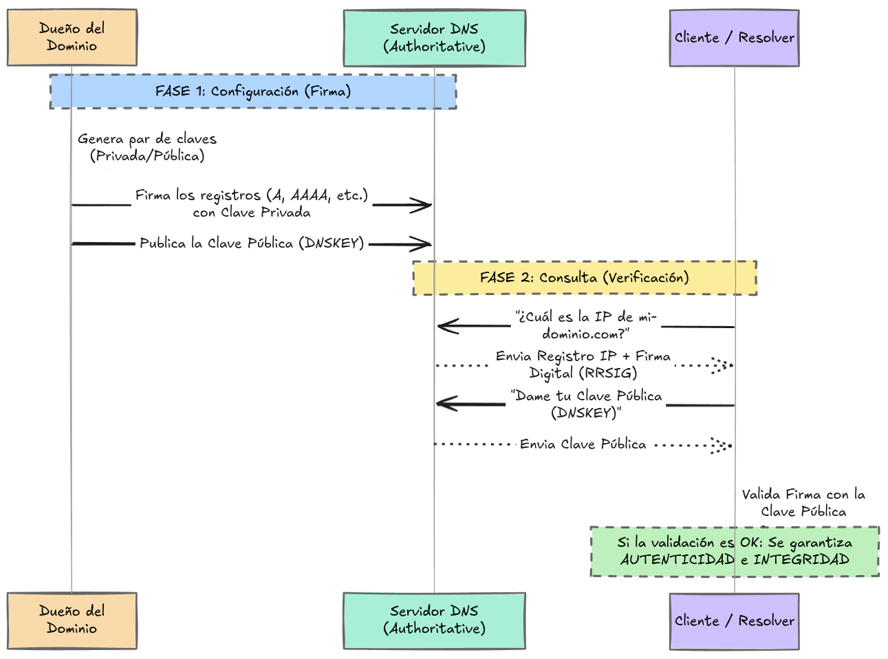
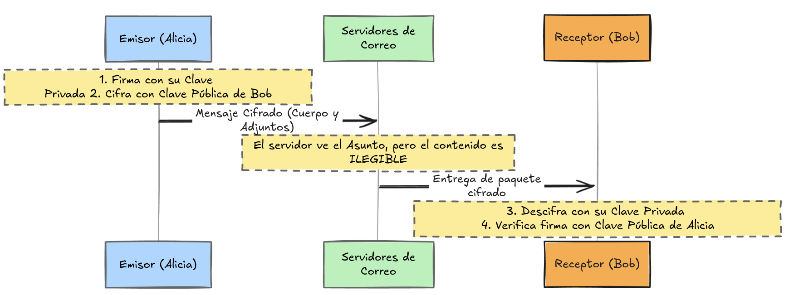
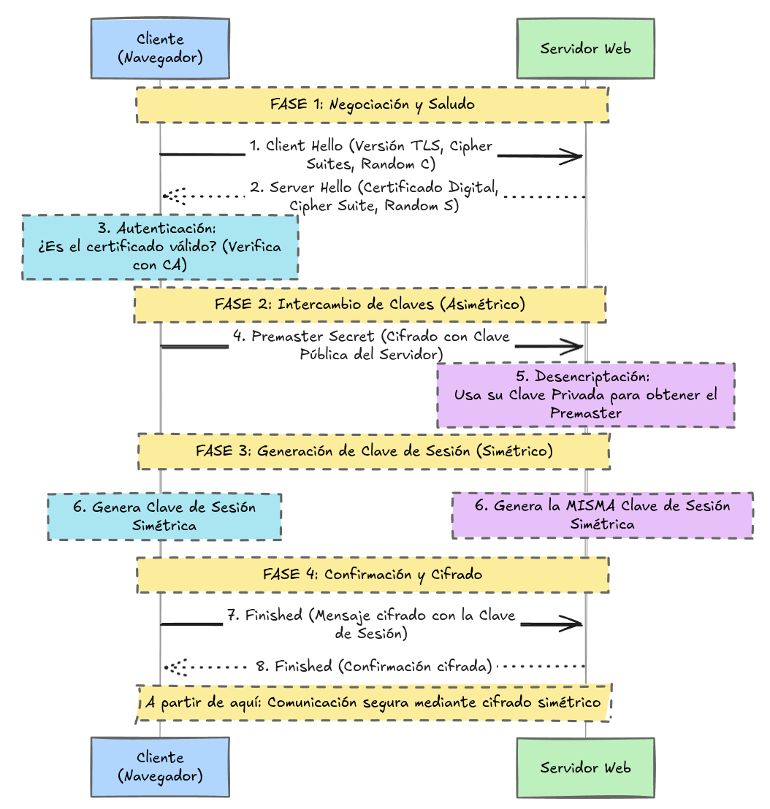
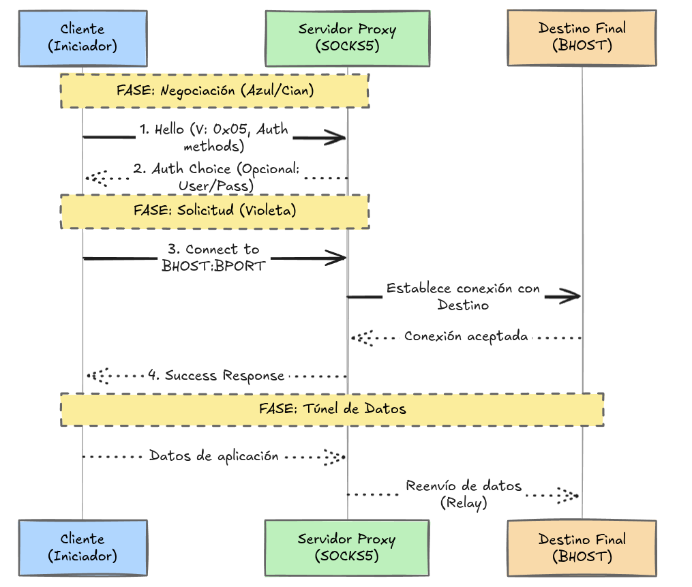
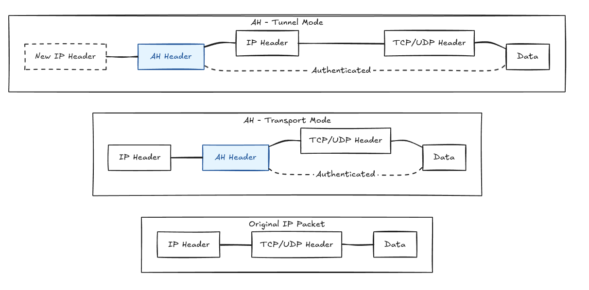
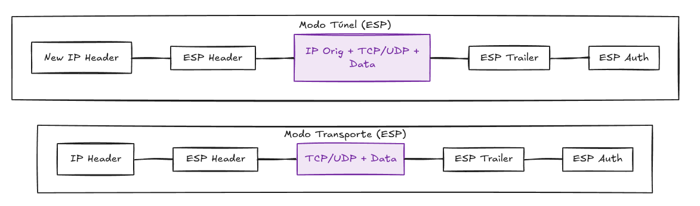

# Protocolos de Seguridad en Red (Capa de Aplicación)

Este módulo se centra en las variantes seguras de los protocolos de capa 7, que utilizan **SSL/TLS** para garantizar la tríada CIA (Confidencialidad, Integridad y Disponibilidad).

---

## 1. HTTPS: Navegación Web Segura

HTTPS es la versión cifrada de HTTP. La diferencia fundamental radica en la capa de transporte.

* **Mecanismo:** Utiliza **Cifrado Asimétrico** (clave pública/privada) para negociar la sesión y **Cifrado Simétrico** para la transferencia de datos.

* **Puerto:** TCP 443.

* **Seguridad:** Protege contra la interceptación de paquetes (sniffing) y la alteración de datos (integridad).

---

## 2. FTPS: Transferencia de Archivos Segura

Extensión de FTP que añade seguridad TLS a los comandos y a las conexiones de datos.

### Modos de Conexión

* **Activo:** El servidor inicia la conexión de datos (puerto 20) al cliente. Suele fallar debido a firewalls o NAT en el lado del cliente.

* **Pasivo:** El cliente inicia ambas conexiones. Es el estándar moderno recomendado.

### Métodos de Seguridad

| Método | Descripción | Puerto |
| :--- | :--- | :--- |
| **Implícito** | La conexión se cifra automáticamente desde el inicio. | 990 |
| **Explícito** | El cliente solicita elevar la seguridad (`AUTH TLS`) en el puerto estándar. | 21 |

---

## 3. Seguridad en el Correo Electrónico

Es crucial distinguir entre el envío (SMTP) y la recuperación (POP3) de correos.

### SMTPS (Envío - Email Push)

* **Protocolo:** Envuelve SMTP en TLS.

* **STARTTLS:** Comando clave para convertir una conexión insegura en segura "al vuelo".

* **Puertos:** 465 (Implícito/Legacy) y 587 (Explícito/Estándar).

### POP3S (Recuperación - Email Pull)

* **Protocolo:** Versión segura de POP3 envuelta en TLS.

* **Limitación:** Descarga el correo localmente; por defecto borra la copia del servidor (sin sincronización entre dispositivos).

* **Puerto:** TCP 995.

---

## Resumen de Puertos Clave

| Protocolo | Inseguro | Seguro | Capa OSI |
| :--- | :--- | :--- | :--- |
| **Web** | HTTP (80) | **HTTPS (443)** | Aplicación |
| **Archivos** | FTP (21) | **FTPS (990/21)** | Aplicación |
| **Envío Mail** | SMTP (25) | **SMTPS (465/587)** | Aplicación |
| **Recuperación** | POP3 (110) | **POP3S (995)** | Aplicación |

---

## 5. DNSSEC (Domain Name System Security Extensions)

El protocolo DNS estándar es vulnerable a ataques de **DNS Spoofing** (suplantación), ya que acepta cualquier respuesta sin verificar su origen.

* **Propósito:** Garantizar que la resolución de nombre a IP proviene del dueño legítimo del dominio.

* **Mecanismo:** 

    1. El dueño de la zona firma los registros con una **clave privada**.
    
    2. El servidor publica una **clave pública** para que los clientes validen la firma.

* **Garantías:**

    * **Autenticidad:** Confirma el autor del registro (dueño del dominio).
    
    * **Integridad:** Asegura que el registro no fue modificado (un cambio invalidaría la firma).

* **Nota importante:** DNSSEC no cifra la consulta (privacidad), solo asegura su veracidad. Para privacidad se requiere DoH (DNS over HTTPS).

---

## 6. OpenPGP (Cifrado de Extremo a Extremo)

A pesar de existir SMTPS o HTTPS para webmail, los correos siguen siendo legibles para los servidores de correo intermedios. OpenPGP soluciona esto mediante cifrado a nivel de mensaje (E2EE).

* **Concepto:** Basado en el estándar PGP (*Pretty Good Privacy*). Permite que solo el destinatario final lea el mensaje; ni los administradores del servidor ni atacantes con acceso al tráfico pueden verlo.

* **Uso de Claves:**

    * **Emisor:** Firma con su *clave privada* (autenticidad) y cifra con la *clave pública* del receptor (confidencialidad).

    * **Receptor:** Verifica la firma con la *clave pública* del emisor y descifra con su propia *clave privada*.

* **Limitación:** Cifra el cuerpo del mensaje y archivos adjuntos, pero **no cifra los encabezados** (Asunto, Destinatario, Remitente).

* **Herramienta:** **GnuPG (GPG)** es la implementación de código abierto más común.

---

## 7. SSH (Secure Shell)

SSH es el reemplazo seguro de protocolos obsoletos como **Telnet** y **rlogin**, situándose como el estándar para administración remota.

* **Diferencia Crítica:** Mientras que Telnet envía credenciales y comandos en **texto plano** (visibles con un simple análisis de paquetes), SSH cifra toda la sesión desde el inicio.

* **Capacidades:**

    * **Confidencialidad:** Cifra el tráfico para que no sea legible.

    * **Integridad:** Evita que un atacante modifique los comandos enviados mediante firmas de mensaje.

    * **Autenticación:** Soporta contraseñas y, preferiblemente, pares de llaves criptográficas (RSA/Ed25519).

## 8. Protocolos SSL/TLS (Capa de Presentación)

**SSL (Secure Socket Layer)** y **TLS (Transport Layer Security)** actúan como un "envoltorio" (*wrapper*) que cifran protocolos de comunicación como HTTP o FTP para convertirlos en sus versiones seguras (HTTPS, FTPS).

### El Handshake SSL/TLS (Paso a Paso)

Es el proceso de negociación entre cliente y servidor para establecer una conexión cifrada:

1.  **Client Hello:** El cliente envía su versión de TLS, los algoritmos de cifrado soportados (*cipher suites*) y bytes aleatorios.

2.  **Server Hello:** El servidor responde con su certificado, el *cipher suite* elegido y sus propios bytes aleatorios.

3.  **Autenticación:** El cliente verifica el certificado del servidor contra una Entidad Certificadora (CA) de confianza.

4.  **Premaster Secret:** El cliente cifra nuevos bytes aleatorios con la **clave pública** del servidor (extraída del certificado).

5.  **Desencriptación:** El servidor usa su **clave privada** para obtener el *premaster secret*.

6.  **Generación de Claves de Sesión:** Ambos generan la misma **clave de sesión simétrica** basándose en los bytes aleatorios y el *premaster*. Esta clave **no se transmite** por la red.

7.  **Ready Message:** Ambos envían un mensaje de "finalizado" cifrado con la clave de sesión para empezar el intercambio de datos.

---

## 9. Protocolo SOCKS5 (Capa de Sesión)

**SOCKS5 (Socket Secure)** es un protocolo de proxy que intercambia datos a través de un servidor delegado. Se utiliza para enrutar el tráfico de aplicaciones de forma que parezca provenir del proxy y no del cliente original.

### Flujo de Trabajo (Handshake SOCKS5)

1.  **Iniciación:** El cliente se conecta al proxy enviando la versión (`0x05`) y los métodos de autenticación soportados.

2.  **Respuesta del Proxy:** El servidor elige el método de autenticación y confirma la conexión.

3.  **Solicitud de Destino:** El cliente envía la dirección y el puerto del host final (BHOST/BPORT) al que quiere llegar.

4.  **Transferencia:** Una vez establecida la asociación, el proxy actúa como relé, pasando los datos entre el cliente y el destino.

### Beneficios para la Seguridad

* **Anonimato:** Oculta los detalles internos de la red del cliente (como su IP real) ante el destino final.

* **Evasión de Censura:** Permite saltar bloqueos geográficos o cortafuegos al actuar como un puente intermedio.

* **Versatilidad:** A diferencia de un proxy HTTP, SOCKS5 puede manejar cualquier tipo de tráfico (TCP/UDP) de diversas aplicaciones.
---

## 10. IPsec (Internet Protocol Security)

IPsec es un conjunto de protocolos que dota al protocolo IP de capacidades de autenticación, integridad y confidencialidad. Es el estándar para interconectar sedes corporativas.

### Componentes de IPsec

* **AH (Authentication Header):** Proporciona **autenticación e integridad**. Asegura quién envía los datos y que no han sido modificados, pero **no cifra** la información (no hay confidencialidad).

* **ESP (Encapsulating Security Payload):** Proporciona **autenticación, integridad y confidencialidad**. Es el protocolo más utilizado ya que sí cifra los datos.

* **SA (Security Association):** Conjunto de parámetros y claves establecidos mediante el protocolo **IKE** para garantizar una comunicación segura.

### Modos de Funcionamiento (AH y ESP)

| Modo | Alcance de la Seguridad | Uso Típico |
| :--- | :--- | :--- |
| **Transport Mode** | Protege la carga útil (TCP/UDP + Datos). La cabecera IP original queda visible. | Comunicación Host-to-Host (directa entre dos equipos). |
| **Tunnel Mode** | Protege todo el paquete (IP original + Datos) y lo encapsula en una nueva cabecera IP. | VPNs Site-to-Site (entre oficinas). Oculta la IP de origen real. |

## 11. VPN (Virtual Private Network)

Una VPN permite establecer un túnel privado y seguro sobre una infraestructura pública e insegura (Internet). 

### Tipos de Protocolos para VPN

1.  **IPsec:** Utiliza principalmente el protocolo **ESP en modo Túnel** para conectar oficinas (Site-to-Site) o usuarios remotos. Es la base de soluciones como Cisco VPN.

2.  **SSL/TLS:** Popularizado por herramientas como **OpenVPN**. Es muy flexible ya que permite autenticación variada y suele ser más fácil de atravesar firewalls que IPsec.

3.  **PPTP (Legacy):** Protocolo antiguo que ya **no se considera seguro** debido a vulnerabilidades conocidas. Debe evitarse en entornos profesionales.

---

## 12. Resumen de Mitigación de Amenazas

La implementación de envoltorios (**wrappers**) de **SSL/TLS** en protocolos de aplicación (HTTPS, FTPS, POP3S, SMTPS) y el uso de túneles **IPsec** en la capa de red son defensas críticas contra:

* **Man-in-the-Middle (MITM):** El cifrado impide que un atacante posicionado entre el cliente y el servidor pueda leer o modificar los datos.

* **Eavesdropping (Escucha Pasiva):** Al cifrar el tráfico, aunque un atacante capture los paquetes (sniffing), solo verá datos ilegibles sin las claves de sesión.

* **Ataques de Replay (Reenvío):** Los protocolos modernos incluyen números de secuencia y marcas de tiempo cifradas que impiden que un atacante capture un paquete válido (como una autenticación) y lo reenvíe más tarde para ganar acceso.

---

## 13. Matriz Global de Protocolos de Seguridad

| Capa OSI | Protocolo Seguro | Protocolo Inseguro | Función Principal |
| :--- | :--- | :--- | :--- |
| **7. Aplicación** | HTTPS / FTPS / SMTPS | HTTP / FTP / SMTP | Transferencia segura de datos y correo. |
| **7. Aplicación** | SSH | Telnet / rlogin | Administración remota cifrada. |
| **7. Aplicación** | DNSSEC | DNS | Integridad y autenticidad en resolución de nombres. |
| **6. Presentación** | SSL / TLS | - | Encriptación y negociación de sesión. |
| **5. Sesión** | SOCKS5 | SOCKS4 | Proxy y relé de datos con autenticación. |
| **3. Red** | IPsec (ESP/AH) | IP | Seguridad a nivel de paquete y túneles VPN. |

---