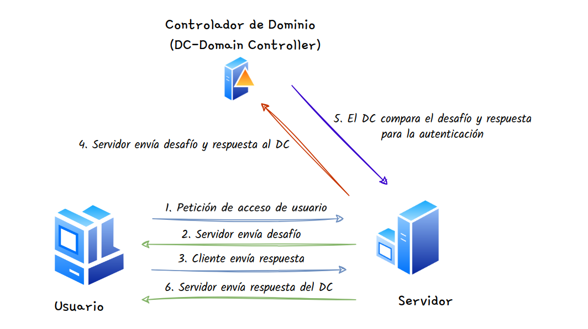
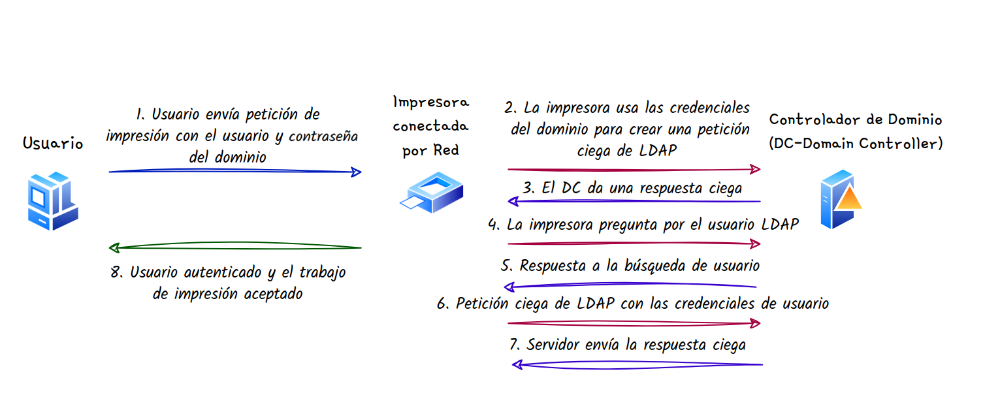
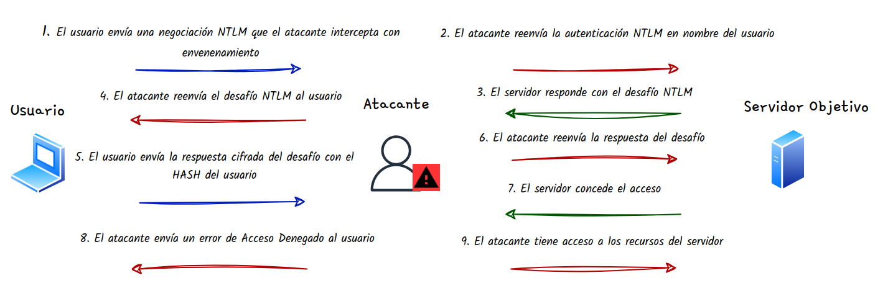
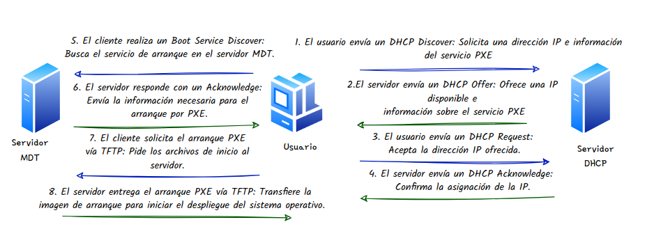

# Introducción a la Vulneración de Active Directory (Initial Access)

Active Directory es el objetivo principal en redes Windows al centralizar la gestión de identidades. El paso crítico inicial es el **Breaching**: obtener cualquier conjunto de credenciales válidas, sin importar su nivel de privilegio, para habilitar la **enumeración profunda** del dominio. Esta fase aprovecha la amplia superficie de ataque de los servicios de AD, ya sea mediante sistemas expuestos a Internet o el uso de dispositivos no autorizados (*rogue devices*) en la red local.

Las técnicas tratadas en este punto para capturar este primer acceso incluyen el abuso de:

- Servicios Autenticados NTLM

- Interceptación de Credenciales de Bind LDAP

- Ataques de Relay

- Explotación del Microsoft Deployment Toolkit (MDT)

- Análisis de Archivos de Configuración con datos sensibles.

**Nota**: Otros vectores como LLMNR/NBT-NS Poisoning, Password Spraying o AS-REP Roasting se categorizan como métodos complementarios para la obtención de acceso inicial en entornos de dominio.

## Servicios Autenticados: NTLM y NetNTLM

**NTLM** es el conjunto de protocolos de seguridad para autenticar identidades en AD mediante un esquema de desafío-respuesta denominado **NetNTLM** (conocido habitualmente como Windows Authentication). En este proceso, el servidor (o la aplicación que aloja) actúa como intermediario: recibe la **respuesta de autenticación** del cliente, la reenvía al Controlador de Dominio (DC) para su validación y, si el DC confirma el desafío, la aplicación autentica al usuario sin llegar a almacenar sus credenciales. Esta arquitectura es común en servicios expuestos como portales OWA (Exchange), RDP, VPNs integradas o aplicaciones web corporativas.

<div align="left" style="margin-bottom: 20px;">
  
</div>

Dada la exposición de estos servicios, son vectores ideales para ataques de **Password Spraying**. A diferencia del **Brute Force** tradicional (probar muchas contraseñas contra un solo usuario), el **Password Spraying** utiliza una única contraseña común contra una lista extensa de usuarios. Esta técnica es preferible en entornos AD por dos razones críticas:

- **Evita el bloqueo de cuentas**: Al realizar un solo intento por usuario, no se alcanza el umbral de bloqueos (*Account Lockout Policy*).

- **Discreción**: Genera menos ruido en los logs de seguridad que un ataque masivo a una sola cuenta.

Para la ejecución de estos ataques, diferenciamos las herramientas según su alcance:

- **Hydra / Python (Requests)**: Se utilizan principalmente para ataques de fuerza bruta o validaciones puntuales sobre servicios web (HTTP/NTLM). El éxito se identifica mediante códigos de estado (ej. `200 OK` para éxito, `401 Unauthorized` para fallo).

- **CrackMapExec (CME / NetExec)**: Es la herramienta estándar para **Password Spraying** a nivel de infraestructura. A diferencia de las anteriores, permite "barrer" segmentos de red completos vía SMB. Su gran ventaja es la post-validación: si el usuario identificado tiene privilegios de administrador local, la herramienta lo señaliza con el mensaje **(Pwn3d!)**, facilitando el movimiento lateral inmediato.

  **Comando de Password Spraying:**

    ```bash
    nxc smb 10.10.x.x/24 -u usuarios.txt -p 'Password123!' --continue-on-success
    ```

  *Nota*: `--continue-on-success` permite que la herramienta siga probando el resto de la lista aunque encuentre una credencial válida, maximizando la recolección de cuentas comprometidas.

## Interceptación de Credenciales: LDAP y LDAP Pass-back

El protocolo **LDAP** es una alternativa común a NTLM para la autenticación en aplicaciones de terceros (GitLab, Jenkins, impresoras, VPNs). A diferencia de NTLM, la aplicación suele manejar directamente las credenciales: posee una cuenta de servicio de AD para realizar consultas y verificar los datos del usuario. Esto introduce dos riesgos críticos: las credenciales pueden estar almacenadas en texto plano en archivos de configuración o pueden ser interceptadas mediante un ataque de **LDAP Pass-back**.

<div align="left" style="margin-bottom: 20px;">
  
</div>

El ataque **LDAP Pass-back** se basa en manipular la configuración de un dispositivo (como la interfaz web de una impresora con credenciales por defecto `admin:admin`) para que apunte a un servidor LDAP controlado por el atacante. Los puntos clave de este proceso son:

- **Redirección del Tráfico**: Se modifica la IP del servidor LDAP en el dispositivo por la nuestra.

- **Captura Simple vs. Compleja**: En configuraciones vulnerables de tipo **Simple Bind**, un simple listener como `nc -lvp 389` puede ser suficiente para ver la contraseña en texto plano.

- **Servidor Rogue y Downgrade**: En clientes más robustos que negocian la seguridad (SASL), es necesario levantar un servidor **OpenLDAP** falso utilizando un archivo **.ldif** (*LDAP Data Interchange Format*). Este archivo permite que nuestro equipo acepte cualquier intento de conexión y fuerce al dispositivo a realizar un **downgrade** a métodos de autenticación inseguros como **PLAIN** o **LOGIN**.

- **Extracción**: Al ejecutar el "Test Settings" en el dispositivo, este se conecta a nuestro servidor degradado y envía las credenciales de AD, las cuales capturamos mediante **tcpdump** o **Wireshark** analizando el tráfico del puerto **389**.

## Ataques de Relay y Envenenamiento de Red (LLMNR/NBT-NS)

En las redes Windows, los servicios se comunican constantemente mediante el protocolo **SMB (Server Message Block)**. Para facilitar la conexión cuando el DNS falla, los sistemas utilizan protocolos de resolución local como **LLMNR (Link-Local Multicast Name Resolution)**, **NBT-NS (NetBIOS Name Service)** y **WPAD (Web Proxy Auto-Discovery Protocol)**. Estos protocolos funcionan mediante broadcast (difusión a toda la red), lo que permite a un atacante con un dispositivo en la red local interceptar dichas peticiones.

El ataque se basa en el uso de herramientas como **Responder**, que escucha estas peticiones y "envenena" la respuesta, diciéndole a la víctima que nuestra IP es el servidor legítimo que busca. Esto fuerza a la víctima a intentar autenticarse contra nuestra máquina, lo que nos permite dos vías de ataque:

- **Captura y Cracking Offline**: Interceptamos el desafío/respuesta NetNTLMv2. Aunque no es la contraseña en sí, podemos usar herramientas como Hashcat (modo 5600) para intentar romper el hash mediante fuerza bruta o diccionarios.

- **SMB Relay**: En lugar de crackear el hash, lo reenviamos (relaying) en tiempo real a otro servidor de la red. Si el usuario interceptado tiene privilegios suficientes en ese servidor y el **SMB Signing (firmado SMB) está desactivado** o **no es requerido**, obtendremos una sesión autenticada (o incluso ejecución de comandos) en el sistema destino sin conocer la contraseña.

<div align="left" style="margin-bottom: 20px;">
  
</div>

Las técnicas tratadas en este punto para capturar este primer acceso incluyen el abuso de:

- **Envenenamiento de Red**: Uso de Responder para capturar hashes mediante protocolos de resolución de nombres locales.

- **Cracking de Hashes**: Uso de Hashcat para recuperar contraseñas de cuentas de servicio capturadas.

- **Relay de Autenticación**: Reenvío de desafíos NetNTLM para ganar acceso lateral o administrativo en otros hosts de la red.

## Explotación de Microsoft Deployment Toolkit (MDT)

Las organizaciones grandes utilizan herramientas como **MDT** y **SCCM** para automatizar el despliegue de sistemas operativos y software. Un método común es el uso de PXE Boot (Preboot Execution Environment), que permite a nuevos dispositivos cargar e instalar un sistema operativo directamente desde la red sin necesidad de medios físicos. Este proceso, aunque eficiente, presenta vulnerabilidades críticas si no se asegura correctamente.

<div align="left" style="margin-bottom: 20px;">
  
</div>

El ataque se centra en interceptar la imagen de arranque enviada por la red para extraer información sensible. Los puntos clave de esta técnica son:

- **Proceso PXE y TFTP**: Cuando un equipo inicia por red, recibe vía DHCP la IP del servidor MDT y el nombre de los archivos de configuración (BCD). Estos archivos se descargan mediante TFTP, un protocolo que no requiere autenticación y permite solicitar archivos si se conoce su ruta.

- **Imagen de Windows (WIM)**: Analizando el archivo BCD (usando herramientas como PowerPXE), se puede identificar la ubicación de la imagen de arranque principal (.wim). Esta imagen contiene el entorno de pre-instalación de Windows totalmente configurado.

- **Extracción de Credenciales**: Las imágenes de MDT suelen incluir un archivo llamado bootstrap.ini. Para que la instalación sea desatendida y automática, este archivo frecuentemente almacena credenciales de AD en texto plano (UserID, UserDomain y UserPassword). Estas cuentas suelen tener privilegios suficientes para acceder a recursos compartidos de red o realizar tareas de despliegue.

- **CustomSettings.ini y OUs**: Además de `bootstrap.ini`, es fundamental revisar el archivo   **CustomSettings.ini**. Estos ficheros no solo suelen contener credenciales de cuentas de servicio, sino que revelan la jerarquía del AD al mostrar las **Unidades Organizativas (OUs)** donde se despliegan los nuevos equipos. Esta información es crítica para mapear el dominio antes de iniciar el movimiento lateral.

Las técnicas tratadas en este punto para capturar este primer acceso incluyen:

- **Enumeración de archivos BCD**: Localización de configuraciones de arranque en el servidor MDT.

- **Descarga de imágenes WIM**: Recuperación de sistemas operativos preconfigurados mediante TFTP.

- **Análisis de archivos de respuesta**: Extracción de contraseñas de cuentas de servicio desde bootstrap.ini.

## Análisis de Archivos de Configuración

Una vez obtenido un acceso inicial a un host de la red, los archivos de configuración representan una de las fuentes más valiosas para la post-explotación y la escalada de privilegios. Muchas aplicaciones y servicios locales almacenan credenciales de Active Directory para autenticarse contra el dominio o bases de datos centrales durante su ejecución o instalación.

Los puntos clave de esta técnica son:

- **Vectores de Exposición**: Las credenciales suelen residir en archivos de configuración de aplicaciones web (web.config), servicios del sistema, claves del registro o software desplegado centralizadamente.

- **Automatización de Búsqueda**: Herramientas como **[Seatbelt](https://github.com/GhostPack/Seatbelt)** o **[winPEAS](https://github.com/peass-ng/PEASS-ng/tree/master/winPEAS)** permiten identificar rápidamente este "botín" (loot) en rutas comunes y bases de datos locales de aplicaciones.

- **Tratamiento de Credenciales**: Aunque los campos de contraseña suelen estar codificados o cifrados (ej. Base64), muchas aplicaciones utilizan algoritmos reversibles o claves estáticas que permiten obtener la contraseña en texto plano mediante scripts de descifrado conocidos.
